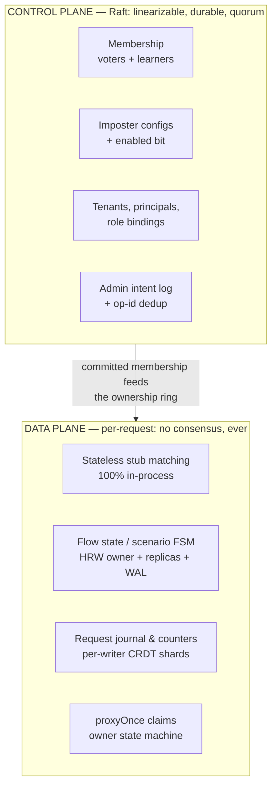
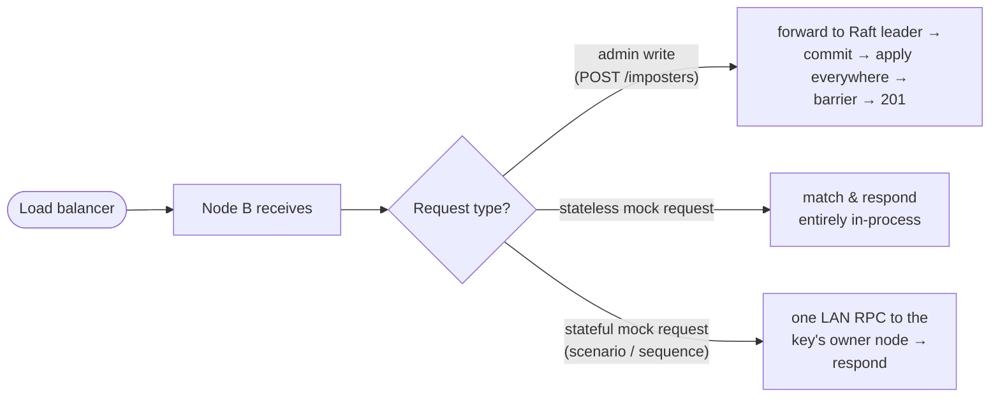

# Chapter 1 — Overview & Design Goals

## What Rift is, and what the distributed edition adds

Rift is a Mountebank-compatible mock/service-virtualization server written in
Rust: you `POST` an *imposter* (a mock service bound to a TCP port, carrying an
ordered list of *stubs* — predicate/response pairs), point your system under
test at it, and assert afterwards on what it received. A single Rift process
sustains 20–40k RPS, so one node is usually enough *compute*. What one node
cannot give you is:

1. **High availability** — an always-on shared mock environment that survives a
   node dying mid test-run.
2. **Horizontal throughput** — for the load-test cases where Rift itself is the
   bottleneck.
3. **Cluster-wide stateful correctness** — scenarios, response cycling,
   request verification, and proxy recording behave correctly even when one
   logical test's requests land on different nodes.
4. **Config ergonomics** — `POST /imposters` against *any* node, and the whole
   fleet serves it.

The distributed edition (RiftCluster) delivers these as an **open-core product**:
the open-source engine is unmodified and unaware of clustering; every cluster
behavior enters through eight generic extension seams that were upstreamed
first (`achird-labs/rift#311–#318` — pluggable flow store with CAS, response
sequencer, request journal, proxy-recording store, incremental config apply
with change events, the embeddable server builder, and response decoration).
Chapter 11 covers that boundary in detail.

## The four load-bearing requirements

The design is shaped by four requirements, stated here exactly because each one
eliminates a class of simpler designs:

| # | Requirement | What it eliminates |
|---|---|---|
| R1 | A config change acknowledged on any node is **servable from every node** at the moment the client gets its 2xx | Fire-and-forget replication; "eventually consistent, poll for convergence" |
| R2 | A flow-state change made while serving a request is **visible to the very next request**, whichever node receives it | Reading local replicas for correctness-bearing state |
| R3 | **Nothing is lost on a full-cluster restart** — imposter configs *and* flow state | Memory-only state; "durability = at least one node survives" |
| R4 | An accepted admin request is **never lost**, even if the node handling it dies mid-flight | Best-effort forwarding; client-side-only retry |

R1+R3+R4 together demand a **strongly consistent, durable control plane**. R2
demands **single-writer semantics with authoritative reads** for flow state.
And the product's founding constraint — *no mandatory external dependency;
Rift clusters itself* — demands that both arrive as embedded libraries, not
sidecar services. That triangle is resolved by the central architectural
decision (ADR-001): an **embedded Raft group** (`openraft`, in-process, over
Rift's own cluster port) for the control plane, and **consensus-free
single-writer ownership** for the request-path state, both persisting through
an embedded ACID store (`redb`).

## Non-goals

Just as load-bearing. The cluster is **not**:

- **A general database.** Durability covers configs, tenancy, admin intents,
  and (tunably) flow state. Response cursors, the recorded-request journal, and
  in-flight proxy claims are deliberately volatile — Chapter 9 has the full
  matrix and the reasoning for each row.
- **Cross-region.** One failure domain, one LAN. WAN latencies would invalidate
  every timeout in this book.
- **Linearizable end-to-end.** The *control plane* is linearizable. The *data
  plane* is single-writer-per-key with bounded, counted, flagged degradation
  windows (Chapter 9). A mock server that returned wrong answers silently would
  be worse than one that briefly refuses; when in doubt the design rejects.
- **Unbounded.** Design target 3–9 voters, documented ceiling 16 nodes (extra
  nodes join as non-voting learners).
- **An affinity-dependent design.** Load-balancer stickiness is treated purely
  as a latency optimization. Correctness never depends on which node a request
  lands on (Chapter 5).

## The two-plane architecture

Everything in this guide hangs off one split. State is divided by *what would
go wrong if two nodes disagreed about it*, and each class gets the cheapest
mechanism that makes disagreement impossible — or harmless:

- **The control plane** changes at human/CI frequency (an admin call, a node
  joining). It can afford a quorum round-trip and an fsync per write, and in
  exchange every node agrees on its content at every log index. Membership
  itself lives here — which is the trick that simplifies everything downstream:
  the data plane's ownership ring is computed from *committed* membership, so
  no two nodes can durably disagree about who owns a key (Chapter 3).
- **The data plane** changes at request frequency (up to tens of thousands of
  times per second). Nothing consensus-shaped is allowed here. Stateless
  matching never leaves the process. Stateful features use exactly one
  authoritative writer per key — placed by rendezvous hashing over committed
  membership — plus asynchronous replication for handoff and an embedded
  write-ahead tier for durability (Chapter 6).

The corollary that makes the throughput story work: **a stub with no stateful
features never touches the coordination layer at all.** The hot path of the
open-source engine is preserved bit-for-bit; the standing performance gate is
that single-node benchmarks regress ≤ 2% with clustering compiled in but off.

## One request, three planes — a preview

To make the split concrete, here is where work happens for the three request
categories (Chapters 4, 5 and 7 walk each in full):

The design budgets **one LAN round-trip per stateful operation** as the normal
cost — sub-millisecond on the target networks — and treats `owner == self`
(~1/N of operations, more with affinity) as an opportunistic fast path, never
an assumption.

## Reading the guarantees honestly

Every guarantee in this book comes with its boundary, and the boundaries are
themselves part of the design — bounded, counted in metrics, and flagged on
responses (`Rift-Cluster-*` headers), never silent:

- R1 holds via the write barrier; if a Ready node cannot confirm apply within
  the barrier timeout, the write still succeeds and the response *names the
  lagging nodes* in a warning header.
- R2 holds via owner-routed reads; if the owner is unreachable, the default is
  a fast, honest `503` — not a stale answer (per-feature overrides exist and
  stamp a degradation header when used).
- R3 holds at durability level `sync` absolutely; at the default `async`, the
  loss window is one fsync interval, and only if *all three* holders of a key
  die inside it.
- R4 holds via the durable intent log; a client that gets a `503` also gets an
  op-id whose fate it can query — "accepted but unconfirmed" is a queryable
  state, not a mystery.

The rest of this guide is the machinery behind those four sentences.
