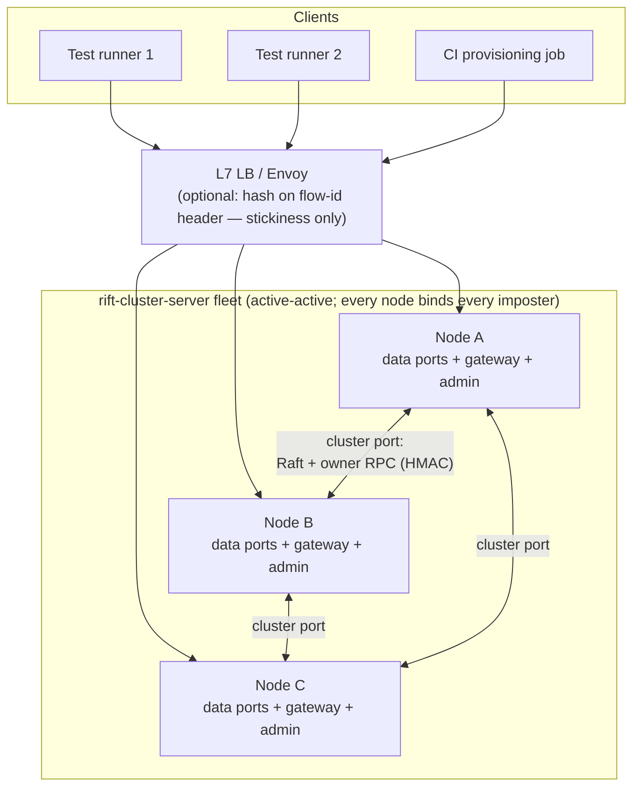

# Chapter 2 — Topology & Request Routing

How does a request find a node, and how does a node find the right imposter?
Rift inherits two isolation models from its single-node life, and they cluster
very differently. This chapter explains all three ways traffic enters the
fleet, and why the design refuses to let any of them affect correctness.

## The two isolation models

**Port-based isolation** (the Mountebank default): one imposter = one TCP
listener; N mock services = N ports; ports can even be minted at runtime
(`POST /imposters` without a port scans 49152–65535). Every node in the cluster
binds *every* imposter port — the fleet is a replica set, not a shard set.

**Space-based isolation** (Rift's extension, upstream #223): many isolated
environments multiplexed onto *one* port. A stub carries `space: "X"` and
matches only when the request's resolved `flow_id` equals `X`, where the flow
id comes from a header (`flowIdSource: "header:X-Flow-Id"`). Adding a tenant or
a parallel test run costs a header value, not a port.

## Why space-based is the clustering-native topology

Port-based isolation fights managed load balancers: an ALB/NLB needs a listener
and target group per port, cannot discover runtime-minted ports, and hits
listener quotas around 50. Space-based isolation collapses the problem — one
front-end port, isolation scales with header cardinality:

| Model | LB objects needed | Runtime-minted ports? | Header affinity possible? |
|---|---|---|---|
| Port-based | one listener per imposter port | invisible to the LB | no (L4 can't read headers) |
| Space-based | one | n/a — one port | yes (L7 hash on flow-id header) |
| Gateway-fronted | one | immediately addressable | yes |

**Gateway-fronted mode** is the bridge for existing port-based configs: the
target port is carried *in the request* and dispatched in-process against the
imposter map — the pattern of the upstream `/__rift/:port/<path>` admin gateway
(#212), promoted to a first-class data-plane listener by the embeddable-server
seam (#317, `gateway::dispatch_to_port`). Three addressing schemes were designed,
in order of transparency — but **only the path prefix is built**: upstream's
`gateway.rs` parses `/__rift/:port/<path>`, and the front door (Chapter 13) uses
that same form as its no-route fallback. The header and subdomain forms were
withdrawn by D-54: a front-door route expresses either one, tenant-scoped and
without a second implicit addressing path to account for.

| Scheme | Example | Status | Caveat |
|---|---|---|---|
| Header | `X-Rift-Port: 8080` | withdrawn (D-54) | use a front-door route: `match.headers` |
| Subdomain | `p-8080.mocks.example.com` | withdrawn (D-54) | use a front-door route: `match.host` |
| Path prefix | `/__rift/8080/orders` | built (`gateway::dispatch_gateway_path`) | the prefix is stripped before dispatch, so predicates and recordings see `/orders` |

On Kubernetes, gateway-fronted mode is effectively mandatory — Service ports
are static, so runtime-minted imposter ports cannot be exposed any other way
(Chapter 10). And for callers that cannot be asked to name a port at all — an
unmodified system-under-test calling what it believes is a real hostname — the
**front door** (Chapter 13) extends this listener with a content-based route
table: host/path/header rules select the imposter, and the existing gateway
addressing remains as the fallback on the same port.

## The honest truth about load-balancer affinity

A tempting shortcut runs through this whole problem space: *"hash the flow-id
header at the LB, and the node that receives a flow's requests will also own
its state — zero-hop stateful operations!"* The design explicitly rejects this
reasoning, and the rejection is recorded as a decision (D-13), because it is
**factually wrong**: an L7 LB hashes headers onto *its own* ring over *its own*
endpoint list. It does not compute Rift's ownership function. The sticky node
coincides with the state owner roughly 1/N of the time — chance, not design.

What affinity genuinely buys: per-flow request ordering through one node,
warm connection reuse, and stable RPC fan-out patterns. All worth having. What
it must never be allowed to buy: correctness. Hence the rule that shapes
Chapters 5 and 6:

> **Placement is a latency optimization. Ownership is a correctness mechanism.
> They are computed by different systems and must be assumed to disagree.**

Practical LB guidance (header-hash capable: Envoy `ring_hash`/`maglev`, nginx
`hash … consistent`, HAProxy `balance hdr(...)`; not capable: AWS ALB/NLB —
front them with an Envoy tier if affinity is wanted).

## Every node serves everything

A consequence worth stating plainly: this is a **replicated** cluster, not a
sharded one. Every node holds the full imposter set, binds every port, and can
serve any mock request — stateful features reach across to owners as needed.
Sharding *imposters* across nodes was rejected because config is small, and
"any node answers any port" is what makes the LB story trivial and node loss
non-disruptive. What *is* sharded — by rendezvous hashing — is state
*ownership*: the authority over one scenario's FSM entry or one sequence
cursor, which costs nothing to move and must have exactly one writer
(Chapter 6).

Two port-level details complete the picture:

- **Bind divergence.** Binds can fail on individual nodes (a port taken by an
  unrelated local process). The imposter still exists cluster-wide; the failing
  node reports per-`(port, node)` bind status to the leader (surfaced via
  `GET /_cluster/imposters` and a `Rift-Cluster-Warnings` header on create),
  and can still serve that imposter via the gateway listener. In L4/port-based
  deployments, per-port LB health checks route around the failed bind.

  Each node also reports its own bind state on the members projection —
  `bound_ports`, `bind_failures` and `bind_status_unavailable` on
  `GET /_cluster/members`, merged across voters by `GET /_fleet/members` (#369),
  which is what lets the console show one row per node for a single imposter
  without a client-side fan-out. `bound_ports` is a **positive** list on purpose:
  "not recorded as failed" is equally true of a port a node has never applied, so
  a node that is silent, unreachable, or running an older build reads as
  *unknown* rather than as bound. A failed bind is a degraded path, not a failed
  imposter — dispatch targets the imposter object, not its socket.
- **Auto-assigned ports** are minted once, by the config leader during the
  write, and fixed in the replicated config — nodes never re-mint on bind
  failure, because the port number is the imposter's identity.
