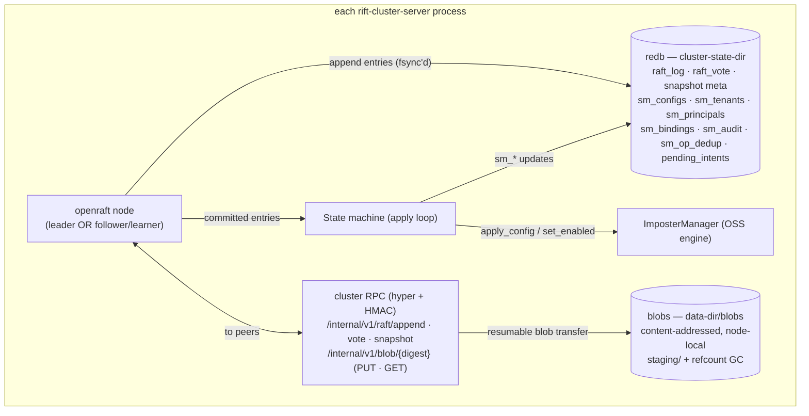

# Chapter 3 — The Control Plane

The control plane is where the cluster agrees on the things it cannot afford to
disagree about: **who is in the cluster, what the imposters are, who the
tenants and principals are, and which admin requests have been accepted.** It
is an embedded Raft group — `openraft` running inside every `rift-cluster-server`
process, speaking over the same HMAC-authenticated cluster port as everything
else. There is no external coordinator, no sidecar, no operator-managed quorum
service. Three Rift binaries behind an LB *are* the consensus group.

## Why Raft, and why membership lives inside it

The earlier design draft (RFC-001 v2) built the control plane on gossip:
eventually-consistent membership, ownership by hashing over whatever roster a
node currently believed, and then — because two nodes could transiently
believe different rosters — a stack of compensating machinery: ring epochs,
settle delays before a new owner may serve, per-key ownership generations,
version-vector merges on heal. Every piece existed to manage disagreement
about membership.

Putting membership *itself* into a Raft log (D-15) removes the disagreement
instead of managing it. The roster is now a value in a linearizable state machine: at any
log index, every node that has applied that index computes byte-identical
membership, and therefore byte-identical ownership for every key. The settle
delay, the generations, the epoch-mismatch retry ladders — deleted, not
mitigated. The one residual window (a node partitioned away that hasn't yet
learned it lost ownership) is closed by a lease rule at the *owner* side
(Chapter 6), not by caller-side guessing.

The same log then carries configs, tenancy, and admin intents — so R1
(fleet-wide visibility), R3 (durability), and R4 (no lost requests) come from
one mechanism instead of three bespoke protocols.

## Anatomy

- **Log and vote storage** commit with `redb`'s `Durability::Immediate` —
  fsynced before acknowledged. This single property is what makes "committed"
  mean "survives a full-cluster power loss": a majority has the entry on disk
  before any client sees success.
- **The state machine** holds the applied view: imposter config records
  (`(tenant, port) → {config, enabled, revision}` where `revision` is simply
  the Raft log index — monotone and totally ordered fleet-wide for free),
  tenancy records, and the op-id dedup map that gives admin retries
  exactly-once *effect*.
- **Apply is deterministic and cannot fail.** All validation happens on the
  leader *before* the entry is appended; apply only writes `sm_*` tables and
  calls the local engine (`ImposterManager::apply_config` — the incremental
  reconciler from upstream #316, which touches only what changed). A node
  where the local side-effect fails (say, a port bind conflict) still advances
  its applied index — the config exists; that node reports the bind failure as
  status (Chapter 2), preserving "one node's local problem never stalls the
  fleet's log."
- **Snapshots** serialize the `sm_*` tables on openraft's default policy —
  every 5 000 log entries since the last snapshot (`snapshot_log_entries` lowers
  it for tests only) — and purge the log behind them. Both happen on their own:
  no admin route or console panel triggers a snapshot or a compaction (D-24).
  The payload is a file at `<cluster-state-dir>/snapshot/<snapshot_id>`,
  written temp-file → fsync → rename → fsync-dir before the redb row naming it
  commits, so the row never points at a payload that is not already durable
  (#436; Chapter 9). Config bodies ride in log entries (small JSON); snapshots are the
  compaction story, replacing v2's content-addressed body fetch entirely.
  The deliberately larger payloads — an OpenAPI spec up to 4 MiB (RFC-004 §4.1,
  #278) and a dataset up to the tenant's `maxDatasetBytes`, default 8 MiB
  (RFC-005 §3.2, #285) — **no longer ride the log** (epic #432): every node
  still needs *identical* bytes, but content-addressing is what guarantees that,
  so a `SpecPut`/`DatasetPut` commits a digest and the bytes are sideloaded
  through the blob transfer store below — fanned out to a quorum before propose
  (#438) and fetched on apply by any member that lacks them (#439). Snapshots
  carry a manifest of those digests, not the bytes, and a joiner fetches what it
  lacks on install (#440). A dataset still keeps one derived artefact: apply
  materializes `<data-dir>/datasets/<digest>.csv` from the resolved bytes before
  inserting the record, so the file is on every node before any config that names
  it. That file is derived state — rebuilt from `sm_dataset_blobs` on restart,
  never fetched from a peer.
- **Blob transfer store** (#437, epic #432) — `<data-dir>/blobs/<digest>`, a
  per-node content-addressed store fed by `PUT`/`GET /internal/v1/blob/{digest}`
  over the same signed cluster port as the Raft routes. Writes are chunked and
  resumable, verified against the digest before an atomic rename makes them
  visible, and reclaimed by a grace-windowed sweep over what the applied state
  still references. The store itself **replicates nothing** — it has no mechanism
  of its own for putting a blob on another node, so two nodes holding different
  blob sets is expected rather than divergence. What routes through it today is
  the pre-propose fan-out (#438): the accepting node stores the blob and puts it
  on a joint-consensus quorum (D-19) before the referencing op is submitted.

  That is not in tension with **ADR-001 D-18** ("every member holds every live
  blob"): D-18's completeness is established by the write path, never by the
  store — #438 fans a blob to a joint-consensus quorum *before* the op is
  proposed, and #439 fetches on apply for any member the fan-out missed, so a
  commit implies quorum-durability and every member converges to holding every
  live blob. A joiner catching up by snapshot fetches the manifest's blobs the
  same way (#440, D-50). The bytes have left the log; this store is now the
  primary carrier for them.

  Not the *only* carrier, though. A `GET` this store cannot answer falls back to
  `sm_spec_blobs`/`sm_dataset_blobs` (#486, **D-51**), so every member that still
  references a blob can serve it even if its own `blobs/` directory never held
  the bytes or has since been wiped — which is what makes D-18's "holds" mean
  *can serve*, by construction rather than by how the bytes arrived. The fallback
  reaches the referenced set only: a row is dropped in the same transaction that
  drops its last reference, so it can never serve something the fleet has reaped.
  A `?stat` probe deliberately does **not** consult it — that probe is what the
  fan-out uses to decide it may skip a peer, and it must keep meaning "this
  store has the bytes".

## Membership lifecycle

Key rules, each carrying weight:

- **Node identity** is a `u64` the node mints for itself at first start —
  derived from `--cluster-node-name` when set, otherwise from the clock — and
  persists in the state dir. A pod rescheduled with its volume keeps its
  identity; one rescheduled without it returns as the same node if it carries
  the same name, and joins as a new node otherwise (the old id is removed via
  runbook). This replaces the v2 incarnation scheme outright.
- **Membership changes only by a node joining or leaving** (D-21). Admission is
  initiated by the joining node over the signed cluster port; no admin route or
  console action adds or removes a learner or a voter — membership is the
  trust boundary, and what can enter the fleet is bounded by what an operator
  chose to *start*.
- **Seeds are re-resolved through DNS on every attempt** — pod IPs churn, and a
  cached-IP join loop after a full restart would brick the fleet. Every address
  a name resolves to is dialled, in the resolver's own order; there is no
  prefer-IPv4 knob (D-28).
- **Voter cap at 9**: beyond that, nodes join as learners — full data-plane
  citizens (they bind imposters, own flow-state keys, serve traffic) with no
  election weight. Consensus latency stays flat as the fleet grows to the
  16-node ceiling. The cap is a *soft* ceiling on what the fleet does by
  itself, and a promotion only ever adds voter ids — it can never silently
  evict one (D-27).
- **Admission is two-phase** (#433, the etcd learner pattern): the join RPC
  commits the membership entry — the fast, consensus-bound fact — and returns
  `admitted` with the role and a `catching_up` estimate. Catch-up belongs to
  replication, and the **leader's** promotion sweep (1 s cadence) makes a
  caught-up learner a voter under the same admission gate and ceiling. A
  joiner never waits out its own catch-up inside an RPC deadline, and the
  diagram above is literally what the code does: `Learner → CatchingUp →
  Voter`, each transition a committed entry the joiner does not drive.
- **Readiness is a gate, not a vibe**: `/readyz` goes 200 only when the node's
  applied index has caught up to the leader's commit index observed at join
  *and* its imposters are bound-or-reported. An LB never routes to a node
  serving yesterday's config (Chapter 10).
- **Graceful leave** (SIGTERM): drain readiness, leave the membership, and let
  ownership of its flow state move with the committed entry (Chapter 6 — there is
  no pre-leave handoff; every write was already pushed to the successors) — a
  rolling restart never triggers an election or an ownership *guess*; every
  transition is a committed entry.
  The leader refuses a departure that would leave fewer than two voters
  (D-25): the refused node exits crash-equivalent and resumes on its next
  start, so a whole-fleet teardown cannot walk the membership down to a single
  volume. A node that really departed writes a `departed` marker beside its
  state, which — with the presence of a Raft vote and the reachability of its
  seeds — decides *resume*, *rejoin* or *bootstrap* on the next start; the
  state directory is never wiped to force a clean join (D-26).

## Cold start — the payoff

A full-cluster restart under v2 gossip required careful merge rules,
tombstone acknowledgment vectors, and a rule against empty nodes GC'ing the
fleet's config. Under Raft the whole scenario collapses to: every node reopens
its `redb`, the group re-forms from persisted vote + log + snapshot, elects a
leader, and replays. Deletions cannot resurrect (a deletion is a log entry —
a lagging node replays it like any other); an empty-disk node is just a
learner catching up from a snapshot; and if *every* disk is empty, there is no
group to re-form and nothing serves until an operator re-initializes — loud
refusal, exactly as R3 demands (Chapter 9 has the full restart matrix).

**A single member restarting is the case that needs care, not the full
fleet.** A voter that comes back must hear the leader within its election
timeout (150–300 ms) or it campaigns — and once its term has moved, the leader
(which rejects a candidate without adopting its term) never reconciles with it.
Two things on the leader and one on the returning node keep that from
happening (#431): the leader retries an unreachable peer every 50 ms and runs a
per-peer *liveness ticker* — an empty AppendEntries on its current vote whenever
openraft has sent that peer nothing for a heartbeat interval, which is the whole
of a snapshot install and the whole of a large entry's transfer — sent through a
probe that bypasses the peer-health tracker (D-22), because the tracker would otherwise
refuse to talk to a just-restarted peer for its cooldown. The ticker speaks only
while its node actually leads: a probe asserts "your leader is alive", and a
leader that has gracefully left (or been deposed) must fall *silent* — its
silence is what lets the survivors' leader leases lapse so a successor can win
during the drain, which is the handover a rolling restart depends on. On the returning node,
a member with persisted state holds elections for a 3 s *restart grace* until it
hears a leader; a fresh node and a single-voter fleet are unaffected, and a
genuinely dead leader is still replaced once the grace expires.

## What the control plane costs

Symmetry demands the bill. A minority partition **cannot write config** — the
two nodes on the wrong side of a 5-node split serve mock traffic from their
applied configs but return `503 + Retry-After + op-id` for admin writes (with
the intent durably parked for replay — Chapter 4). Leader elections (~1–3 s)
pause admin writes, invisibly to clients thanks to the same intent machinery.
And every voter needs a real disk (Chapter 10 makes persistent volumes
mandatory, not advisory). For a control plane that changes at human frequency,
these are the right prices; the request path pays none of them.
