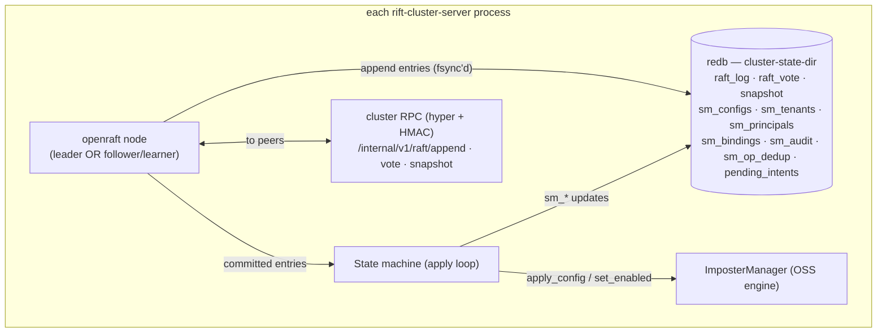

# Chapter 3 — The Control Plane

The control plane is where the cluster agrees on the things it cannot afford to
disagree about: **who is in the cluster, what the imposters are, who the
tenants and principals are, and which admin requests have been accepted.** It
is an embedded Raft group — `openraft` running inside every `rift-cluster-server`
process, speaking over the same HMAC-authenticated cluster port as everything
else. There is no external coordinator, no sidecar, no operator-managed quorum
service. Three Rift binaries behind an LB *are* the consensus group.

## Why Raft, and why membership lives inside it

The earlier design draft (RFC-001 v2) built the control plane on gossip:
eventually-consistent membership, ownership by hashing over whatever roster a
node currently believed, and then — because two nodes could transiently
believe different rosters — a stack of compensating machinery: ring epochs,
settle delays before a new owner may serve, per-key ownership generations,
version-vector merges on heal. Every piece existed to manage disagreement
about membership.

Putting membership *itself* into a Raft log removes the disagreement instead of
managing it. The roster is now a value in a linearizable state machine: at any
log index, every node that has applied that index computes byte-identical
membership, and therefore byte-identical ownership for every key. The settle
delay, the generations, the epoch-mismatch retry ladders — deleted, not
mitigated. The one residual window (a node partitioned away that hasn't yet
learned it lost ownership) is closed by a lease rule at the *owner* side
(Chapter 6), not by caller-side guessing.

The same log then carries configs, tenancy, and admin intents — so R1
(fleet-wide visibility), R3 (durability), and R4 (no lost requests) come from
one mechanism instead of three bespoke protocols.

## Anatomy

- **Log and vote storage** commit with `redb`'s `Durability::Immediate` —
  fsynced before acknowledged. This single property is what makes "committed"
  mean "survives a full-cluster power loss": a majority has the entry on disk
  before any client sees success.
- **The state machine** holds the applied view: imposter config records
  (`(tenant, port) → {config, enabled, revision}` where `revision` is simply
  the Raft log index — monotone and totally ordered fleet-wide for free),
  tenancy records, and the op-id dedup map that gives admin retries
  exactly-once *effect*.
- **Apply is deterministic and cannot fail.** All validation happens on the
  leader *before* the entry is appended; apply only writes `sm_*` tables and
  calls the local engine (`ImposterManager::apply_config` — the incremental
  reconciler from upstream #316, which touches only what changed). A node
  where the local side-effect fails (say, a port bind conflict) still advances
  its applied index — the config exists; that node reports the bind failure as
  status (Chapter 2), preserving "one node's local problem never stalls the
  fleet's log."
- **Snapshots** serialize the `sm_*` tables at 5k entries / 64 MiB and truncate
  the log. Config bodies ride in log entries (small JSON); snapshots are the
  compaction story, replacing v2's content-addressed body fetch entirely.

## Membership lifecycle

Key rules, each carrying weight:

- **Node identity** is a `u64` minted by the leader at first join and persisted
  in the state dir. A pod rescheduled with its volume keeps its identity; one
  rescheduled without it joins as a new node (and the old id is removed via
  runbook). This replaces the v2 incarnation scheme outright.
- **Seeds are re-resolved through DNS on every attempt** — pod IPs churn, and a
  cached-IP join loop after a full restart would brick the fleet.
- **Voter cap at 9**: beyond that, nodes join as learners — full data-plane
  citizens (they bind imposters, own flow-state keys, serve traffic) with no
  election weight. Consensus latency stays flat as the fleet grows to the
  16-node ceiling.
- **Readiness is a gate, not a vibe**: `/readyz` goes 200 only when the node's
  applied index has caught up to the leader's commit index observed at join
  *and* its imposters are bound-or-reported. An LB never routes to a node
  serving yesterday's config (Chapter 10).
- **Graceful leave** (SIGTERM): demote to learner, hand off owned flow state
  (Chapter 6), then leave the membership — a rolling restart never triggers an
  election or an ownership *guess*; every transition is a committed entry.

## Cold start — the payoff

A full-cluster restart under v2 gossip required careful merge rules,
tombstone acknowledgment vectors, and a rule against empty nodes GC'ing the
fleet's config. Under Raft the whole scenario collapses to: every node reopens
its `redb`, the group re-forms from persisted vote + log + snapshot, elects a
leader, and replays. Deletions cannot resurrect (a deletion is a log entry —
a lagging node replays it like any other); an empty-disk node is just a
learner catching up from a snapshot; and if *every* disk is empty, there is no
group to re-form and nothing serves until an operator re-initializes — loud
refusal, exactly as R3 demands (Chapter 9 has the full restart matrix).

## What the control plane costs

Symmetry demands the bill. A minority partition **cannot write config** — the
two nodes on the wrong side of a 5-node split serve mock traffic from their
applied configs but return `503 + Retry-After + op-id` for admin writes (with
the intent durably parked for replay — Chapter 4). Leader elections (~1–3 s)
pause admin writes, invisibly to clients thanks to the same intent machinery.
And every voter needs a real disk (Chapter 10 makes persistent volumes
mandatory, not advisory). For a control plane that changes at human frequency,
these are the right prices; the request path pays none of them.
