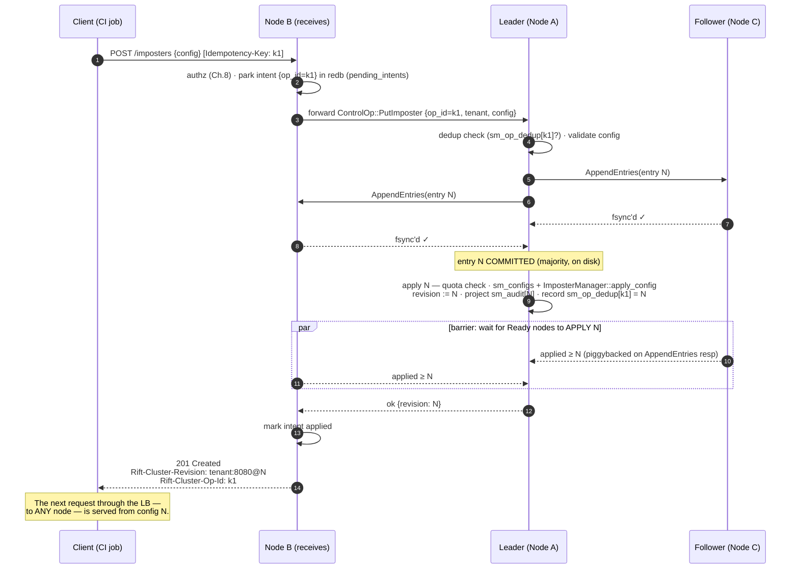

# Chapter 4 — The Write Path

The life of an admin request: `POST /imposters`, `PUT .../stubs/by-id/:id`,
`POST .../disable`, a proxy-mode recording appending a captured stub, a tenant
being created. This path carries three of the four load-bearing requirements —
R1 (servable everywhere at ack time), R3 (durable), R4 (never lost) — so it is
specified end-to-end, including every way it can fail.

## The happy path

The steps that make the guarantees:

- **Step 2 — park before forward.** The accepting node durably records the
  intent *before* anything else happens. From this moment the request cannot be
  lost: whatever dies downstream, some disk knows the client asked (R4).
- **Steps 5–7 — commit means fsync'd on a majority.** Not "in memory on a
  majority". A full-cluster power loss after commit replays the entry on
  restart (R3).
- **Step 8 — validation precedes append; apply cannot fail.** A config the
  fleet would reject never enters the log; a config in the log lands on every
  node deterministically. Apply uses upstream `apply_config` (#316) — the
  order-aware, incremental reconciler — so applying config for port 8080 never
  disturbs port 8081's scenario state, cursors, or recorded requests.
- **Steps 9–10 — the read-after-write barrier.** Raft's commit guarantees
  durability, not that follower state machines have *applied*. The barrier
  closes exactly that gap: the leader waits until every **Ready** node reports
  applied-index ≥ N. Joining/not-Ready nodes are excluded — they are not behind
  the LB yet, so they cannot violate R1.
- **Step 12 — the response carries proof.** `Rift-Cluster-Revision` is the log
  index: monotone, fleet-wide, comparable. `GET /_cluster/config` reports every
  node's applied revision against it.

Cost accounting: one forward hop, one Raft round (parallel fsyncs), one apply
wait. Single-digit milliseconds on a LAN — on a path exercised at human/CI
frequency.

## Exactly-once effect: op-ids and the dedup map

Retries are the norm in CI, and **stub-append is not idempotent by content**
(`POST .../stubs` twice = the stub twice, matching first-wins semantics
corrupted silently). Hence op-ids, end to end:

- Every mutation carries an `op_id` — client-supplied via `Idempotency-Key`, or
  minted by the accepting node and returned in `Rift-Cluster-Op-Id`.
- The leader consults `sm_op_dedup` *inside the state machine* — the map is
  itself replicated and durable, so dedup survives leader failover and
  full restart. A replayed op returns its recorded outcome (including the
  original revision), applying nothing.
- Entries GC after 24 h; a retry older than that is a new operation
  (documented; retention configurable).

The same apply step also **projects the entry into `sm_audit`** (Chapter 8) — one
row per committed write, derived from the entry rather than recorded by the
handler, and placed *below* the dedup short-circuit so a replay adds no second
row. Because it is derived at apply, every replica computes the identical row and
`GET /admin/audit` needs no fan-out.

**Quotas are checked at this step too, not before the append.** A refusal is
therefore a *committed* decision: it lands in the log as
`ControlOutcome::Failed { reason }` at a revision, identical on every node, and a
write that was parked during an outage discovers it through
`GET /_cluster/ops/:id` on replay rather than at submit time. See Chapter 8,
"What T4 ships".

## Every failure mode, and what the client sees

| Failure | Behavior | Client sees |
|---|---|---|
| Accepting node dies **before parking** | Nothing happened anywhere | Connection error; safe to retry blind |
| Accepting node dies **after parking, before forward** | On restart, its recovery loop replays pending intents to the current leader; dedup makes replay exactly-once | Connection error; retry with same key is safe, or query op-id later |
| Leader dies **before commit** | Entry never committed; new leader elected ≤ ~3 s; accepting node's forward retries against new leader | Slightly slower 2xx |
| Leader dies **after commit, before responding** | Entry is committed — new leader has it; accepting node retries, dedup returns recorded outcome | Slightly slower 2xx, same revision |
| A Ready follower is slow/wedged during barrier | Barrier caps at `--cluster-write-barrier-timeout` (2 s) | `201` + `Rift-Cluster-Warnings: unapplied=nodeC` — success with a named asterisk |
| **The answering node's own apply is slow, under `barrier=none`** | Same cap; the node then renders what it can actually read | Usually `201`. If the apply still has not landed, the re-read's real status (a `404`) + `Rift-Cluster-Warnings: unapplied=<this node>` — **a non-2xx here is not proof the write failed**: it committed, and `Rift-Cluster-Revision` names it. Poll `GET /_cluster/ops/:op_id` to settle it |
| **No quorum reachable** (minority side of a partition) | Intent stays parked; replay fires on leader-change/heal | `503` + `Retry-After` + `Rift-Cluster-Op-Id` — *"durably queued, will converge; poll GET /_cluster/ops/:id or retry with the same key"* |
| Duplicate delivery (client retry + intent replay race) | Both hit the same dedup entry | One application, both callers get revision N |

Two client-facing conveniences round this out: `GET /_cluster/ops/:op_id` →
`{state: pending | applied | failed, revision?, detail?}` lets a CI step wait
for its own write deterministically; `--cluster-admin-async` flips the API to
`202 Accepted + op-id` for bulk provisioning that would rather poll than block.

## The barrier's escape hatches — and the net under them

`--cluster-write-barrier=none` exists for mass-provisioning bursts that will
poll convergence themselves. It drops the *fleet* barrier, not local coherence:
the answering node still waits for its own apply, because it renders a create by
re-reading what it just committed and would otherwise answer `404` for a write it
durably holds (#99). "Read-your-write here" rather than "read-your-write
anywhere" — never "no read-your-write at all". For that mode, for
barrier-timeout stragglers, and
for any window not yet imagined, the data plane carries a **pull-on-miss safety
net**: when a mock request finds no imposter/no matching stub *and* the node's
applied index trails the leader commit index it last heard, the node waits for
apply (≤ 500 ms) and retries the match once before answering. It triggers only
on requests that were about to fail anyway — zero cost on the hot path, and it
converts "404 because I'm 200 ms behind" into a correct answer.

## Writes that are not config

The same path carries `SetEnabled` (pause/resume — a first-class op precisely
because it must replicate and survive restart, issue #15), tenancy ops
(Chapter 8), and proxy-recorded stubs (a recording is a `PatchStubs` append —
recording already waits on an upstream call, so a Raft round is noise).

What does **not** go through Raft: scenario-state writes from the admin API
(`PUT .../scenarios/:name/state`, reset) — those are *flow state*, routed to
the flow owner like any data-plane transition (Chapter 6). The rule of thumb:
**Raft carries what you'd expect to survive a restart; the ownership ring
carries what a running test mutates.** The one deliberate exception is
`enabled`, which looks runtime-ish but is an operator decision that must
outlive both restarts and node boundaries — so it is config.
