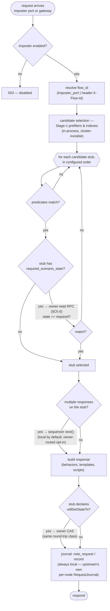
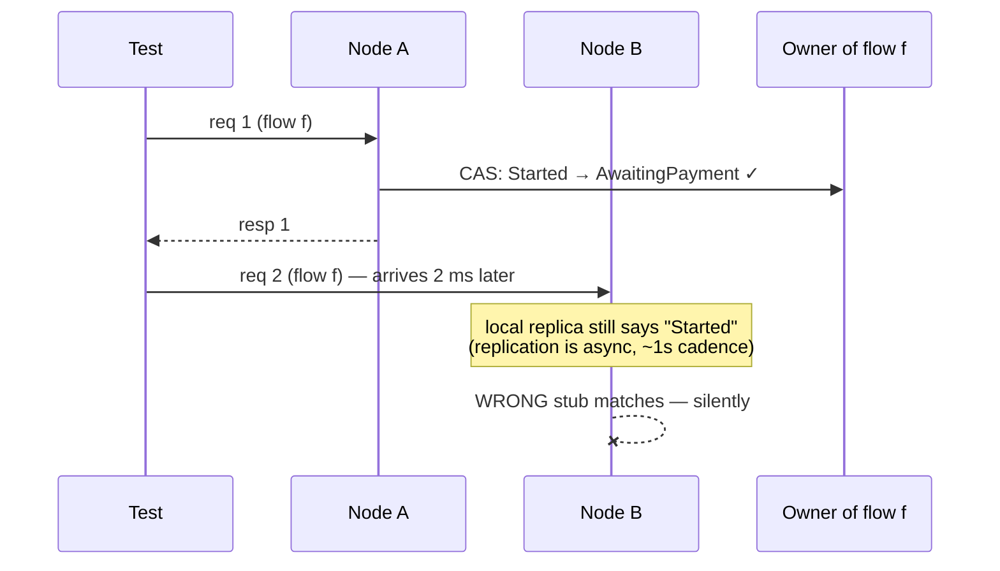
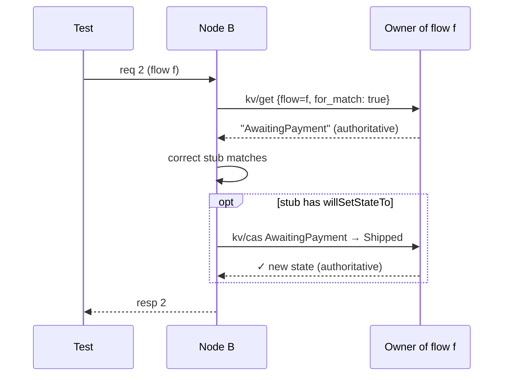

# Chapter 5 — The Read Path

The life of a mock request: a system-under-test calls what it believes is a
real service, and some node in the fleet must answer exactly as the configured
imposter dictates — including the stateful features, no matter which node the
load balancer picked. This chapter walks the request anatomy and pins down
precisely where the cluster does and does not appear.

## Anatomy of a request

Three zones, three cost profiles:

1. **The stateless zone** — everything from candidate selection through
   response building for stubs with no scenario/sequence features. This is
   unmodified open-source engine code running entirely in-process: the
   prefilter indexes, predicate evaluation, behaviors, templating, scripting.
   The cluster does not exist here. This is why the throughput story survives
   clustering, and it is protected by a standing benchmark gate (≤ 2%
   regression with clustering compiled in).
2. **The owner zone** — the scenario match gate, scenario transitions, flow-KV
   reads/writes from scripts, and (Phase 4+) sequence advances. Each such
   operation is **one LAN RPC to the key's owner** unless this node *is* the
   owner. Chapter 6 is entirely about this zone.
3. **The local-append zone** — request journaling and counters. Always local,
   never blocking on any other node — and never merged either: recording is
   upstream Rift's own `RequestJournal`, so what a node records is what that
   node answers with (D-74).

## Why the scenario gate must read through the owner

The single most important correctness decision on the read path. A scenario
stub matches only if the flow's FSM state equals `required_scenario_state`.
Consider the classic two-request race with the state read from a *local
replica*:

Request 2 matching the "Started" stub is not an error anyone sees — it is a
*wrong mock response*, the one failure class a verification tool must never
produce. So the gate reads through the owner, always:

Match-and-transition costs one round-trip each, `owner == self` short-circuits
to memory, and — the point of Chapter 2's affinity discussion — **this is
correct under any load balancer whatsoever**, including plain round-robin.
The same rule now extends to script-visible reads (`flow_store:get`): by
default they are owner-authoritative too, because scripts drive response
content off that state; imposters that prefer speed over freshness opt out
per-imposter with `readConsistency: "local"` (issue #16). Correct by default,
fast by choice.

## What the node does when the owner is gone

The read path never hangs and never guesses (defaults; the per-imposter
`readConsistency: "local"` override is a contract the imposter opted into, not a
degradation, and stamps no header — the flow store is reached through
`spawn_blocking`, which the response-annotation scope does not cross; full
table in Chapter 9):

- **Fast-fail**: if the owner is already marked unhealthy by local RPC health
  tracking, the op resolves immediately — no burning the 2 s timeout per
  request.
- **Reject-by-default**: a scenario-gated request whose owner is unreachable
  answers `503` with the standard error envelope — loudly wrong-side-up rather
  than quietly wrong.
- **The bridge protects the stateless zone**: owner RPCs issued from sync
  engine code park on a bounded bridge (semaphore `max(2, workers/2)`); when an
  owner black-holes, excess stateful ops shed immediately and *stateless*
  traffic keeps flowing at full speed (chaos scenario C13 — Chapter 12, not yet
  built — specifies p99 < 5 ms through an owner loss).
- **The owner refuses itself**: the case this section's title does not cover.
  An owner that cannot see a quorum reports `is_isolated()` and declines its own
  owner-side reads rather than answering from a copy a healed majority may
  already disagree with (D-17, the isolated-owner rule, Chapter 6). It applies
  to the local owner branch and to a forwarded owner-read alike, and the refusal
  is `RpcError::Unavailable` — which the store carries out as
  `BackendUnavailable`, so it reaches the caller as the same `503` an
  unreachable owner produces, for a different reason (D-65). `local` reads never
  enter that branch and stay available (D-10).

> **Amended by D-65** (2026-08-28, #522): the sentence above was true of the cluster port
> only until #522 — on the data plane the store flattened the typed error and both cases
> answered 500. It now holds on the scenario paths (match gate, transition, debug preview);
> the template and script doors erase the type upstream and still answer as they did
> (Chapter 9, the paragraph under the degradation table).

## Admin reads

> **Amended by D-74** (2026-09-08): verification reads are no longer cluster-merged. `GET
> /imposters/:port/requests`, its `savedRequests` spelling and `numberOfRequests` answer for the
> node the read reached, and the request-anatomy diagram and the local-append zone above are
> amended with them. One data-plane consequence rides along (D-74's amendment): retention. Each
> node now retains upstream's `MAX_RECORDED_REQUESTS = 10_000` entries per port rather than a
> `max(10_000 / voter_count, 500)` share of a merged cap, and — the larger change — the shard's
> second retention dimension is gone: it also dropped entries older than `DEFAULT_MAX_AGE = 600 s`,
> where upstream's journal evicts by count alone, so a long-lived imposter's recordings are now
> unbounded in time. What *has not* changed is the replace: a wholesale replace of an imposter
> still drops that port's recorded requests on every node, because upstream's
> `delete_imposter_inner` cleared an injected journal too — the mechanism moved into the core, the
> behaviour did not. There is no `PUT /imposters/:port` route (`ImposterRoute::Root` dispatches
> `GET` and `DELETE` only); the write with those semantics is the collection
> `PUT /imposters` (`Terminated::ReplaceAllImposters` → `apply_config`), which replaces a port only
> on an imposter-level field change other than `enabled` or on a degenerate stub diff, and
> otherwise patches the stub set in place and keeps the journal.

`GET /imposters`, `GET .../stubs` read the local applied state machine — every
node serves them, consistent at its applied revision, comparable fleet-wide via
the revision header and `/_cluster/config`. Verification reads are ordinary
proxied reads to that node's own engine: `GET /imposters/:port/requests` (and
`savedRequests`) is upstream's per-imposter journal, `?since=` is upstream's own
scalar cursor with upstream's `x-rift-next-index` / `x-rift-truncated` headers,
and `numberOfRequests` on `GET /imposters` and `GET /imposters/:port` is **this
node's own count** — not a fleet sum. Nothing decorates or terminates them, so
a client reading through the cluster front sees exactly what it would reading
the node's engine directly. A test that needs the fleet's answer pins a node or
reads all of them (RFC-007 §3.3).

That makes the node the read reached the unit of every verification answer, which is why cluster
introspection matters more here, not less: `/_cluster/members`, `/_cluster/config`, and
`GET /imposters/{port}/spaces/{flowId}` (which names the flow's owning node) exist precisely so
that "why did this request match that stub on that node" is always answerable from the outside.
