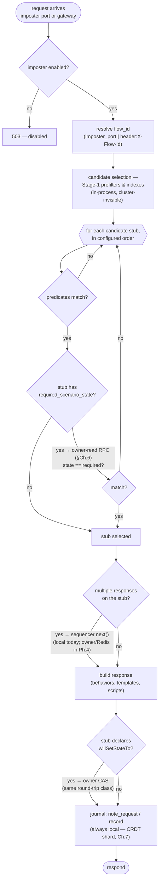
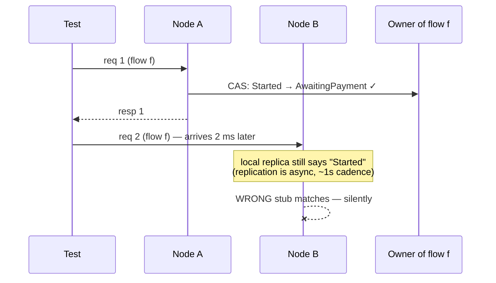
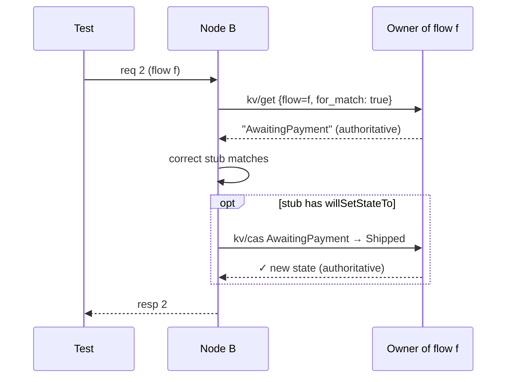

# Chapter 5 — The Read Path

The life of a mock request: a system-under-test calls what it believes is a
real service, and some node in the fleet must answer exactly as the configured
imposter dictates — including the stateful features, no matter which node the
load balancer picked. This chapter walks the request anatomy and pins down
precisely where the cluster does and does not appear.

## Anatomy of a request

Three zones, three cost profiles:

1. **The stateless zone** — everything from candidate selection through
   response building for stubs with no scenario/sequence features. This is
   unmodified open-source engine code running entirely in-process: the
   prefilter indexes, predicate evaluation, behaviors, templating, scripting.
   The cluster does not exist here. This is why the throughput story survives
   clustering, and it is protected by a standing benchmark gate (≤ 2%
   regression with clustering compiled in).
2. **The owner zone** — the scenario match gate, scenario transitions, flow-KV
   reads/writes from scripts, and (Phase 4+) sequence advances. Each such
   operation is **one LAN RPC to the key's owner** unless this node *is* the
   owner. Chapter 6 is entirely about this zone.
3. **The local-append zone** — request journaling and counters. Always local,
   never blocking on any other node; merged at *read* time instead (Chapter 7).

## Why the scenario gate must read through the owner

The single most important correctness decision on the read path. A scenario
stub matches only if the flow's FSM state equals `required_scenario_state`.
Consider the classic two-request race with the state read from a *local
replica*:

Request 2 matching the "Started" stub is not an error anyone sees — it is a
*wrong mock response*, the one failure class a verification tool must never
produce. So the gate reads through the owner, always:

Match-and-transition costs one round-trip each, `owner == self` short-circuits
to memory, and — the point of Chapter 2's affinity discussion — **this is
correct under any load balancer whatsoever**, including plain round-robin.
The same rule now extends to script-visible reads (`flow_store:get`): by
default they are owner-authoritative too, because scripts drive response
content off that state; imposters that prefer speed over freshness opt out
per-imposter with `readConsistency: "local"` (issue #16). Correct by default,
fast by choice.

## What the node does when the owner is gone

The read path never hangs and never guesses (defaults; the per-imposter
`readConsistency: "local"` override is a contract the imposter opted into, not a
degradation, and stamps no header — the flow store is reached through
`spawn_blocking`, which the response-annotation scope does not cross; full
table in Chapter 9):

- **Fast-fail**: if the owner is already marked unhealthy by local RPC health
  tracking, the op resolves immediately — no burning the 2 s timeout per
  request.
- **Reject-by-default**: a scenario-gated request whose owner is unreachable
  answers `503` with the standard error envelope — loudly wrong-side-up rather
  than quietly wrong.
- **The bridge protects the stateless zone**: owner RPCs issued from sync
  engine code park on a bounded bridge (semaphore `max(2, workers/2)`); when an
  owner black-holes, excess stateful ops shed immediately and *stateless*
  traffic keeps flowing at full speed (chaos scenario C13 — Chapter 12, not yet
  built — specifies p99 < 5 ms through an owner loss).

## Admin reads

`GET /imposters`, `GET .../stubs` read the local applied state machine — every
node serves them, consistent at its applied revision, comparable fleet-wide via
the revision header and `/_cluster/config`. Verification reads
(`savedRequests`, counts) are the cluster-merged reads of Chapter 7. Cluster
introspection (`/_cluster/members`, `/_cluster/config`, and
`GET /imposters/{port}/spaces/{flowId}`, which names the flow's owning node)
exists precisely so that "why did this request match that stub on that node" is
always answerable from the outside.
