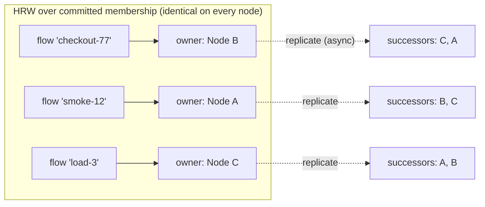

# Chapter 6 — Flow State: Ownership, Replication, Durability

Flow state is the per-`flow_id` key-value store behind scenarios (the FSM the
match gate reads), script state (`flow_store:get/set/incr`), and space-scoped
test data. It is the state R2 is about — *the next request must see the exact
state, whichever node serves it* — and, since the durability requirement
landed, also R3 state: it must survive a full-cluster restart. It is the one
subsystem that is both correctness-critical **and** on the request path, which
is why it gets its own machinery instead of riding the Raft log: a quorum
round per scenario transition at 20–40k RPS is not a design, it's an outage.

## What a flow id names: the context scope

Before ownership is computed, the id has to mean something unambiguous — and a
raw flow id does not. `flowIdSource: "header:X-Session"` makes the *client*
choose the id, so two imposters reading the same header hand this subsystem the
same string while meaning two different contexts. Single-node Rift never has to
answer that question: each imposter owns a separate store instance, so the
boundary is a consequence of the object graph. One `FlowNet` backs every
imposter on a clustered node, so here the boundary has to be drawn explicitly.

It is drawn at the **store face**, in `ClusteredFlowStore`: every id crossing it
is prefixed with the imposter's namespace, rendered once when the provider builds
the store from `ContextScope` (`_rift.flowState.contextScope`) and the port.

| Scope | Prefix | Meaning |
|---|---|---|
| `imposter` (default) | `i<port>:` | Per-imposter namespace — the single-node semantics, restored |
| `fleet` | `f:` | One namespace fleet-wide — imposters deliberately share contexts |

Two properties make this the right seam:

- **Everything below it is unchanged.** Shard tables, the ownership ring,
  replication, anti-entropy, adoption markers and the admin `flow_get`/`flow_set`
  routes all consume whatever id the store hands them. Scoping once, above them,
  covers every path uniformly and leaves none of them needing to know the
  concept exists. A prefix that had to be understood at shard level would be a
  sign it was applied too deep.
- **The namespaces are disjoint by construction.** `fleet` carries `f:` rather
  than passing ids through bare, so a caller-chosen id that happens to look like
  `i6400:cart` still cannot address imposter 6400's `cart`.

It also settles a limitation the durable tier records below: a repair path could
not previously tell which imposter a `flow_id` belonged to. Now the id says.

Scope is per-imposter and not a cluster-wide setting, because it is a property
of what an imposter's contexts *mean* — the same reason `readConsistency` is
per-imposter. See `docs/rift-cluster-server.md` for the knob, the behaviour change it
represents, and the upgrade note (old ids are orphaned, TTL-bounded, with no
dual-read path).

## Single-writer by placement: the ownership ring

Every flow key has **exactly one authoritative owner node** at any moment,
computed — not negotiated — by rendezvous (HRW) hashing:

```
owner(flow_id) = argmax over Ready nodes n of xxhash64(n.node_id, flow_id)
```

The input roster is the **committed membership from the Raft state machine**
(Chapter 3), evaluated at this node's applied index. That provenance is the
entire trick: because membership changes are totally ordered log entries, any
two nodes at the same applied index compute identical owners for every key —
there is nothing to gossip, no epoch to compare, no settle window to wait out.
Ownership *transfer* is not a protocol; it is a deterministic consequence of a
committed membership entry, taking effect at that entry's index (`m_idx`).



The owner holds the authoritative copy and serializes all writes and all
correctness-bearing reads (Chapter 5). Every accepted write is pushed
asynchronously to the key's **two HRW successors** (fire-and-forget, backed by
a 5 s anti-entropy pull) — replication exists for *handoff continuity and
durability spread*, not for read scaling.

## Versioning and fencing

Every value carries `(m_idx, v, origin)`:

- `m_idx` — the membership log index under which the writing owner held
  ownership. Assigned by consensus, so a *deposed* owner's writes are fenced
  arithmetically: replicas and adopters take the highest `(m_idx, v, origin)`,
  and anything written under a superseded membership loses deterministically.
- `v` — the owner's per-key write counter; `origin` — the writer's node id,
  breaking exact ties.

And the rule that closes the classic split-brain window — an old owner,
partitioned away, that hasn't yet applied the membership change that deposed
it — is enforced at the *owner*, not assumed at callers:

> **Isolated-owner rule.** A node that has not heard a leader heartbeat within
> 3× the election timeout marks itself *isolated* and rejects owner-side
> stateful operations (per the Chapter 9 degradation table). A new owner, by
> definition, is on the quorum side and has applied the deposing entry. The
> two serving windows cannot overlap by more than the heartbeat bound, and the
> fencing tuple mops up anything written inside it.

## Ownership handoff

```mermaid
sequenceDiagram
    participant L as Raft leader
    participant B as Node B (dies)
    participant C as Node C (new owner)
    participant A as Node A (replica)

    Note over B: owner of flow f, replicating to C, A
    B--xB: crash
    L->>L: commit membership entry M: B removed
    Note over C: applies M → ring says: I own f (as of m_idx=M)
    C->>A: pull range for f — highest (m_idx, v, origin)
    A-->>C: f = ("AwaitingPayment", M-1, 42, B)
    Note over C: adopt; staleness ≤ one replication round (~1s)<br/>behind B's final accepted write
    C->>C: serve f — writes now carry m_idx = M
```

Per-state-type handoff semantics (unchanged from RFC v2, restated with the new
fencing):

| State | On ownership change | Rationale |
|---|---|---|
| Scenario FSM / flow KV | **Adopt** highest `(m_idx, v, origin)` from replicas/disk | ≤ 1 replication round staleness; adopt-found-nothing ⇒ FSM restarts, response stamped `Rift-Cluster-Degraded: kv-adopt`, counted — bounded and visible, never silent |
| Sequence cursors | **Reset** | Deliberate (D-8): replicating every advance puts a network write on the hottest stateful path for test-run-scoped data. A mid-test membership change may restart sequences; documented |
| proxyOnce | `Recorded` adopts (replicated); `Pending` dies with the owner → re-claim | Duplicate-upstream bound: 1 + ownership changes in flight (Chapter 7) |
| Journal / counters | No owner — nothing to hand off | CRDT merge-on-read (Chapter 7) |

Graceful leave tightens the loop: the leaver pushes final values to successors
*before* the membership entry commits, so planned restarts hand off with zero
staleness (Chapter 3's lifecycle).

## The durable tier

R3 extended durability to flow state; the mechanism keeps disk off the
per-operation critical path by default. Each node runs a `FlowShard` — an
embedded `redb` store (a `flow.redb` file beside, deliberately not inside, the
control-plane store, so the two fsync policies never contend) holding every
key the node **owns or replicates**. Since each key already lives on three
nodes, it lands on three disks with no new replication machinery:

```
flow_kv:   (flow_id, key) → { m_idx, v, origin, expires_at, value }
flow_meta: flow_id        → { last_touch, entry_count }     // TTL + LRU sweeps
```

Per-imposter durability knob (`_rift.flowState.durability`), mapping 1:1 onto
`redb`'s per-commit durability levels:

| Level | Mechanism | Loss window on full-cluster crash |
|---|---|---|
| `sync` | `Immediate` (fsync) commit before the CAS acks | **zero** |
| `async` (default) | ordered non-fsync commits + one group fsync per interval (default 50 ms) | ≤ one interval — and only if **all three** holders die inside it |
| `none` | memory only, disk bypassed | everything (explicitly opted: throwaway CI imposters) |

A single writer task per node batches mutations; a `sync` op in a batch
escalates that batch's commit. Hot-path cost at `async`: one channel send.
Recovery: reopen `redb`, drop expired entries, serve as a replica source;
adoption pulls from recovered disk state exactly as it would from live memory
— restart is just a very long partition, handled by machinery that already
exists.

Bounds that keep the tier honest: per-flow TTL (default 1 h), 100k entries per
node with whole-flow LRU shedding (never single keys — a half-evicted scenario
would be torn state), both counted in metrics.

### Reading the knobs back (#370)

`durability`, `readConsistency` and `flowIdSource` are readable on `GET
/imposters/:port`, as `_rift.flowStateResolved`, each carrying **whether this
imposter set it or inherited the default**. The distinction is the point: a
control that cannot tell "the default happens to be this" from "someone chose
this" invites an operator to go and change the wrong one — and for these knobs
there is nothing else to change, because the defaults are compiled in rather
than fleet configuration.

So provenance is presence of the key, never equality with the default value.
An imposter pinning `durability: "async"` reads as `set`.

The first two are published there or nowhere: upstream's `_rift.flowState` is
an allowlist that omits them (`flowState.redis` can hold a credentialed URL, so
unknown keys are excluded rather than leaked), and the EE front decorates the
read from the parsed knobs — never from the stored document, which is what
keeps that redaction intact. `contextScope` is not included; it arrives with
#288.

## The strict escape hatch

For customers whose requirements exceed AP-with-bounded-windows — strict
sequencing, exactly-once proxy recording, zero adoption staleness — the same
seams accept **Redis-backed implementations** (cluster, Phases 4–5): the
external store becomes the single writer and the windows above collapse to
Redis's own guarantees. Zero-dependency by default, external store by choice;
the trait boundary makes the swap invisible to imposter configs.
