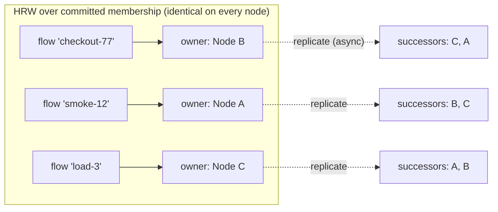
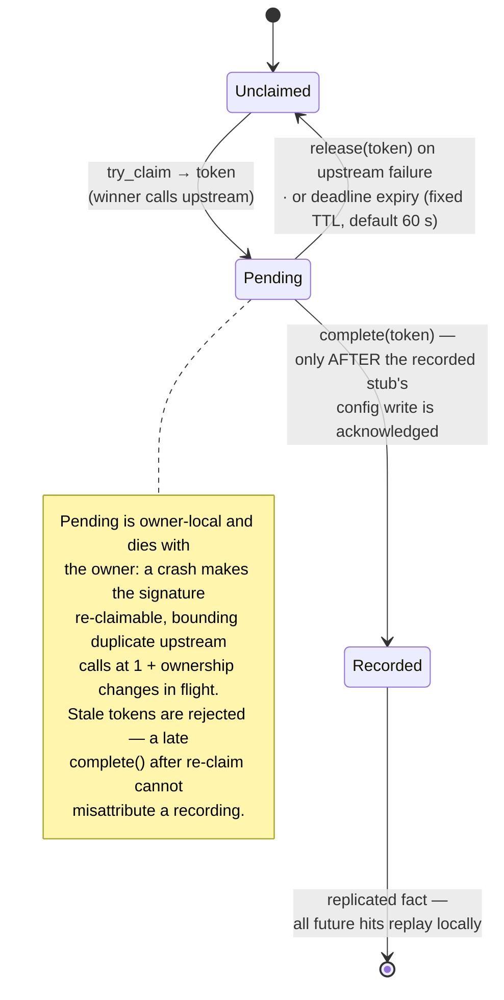

# Chapter 6 — Flow State: Ownership, Replication, Durability

Flow state is the per-`flow_id` key-value store behind scenarios (the FSM the
match gate reads), script state (`flow_store:get/set/incr`), and space-scoped
test data. It is the state R2 is about — *the next request must see the exact
state, whichever node serves it* — and, since the durability requirement
landed, also R3 state: it must survive a full-cluster restart. It is the one
subsystem that is both correctness-critical **and** on the request path, which
is why it gets its own machinery instead of riding the Raft log: a quorum
round per scenario transition at 20–40k RPS is not a design, it's an outage.

## What a flow id names: the context scope

Before ownership is computed, the id has to mean something unambiguous — and a
raw flow id does not. `flowIdSource: "header:X-Session"` makes the *client*
choose the id, so two imposters reading the same header hand this subsystem the
same string while meaning two different contexts. Single-node Rift never has to
answer that question: each imposter owns a separate store instance, so the
boundary is a consequence of the object graph. One `FlowNet` backs every
imposter on a clustered node, so here the boundary has to be drawn explicitly.

It is drawn at the **store face**, in `ClusteredFlowStore`: every id crossing it
is prefixed with the imposter's namespace, rendered once when the provider builds
the store from `ContextScope` (`_rift.flowState.contextScope`) and the port.

| Scope | Prefix | Meaning |
|---|---|---|
| `imposter` (default) | `i<port>:` | Per-imposter namespace — the single-node semantics, restored |
| `fleet` | `f:` | One namespace fleet-wide — imposters deliberately share contexts |

> **Amended by D-73** (RFC-007 §3.2, #550): the third scope, `tenant` (`t<tenant>:`), left with
> tenancy. A config declaring it is **refused at admission by name**, with a `400` citing #550 and
> the two values that remain — never aliased to either, because folding it into one would change
> which imposters share flow state without saying so. `fleet` is no longer gated by a role either:
> there is one administrator, so there is no boundary for a fleet-wide namespace to cross.

Two properties make this the right seam:

- **Everything below it is unchanged.** Shard tables, the ownership ring,
  replication, anti-entropy, adoption markers and the admin `flow_get`/`flow_set`
  routes all consume whatever id the store hands them. Scoping once, above them,
  covers every path uniformly and leaves none of them needing to know the
  concept exists. A prefix that had to be understood at shard level would be a
  sign it was applied too deep.
- **The namespaces are disjoint by construction.** `fleet` carries `f:` rather
  than passing ids through bare, so a caller-chosen id that happens to look like
  `i6400:cart` still cannot address imposter 6400's `cart`.

`f:` is disjoint from `i<port>:`, but it names no narrower owner: the prefix
carries nothing but the tag, and one `FlowNet` shard serves every imposter on a
node. So every imposter that opts into `fleet` shares one namespace and can read
or overwrite another's flow state by naming the same id. That is inherent to what
`fleet` means — a fleet-wide namespace by design — and it is why `imposter` is
the default. Choosing `fleet` is a deliberate act by the one administrator; it
used to require a `FleetAdmin` role, which stopped meaning anything when there
stopped being roles (#550).

`GET /imposters/{port}/spaces` (issue #374) therefore **serves** a fleet-scoped
imposter's listing. It used to refuse one with `unavailable: "fleet-scope"`,
because scanning `f:` would have handed one tenant another tenant's flow ids,
entry counts and owning nodes — a real concern that no longer has a subject.
The one refusal that remains is `scope-unresolved`: an imposter whose own config
cannot be read or parsed has an unknown namespace, and guessing would risk
scanning the wrong one and reporting it complete.

It also settles a limitation the durable tier records below: a repair path could
not previously tell which imposter a `flow_id` belonged to. Now the id says.

The prefix is also what makes an imposter's state *deletable* (#565, the D-5
amendment). Single-node Rift drops an imposter's store instance with the
imposter; here every imposter on a node shares one `FlowNet`, so a deleted
imposter's state would otherwise sit in the shard until its TTL and greet an
identically re-created imposter with yesterday's scenario. So a committed
`DeleteImposter` / `DeleteAll` drops the port's `i<port>:` namespace on **every
node**, from the state machine's apply loop — the same per-node, once-per-entry
discipline as the config reconcile, so it also covers a delete replayed on join
or installed by a snapshot; a cold-start reconcile additionally sweeps any
`i<port>:` namespace the committed configs no longer name, for a delete that
committed while the node was down. `f:` and `t<tenant>:` are not any one
imposter's and are never dropped by a delete, and a config change on the port
(a `PutImposter`) is not a delete and keeps the state.

Scope is per-imposter and not a cluster-wide setting, because it is a property
of what an imposter's contexts *mean* — the same reason `readConsistency` is
per-imposter. See `docs/rift-cluster-server.md` for the knob, the behaviour change it
represents, and the upgrade note (old ids are orphaned, TTL-bounded, with no
dual-read path).

## Single-writer by placement: the ownership ring

Every flow key has **exactly one authoritative owner node** at any moment,
computed — not negotiated — by rendezvous (HRW) hashing:

```
owner(flow_id) = argmax over Ready nodes n of xxhash64(n.node_id, flow_id)
```

The input roster is the **committed membership from the Raft state machine**
(Chapter 3), evaluated at this node's applied index. That provenance is the
entire trick: because membership changes are totally ordered log entries, any
two nodes at the same applied index compute identical owners for every key —
there is nothing to gossip, no epoch to compare, no settle window to wait out.
Ownership *transfer* is not a protocol; it is a deterministic consequence of a
committed membership entry, taking effect at that entry's index (`m_idx`).



The owner holds the authoritative copy and serializes all writes and all
correctness-bearing reads (Chapter 5). Every accepted write is pushed
asynchronously to the key's **two HRW successors** (fire-and-forget, backed by
a 5 s anti-entropy pull) — replication exists for *handoff continuity and
durability spread*, not for read scaling.

## Versioning and fencing

The **isolated-owner rule** is what keeps that tuple from having to do the whole job. A node whose
Raft metrics show no current leader — or which is leader but has not been acknowledged by a quorum
within `3 × election_timeout` — reports `is_isolated()` and refuses the owner-side flow
operations that serve or mutate a **key**: `owner_write` (re-checked under the write lock, since
the call that first observes a partition is otherwise the one that proceeds), the owner branch of
a `strong` read, and the forwarded-read route all return an error naming isolation (D-17, #465).
The aggregate-metadata routes (`spaces`, `counts`) are deliberately left to their existing `m_idx`
divergence gate: they report shape rather than serve values, and a caller already marks a
divergent peer's contribution `partial`. Fencing then reconciles only the writes that were
actually allowed to happen, instead of a minority-side divergence that ran for the length of a
partition. The consequence worth stating plainly is broader than a partition. `is_isolated()` reports
`true` for **any** node whose `current_leader` is `None` — not only for a leader that has lost its
quorum lease — and a node clears `current_leader` as soon as it stops hearing the leader and
campaigns. So an ordinary **leader election** makes every node that has lost sight of the leader
refuse owner-side flow writes and `strong` reads until the new leader is established, whichever
node owns the flow. Measured, that pause is **~13–40 ms** per node per election (13–31 ms on the #472 probe,
32–40 ms re-measured on other hardware) — the election round trip plus the new leader's first
quorum-ack, because `current_leader` is `None` exactly while a node's vote is uncommitted (#472). It is *not* the sub-second-to-1–3 s this chapter previously stated, which was
reasoned from the election timeout rather than measured. Two graces sit in front of it and are
asymmetric: a **follower** does not report isolated until **450–600 ms** after it last heard the
leader (openraft campaigns only after `leader_lease + rand(election_timeout_min..max)`), while a
**leader** has **900 ms** from its last quorum ack (`ISOLATION_WINDOW_MS`). A split vote adds one
150–300 ms round.

That is stricter than this rule's own wording — "has not heard a leader heartbeat within
`3 × election_timeout`" would ride out a routine election, whereas the primitive fails closed the
moment the leader is unknown. Strict is the safe direction and is what ships; whether the flow
path should instead take the looser grace, so that a routine election costs the 20–40k RPS data
path nothing, is #472. A `local` read is untouched either way: the imposter opted into replica
staleness (D-10), and that contract is not silently revoked by this rule.

Every value carries `(m_idx, v, origin)`:

- `m_idx` — the membership log index under which the writing owner held
  ownership. Assigned by consensus, so a *deposed* owner's writes are fenced
  arithmetically: replicas and adopters take the highest `(m_idx, v, origin)`,
  and anything written under a superseded membership loses deterministically.
- `v` — the owner's per-key write counter; `origin` — the writer's node id,
  breaking exact ties.

And the rule that closes the classic split-brain window — an old owner,
partitioned away, that hasn't yet applied the membership change that deposed
it — is enforced at the *owner*, not assumed at callers:

> **Isolated-owner rule.** A node that has not heard a leader heartbeat within
> 3× the election timeout marks itself *isolated* and rejects owner-side
> stateful operations (per the Chapter 9 degradation table). A new owner, by
> definition, is on the quorum side and has applied the deposing entry. The
> two serving windows cannot overlap by more than the heartbeat bound, and the
> fencing tuple mops up anything written inside it.

## Ownership handoff

```mermaid
sequenceDiagram
    participant L as Raft leader
    participant B as Node B (dies)
    participant C as Node C (new owner)
    participant A as Node A (replica)

    Note over B: owner of flow f, replicating to C, A
    B--xB: crash
    L->>L: commit membership entry M: B removed
    Note over C: applies M → ring says: I own f (as of m_idx=M)
    C->>A: pull range for f — highest (m_idx, v, origin)
    A-->>C: f = ("AwaitingPayment", M-1, 42, B)
    Note over C: adopt; staleness ≤ one replication round (~1s)<br/>behind B's final accepted write
    C->>C: serve f — writes now carry m_idx = M
```

Per-state-type handoff semantics (unchanged from RFC v2, restated with the new
fencing):

| State | On ownership change | Rationale |
|---|---|---|
| Scenario FSM / flow KV | **Adopt** highest `(m_idx, v, origin)` from replicas/disk | ≤ 1 replication round staleness; adopt-found-nothing ⇒ FSM restarts, and a takeover that could not verify against any replica is named in a `warn` line — no response header, because the store is reached through `spawn_blocking`, which the annotation scope does not cross; bounded and visible, never silent |
| Sequence cursors | **Reset** | Deliberate (D-8): replicating every advance puts a network write on the hottest stateful path for test-run-scoped data. A mid-test membership change may restart sequences; documented. *Not yet built:* no clustered sequencer exists — cursors are node-local (`LocalSequencer`) today, so there is nothing to hand off |
| proxyOnce | `Recorded` adopts (replicated); `Pending` dies with the owner → re-claim | Duplicate-upstream bound: 1 + ownership changes in flight (the proxyOnce section at the end of this chapter). That is now the bound on *upstream calls* too, not just recordings: a claim the cluster cannot serialize is refused `503` rather than forwarded (D-66), so an outage no longer adds a call per request |

Graceful leave adds no separate flush: every accepted write was already pushed
to the successors when it was applied, so a planned restart hands off with at
most the in-flight pushes outstanding (Chapter 3's lifecycle).

## The durable tier

R3 extended durability to flow state; the mechanism keeps disk off the
per-operation critical path by default. Each node runs a `FlowShard` — an
embedded `redb` store (a `flow.redb` file beside, deliberately not inside, the
control-plane store, so the two fsync policies never contend) holding every
key the node **owns or replicates**. Since each key already lives on three
nodes, it lands on three disks with no new replication machinery:

```
flow_kv:   (flow_id, key) → { m_idx, v, origin, expires_at, value }
flow_meta: flow_id        → { last_touch }                  // TTL + LRU sweeps
```

`flow_meta` carries `last_touch` and nothing else: TTL and LRU both order by it, and neither needs
a count. An entry count is therefore not a stored figure — it is the size of the flow's in-memory
mirror, which is what the usage fan-out (#372) reads. In memory the LRU order is
`(last_touch, touch_seq)` (#408): `last_touch` is millisecond wall-clock and bursty writes tie
on it, so a process-wide touch sequence breaks the tie — the victim among tied flows is the least
recently touched, never a flow a caller is mid-write on. The sequence is not persisted; recovery
restores `last_touch` and assigns sequence in load order.

Per-imposter durability knob (`_rift.flowState.durability`), mapping 1:1 onto
`redb`'s per-commit durability levels:

| Level | Mechanism | Loss window on full-cluster crash |
|---|---|---|
| `sync` | `Immediate` (fsync) commit before the CAS acks | **zero** |
| `async` (default) | ordered non-fsync commits + one group fsync per interval (default 50 ms) | ≤ one interval — and only if **all three** holders die inside it |
| `none` | memory only, disk bypassed | everything (explicitly opted: throwaway CI imposters) |

A single writer task per node batches mutations; a `sync` op in a batch
escalates that batch's commit. Hot-path cost at `async`: one channel send.
Recovery: reopen `redb`, drop expired entries, serve as a replica source;
adoption pulls from recovered disk state exactly as it would from live memory
— restart is just a very long partition, handled by machinery that already
exists.

Bounds that keep the tier honest: per-entry TTL (default 5 min — upstream's
`ttlSeconds: 300`), 100k flows per node with whole-flow LRU shedding (never
single keys — a half-evicted scenario would be torn state), both counted in
metrics.

### Reading the knobs back (#370)

`durability`, `readConsistency` and `flowIdSource` are readable on `GET
/imposters/:port`, as `_rift.flowStateResolved`, each carrying **whether this
imposter set it or inherited the default**. The distinction is the point: a
control that cannot tell "the default happens to be this" from "someone chose
this" invites an operator to go and change the wrong one — and for these knobs
there is nothing else to change, because the defaults are compiled in rather
than fleet configuration.

So provenance is presence of the key, never equality with the default value.
An imposter pinning `durability: "async"` reads as `set`.

The first two are published there or nowhere: upstream's `_rift.flowState` is
an allowlist that omits them (`flowState.redis` can hold a credentialed URL, so
unknown keys are excluded rather than leaked), and the EE front decorates the
read from the parsed knobs — never from the stored document, which is what
keeps that redaction intact. `contextScope` is not included; it arrives with
#288.

## The strict escape hatch

For customers whose requirements exceed AP-with-bounded-windows — strict
sequencing, zero adoption staleness — the same seams accept **Redis-backed
implementations** (cluster, Phases 4–5; D-12, none built yet): the external
store becomes the single writer and the windows above collapse to Redis's own
guarantees. Exactly-once proxy recording no longer needs this hatch: it shipped
cluster-native on consensus (the last section of this chapter, #226). Zero-dependency by default,
external store by choice; the trait boundary makes the swap invisible to
imposter configs.

## proxyOnce: exactly-once recording via an owner claim

*Moved here from Chapter 7 by D-74 (#552), which retired that chapter's journal body. It belongs
in this chapter because a proxy claim is **owned exactly the way a flow is**: `KeyClass::Proxy`,
HRW over `(port, signature)` on the same applied-membership ring (D-20), fenced and handed off by
the machinery above. The journal it used to sit beside is gone; the claim is not.*

> **Amended by D-66** (2026-08-29, #529): the duplicate-upstream bound below holds only while
> something is serializing claims. When nothing is — an isolated, unreachable or not-ready owner —
> the request is now **refused** (`503`) rather than forwarded; see the paragraph after the state
> diagram.

`proxyOnce` must call the real upstream **once** per request signature, record the response, and
replay it forever after. "Once" under concurrent first-hits on three nodes needs an arbiter —
which is this chapter's ring, keyed by `(port, signature)` rather than by flow id, running a small
state machine at the owner:



Two ordering subtleties carry the correctness:

- **Claim owner ≠ config owner.** The recorded stub is published through the
  Chapter 4 write path, while the claim lives at the `(port, signature)`
  owner. `Pending → Recorded` transitions only after the config write is
  acknowledged; if that write fails, the claim releases and the signature
  stays retryable. "Recorded but stub-less" is unrepresentable — and by
  construction, not by discipline: the recorded stub and the Recorded marker
  ride **one** committed op (`ProxyRecorded`), applied in one state-machine
  transaction, because the front door's multi-op mutations commit one log
  entry at a time and a two-op shape would open a crash window between them.
  The stub's insertion position is resolved at apply against the then-current
  stub list, mirroring the engine's own re-locate-under-the-write-lock rule.
- **Why not a simple replicated set?** A pure grow-only claim set cannot
  express *release*: a failed upstream call would either resurrect its claim on
  every merge or wedge the signature forever. The Pending/Recorded split — with
  only `Recorded` ever replicated — is the minimal shape that supports both
  exactly-once success and retryable failure.

Recordings themselves (multi-response proxy modes) append through the config
write path like any stub mutation, so they inherit R1/R3/R4 wholesale —
`proxyAlways` merges into the existing recorded stub at apply (the upstream
#611 structural-equality rule, reproduced deterministically in the state
machine). A `proxyOnce` recording with **no** predicate generators produces no
stub at all; its replayable response is stored in the same committed op, so
`lookup()` answers from any node's applied state forever — that row, not a
config stub, is the replay source for the stub-less case. The claim deadline
is a fixed TTL rather than a per-imposter derivation because the recording
seam (U-16) deliberately carries no timeout context; it only needs to sit
comfortably above any upstream call the engine would wait for.

**When the arbiter cannot answer, the request fails — it is not forwarded.** The bound above
("1 + ownership changes in flight") holds only while *something* is serializing claims. If the
owner is isolated, unreachable, or not yet ready, nothing is: every request for the duration of
the outage would reach the real upstream, and the duplicate would be bounded by the outage rather
than by the contract. So a claim the cluster cannot serialize is **refused** — `503`
`backendUnavailable`, `feature: "proxyOnce"`, the reason in `detail` — and the upstream is never
called (D-66, through the U-17 seam; Chapter 9's degradation table has promised this status since
the design was written, and RFC-001 §7.6 with it). Refusals are counted
`rift_cluster_proxy_claims_total{outcome="refused"}`.

Two things this deliberately does **not** cover. `ClaimOutcome::InFlight` — a concurrent
first-hit that lost the race — still proxies without recording: a claim *was* serialized there, so
that duplicate is the bounded, by-design one (Chapter 12's C11 row). And `complete`/`release`
failures still release the claim and serve the response, because by then the upstream call has
already succeeded; answering `503` would provoke a retry, and the retry is the duplicate.
`proxyAlways` and `proxyTransparent` gate nothing and so refuse nothing.
