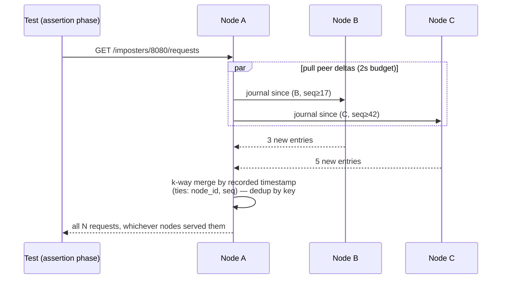
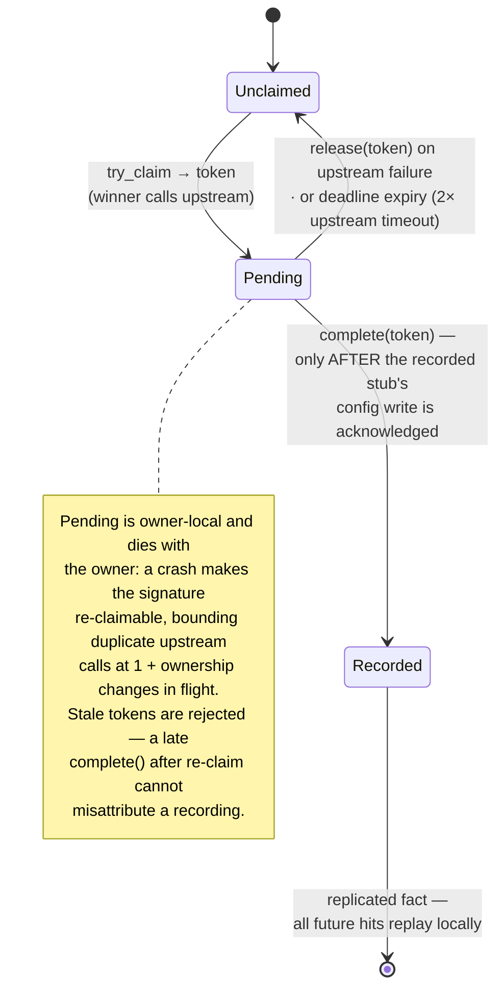

# Chapter 7 — The Verification Plane

Mocks exist to be asserted against. After a test sprays requests across the
fleet, `GET /imposters/:port/requests` must return **all** of them — from any
node; `numberOfRequests` must be the true fleet-wide count; a `DELETE
savedRequests` must clear everywhere without clock games; and proxy recording
must capture upstream responses exactly once. This plane has a luxury the
others lack: its data is **mergeable**. Recorded requests from different nodes
never conflict — they interleave. That property buys a design with no owners,
no consensus, and no coordination on the write side at all.

## The journal: per-writer shards, merge on read

Every node appends recorded requests to **its own shard** — a local,
append-only log per port, entries keyed `(node_id, seq, clear_gen)` with `seq`
a per-node monotone counter. Appending is always local (zone 3 of the read
path): a mock request never waits on another node to be journaled.

Reads merge:

Pull-on-read plus a 5 s background anti-entropy pull keeps reads warm; if a
peer is unreachable, the merged result still returns — stamped
`Rift-Cluster-Partial: true`, so a CI assertion can distinguish "0 requests
arrived" from "0 requests visible right now" (silently conflating those two is
how verification tools lie).

**Caps stay writer-local and honest.** Each shard caps at
`max(500, 10_000 / N_live)` entries per port plus an age cap, evicting oldest
and advancing an `evicted_below_seq` watermark that readers respect — so every
node converges on the same visible set even after eviction.
`numberOfRequests` is a per-node G-counter slot summed on read (it counts even
when body recording is off, matching single-node semantics).

## Clears are generation bumps — never timestamps

`DELETE savedRequests`, count resets, and `teardown_space` must clear
*fleet-wide* atomically-enough, and wall clocks across nodes cannot be
trusted. So clears never delete by time: a **clear generation** — a monotone
integer per port (and per `(port, space)`) — is bumped and replicated; every
journal entry and counter increment is tagged with the generation current at
its writer; merge and read simply ignore anything from an older generation.
Racing clears merge to the same max harmlessly; a clear during a partition
takes effect on the other side the moment generations merge — deterministic,
clock-free, no coordinated deletion required. (Under the ADR-001 control
plane, generation bumps ride the Raft log like any small fleet-wide fact,
which also orders them against config changes for free.)

Targeted deletion (`retain` with a predicate) stays best-effort per shard and
is documented as such — the generation mechanism is the guaranteed path.

## Cursor reads and live streams

Upstream grew a cursor API (#603): `savedRequests?since=<cursor>` and SSE
streams (`GET /events`, `.../savedRequests/stream`), with SDKs in four
languages tailing them. A scalar cursor cannot survive a multi-writer merge —
"index 500" means nothing across three shards. The cluster answer is a
**vector cursor**: the opaque `since` token encodes `{node_id → shard_seq}`;
each pull advances per-shard positions; the merged stream stays gapless and
duplicate-free per shard even as nodes join or die (missing nodes keep their
last position; new nodes enter at 0). SSE in cluster mode rides the same
anti-entropy cadence — events from *other* nodes arrive within the pull
interval, and the stream declares that latency rather than pretending
otherwise.

## proxyOnce: exactly-once recording via an owner claim

The one verification feature that is *not* mergeable: `proxyOnce` must call
the real upstream **once** per request signature, record the response, and
replay it forever after. "Once" under concurrent first-hits on three nodes
needs an arbiter — this is owner territory (Chapter 6's ring, keyed by
`(port, signature)`), running a small state machine at the owner:

Two ordering subtleties carry the correctness:

- **Claim owner ≠ config owner.** The recorded stub is published through the
  Chapter 4 write path, while the claim lives at the `(port, signature)`
  owner. `Pending → Recorded` transitions only after the config write is
  acknowledged; if that write fails, the claim releases and the signature
  stays retryable. "Recorded but stub-less" is unrepresentable.
- **Why not a simple replicated set?** A pure grow-only claim set cannot
  express *release*: a failed upstream call would either resurrect its claim on
  every merge or wedge the signature forever. The Pending/Recorded split — with
  only `Recorded` ever replicated — is the minimal shape that supports both
  exactly-once success and retryable failure.

Recordings themselves (multi-response proxy modes) append through the config
write path like any stub mutation, so they inherit R1/R3/R4 wholesale.

## What this plane deliberately does not promise

Journal entries are **test-run-scoped**: bounded buffers for in-run assertion,
volatile across full-cluster restarts (Chapter 9's matrix, with the segment-file
extension path noted if that ever changes). And under partition, verification
reads are *partial and say so* rather than blocking — a test harness that needs
strict completeness asserts `Rift-Cluster-Partial` is absent, which the chaos
suite does in anger.
