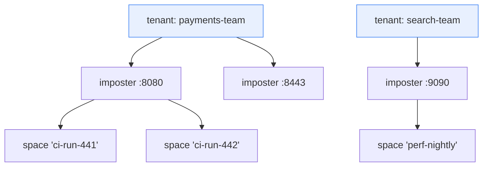

# Chapter 8 — Multi-Tenancy & Security

A shared, always-on mock cluster is only shareable if teams cannot trample
each other's configs, and only operable if "who may do what" has a real
answer. This chapter covers the tenancy and RBAC design (RFC-002, issue #17)
and the cluster's internal security model. One framing rule up front: **the
admin plane is authorized per principal; the data plane is isolated by
port/space, not by principal** — mock traffic from a system-under-test carries
no credentials, and pretending otherwise would break every client. Stating
what tenancy does *not* isolate is part of the design.

## The tenancy model

A **tenant** is an explicit control-plane object owning imposters. Not a port
range (collides with runtime-minted ports and Kubernetes single-port
reality), not a `space` (spaces isolate *matching* within one imposter — two
teams sharing a port would share one config object, making per-team edit
rights unrepresentable). The hierarchy:



Ports remain globally unique (they are TCP ports); the tenant owns the port
*binding*. Config ownership keys become `(tenant, port)` — the tuple exists to
make ownership explicit, **not** to give tenants independent write paths. Every
tenancy and config write is still leader-serialized and still pays the write
barrier, so one tenant's write burst *does* queue behind another's; ADR-001's
single Raft log is the price of authorization data that is strongly consistent
(RFC-002 §3.1). The OSS config schema never learns the field — tenancy is stored
on the control-plane record and injected/stripped at the API boundary, keeping
the upstream boundary clean.

> **Design of record: [RFC-002](../rfc/RFC-002-multi-tenancy-and-rbac.md).** This
> chapter is the architectural overview; the RFC carries the normative model,
> role/action matrix, threat model and phasing.

**Migration:** everything pre-tenancy lands in a reserved `default` tenant;
the legacy `--api-key` maps to a synthetic principal with admin rights on it.
Tenancy becomes real the day a second tenant is created, with zero day-one
breakage.

### What T1 ships, and the one thing it deliberately does not

Slice T1 (RFC-002 §10, issue #159) has landed: `Tenant`, `Principal`,
`RoleBinding`, `Role` and `Quotas` are real records; the six reserved
`ControlOp` variants carry typed payloads; `sm_tenants`, `sm_principals` and
`sm_bindings` are state-machine tables, in snapshots in both directions; and
the single-tenant gate is lifted, so every op accepts any well-formed tenant
slug.

**Storing is not serving.** T1 delivers the records and their storage, not
tenant-aware serving. A resource op naming a non-`default` tenant is validated,
committed and stored against `(tenant, …)`, and `TenantDelete` cascades over
it — but the read and sync paths (`desired_configs`, `desired_routes`,
`read_config`, `configured_ports`) still filter to `default`, so
nothing binds it and no operator surface reports it. T1's exit criterion —
*no observable change* — holds because the admin HTTP front constructs
`TenantId::default()` at every call site, so nothing reachable over the API can
create such a row; only a direct `RiftNode::submit` can, which is how the tests
exercise the cascade and the fleet-wide port rule. *(Resolved by issue #182 —
the read and sync paths named above are tenant-aware now, and "storing is not
serving" no longer holds; see "RFC-002 §11 open questions, settled here", Q5.)*

One consequence to carry into the slice that makes serving tenant-aware:
because ports are fleet-unique across tenants, a config stored for tenant A
*does* claim its port against tenant B. That is RFC-002 §3.2's rule, not a bug,
but it means the read paths must land in the same PR as tenant-aware serving —
otherwise an operator can be refused a port that nothing is listening on and no
read path reports as taken.

Two deletion rules are security properties rather than tidiness, and both are
enforced in the cascade: **`TenantDelete` removes the tenant's bindings**, and
**`PrincipalDelete` removes that principal's bindings across every tenant.** A
tombstone records that an id existed; it does not reserve it. Bindings left
behind would come back to life the moment the name is reused — and principal
ids in particular can be external values (an OIDC `subject`, an mTLS SAN) that
identity providers recycle. Rows already committed to the log cannot be
repaired afterwards, which is why this is settled here rather than in #161.

**Quotas are stored, not enforced.** `Quotas` rides the `Tenant` record so the
shape is in the log format now; enforcement is #163. *(T4 has since shipped —
`max_imposters` and `max_stubs_per_imposter` are enforced; see "What T4 ships".)*

## Principals and roles

Principals are API keys in v1 (argon2id hashes stored, key shown once at
creation), OIDC subjects and mTLS SANs in v2. Roles bind a principal to a
tenant, additive, deny-by-default:

| Role | May |
|---|---|
| `viewer` | read everything in-tenant: imposters, stubs, saved requests, scenarios, SSE streams |
| `operator` | viewer + **pause/resume** (`enable`/`disable`), clear saved requests, reset scenarios, tear down spaces — runtime control without config edits |
| `editor` | operator + create/update/delete imposters and stubs |
| `tenant-admin` | editor + manage the tenant's principals and bindings |
| `fleet-admin` | everything, cross-tenant, plus `/_cluster/*` and delete-all (a binding on the reserved tenant `*`) |

The `operator` role is why issue #15 (replicated `enabled`) mattered for
tenancy: pause/resume that silently applies to one node out of three is not a
role anyone can be given. It has since landed (upstream `EnabledChanged`,
v0.16.0), so Phase T's only hard dependency is Phase 1's control plane
(RFC-002 §10).

All tenancy records — tenants, principals, bindings — are entries in the Raft
state machine (Chapter 3). This is deliberate beyond convenience:
**authorization data is strongly consistent by construction.** An RBAC
revocation that propagates "eventually" is a security hole with a metrics
dashboard; here a revocation is a committed log entry, effective at apply on
every node, and auditable by index.

## Enforcement and the two upstream seams

Enforcement lives at every admin entry point — route handlers, SSE subscribe,
`/_cluster/*` (fleet-admin only) — via a generic upstream hook, because the
open-source admin API must stay tenancy-ignorant:

Both seams have **landed upstream** and are in the current pin — U-9 as
`rift-mock-core::extensions::authz`, U-10 as `EventContext` on the listener
signature. Both are re-exported through `rift_cluster_base::seams` (issue #160).

- **U-9, `AdminAuthorizer`**: a trait consulted after route parsing with
  `(credential, action, port, space, scope, params)`, returning
  allow-with-principal or deny. Installing nothing changes nothing: with no
  authorizer registered the api-key comparison decides alone, exactly as before.
  The cluster implementation resolves principal → bindings → role → action.
  Generic OSS justification: embedders fronting Rift with their own identity
  currently have to reverse-proxy and re-parse routes to get any authorization
  at all.

  Three parts of the contract enforcement (#161) is built on, stated with their
  limits rather than as slogans:

  **Ordering.** The api-key check runs *before* the route is parsed, and only
  then is the hook consulted, so `Deny` renders `403` and a bad key renders
  `401`. But the gate is `if let Some(key) = api_key` — **keyless is upstream's
  default**, and a loopback admin plane with no `--api-key` is a supported
  configuration. So "authenticated" is a precondition, not a guarantee: an EE
  deployment that installs the authorizer and drops `--api-key` on the grounds
  that RBAC now handles identity gets every request arriving with
  `credential: None`. #161 must decide explicitly whether the EE authorizer
  refuses an absent credential or whether the binary requires a key when
  clustered.

  Note also that an EE authorizer **cannot produce a `401`**: `AuthzDecision` is
  `Allow`/`Deny` only, and `Deny` maps unconditionally to `403`. Under EE RBAC a
  missing credential is therefore a `403`, not a `401` — the `401`/`403` split
  described above belongs to the built-in api-key gate, not to us.

  **What the hook does *not* bound.** When route classification returns `None`
  — an unmatched path, or the `/__rift/` gateway — the authorizer is never
  consulted and the request falls through to the ordinary `404`. Upstream states
  the consequence plainly: *"an authenticated caller can still distinguish a
  `404` from a `403`, so the hook bounds what a principal can do, not what it
  can learn about which routes exist."* Route-existence is not concealed; do not
  claim otherwise in tenancy-isolation copy. What the ordering *does* buy is
  that an **unauthenticated** caller cannot use it as an oracle when a key is
  set.

  **`scope` is caller-asserted.** It arrives in the `x-rift-scope` request
  header, so any caller can set it to any value. It names which target a create
  is *claimed* for (`POST /imposters` has no port yet); it must be cross-checked
  against what the credential entitles, never used as the authorization subject.

  Upstream also ships an `actions` module of stable action-string constants
  (`system.read`, `system.write`, `imposter.read`, `imposter.write`,
  `imposter.delete`, `imposter.verify`, `events.read`, `intercept.read`,
  `intercept.write`). `seams_resolve` names all nine, so an upstream rename is a
  compile error here rather than a silently never-matching match arm.

- **U-10, attribution on change events**: a separate `EventContext` parameter on
  `ImposterEventListener::on_event`, **not** a field on `ImposterEvent`. That
  enum is not `#[non_exhaustive]`, so adding a field to every variant would
  break every downstream `match` — the wrong trade for a seam whose premise is
  that installing nothing changes nothing. `EventContext` is itself
  `#[non_exhaustive]` so the next attribution field (scope, request id, remote
  address) is not a second breaking change; embedders build one from `Default`
  and assign.

  The principal reaches the emit site through a **task-local** scope
  (`with_principal_scope` / `current_principal`) rather than a parameter
  threaded through `create_imposter`, `delete_imposter`, `apply_config`,
  `add_stub` and every other mutating method. A task-local follows the task
  across `.await` but **not** across `tokio::spawn`. Upstream is careful about
  this: all sixteen emit sites in `ImposterManager` are direct calls inside the
  mutating method, none is inside a spawned task, so single-node attribution is
  complete.

### The task-local does not reach a clustered write — attribution rides the log

**This is the fact #163 has to be built on, so it is stated here rather than
discovered later.** In a clustered deployment the admin request does not call
the manager. It appends a `ControlOp` and returns; the mutation happens when
openraft applies the entry:

```
admin request task            openraft state-machine task
  with_principal_scope(...)     RedbStateMachine::apply
  append ControlOp        ──▶     drive_engine
  await commit                     engine.apply_config(...)
                                     ImposterManager::emit
                                       current_principal()  ──▶  None
```

`apply` is driven by openraft's own task, not by the task that opened the scope,
so the task-local is out of scope by the time `emit` runs. **Every replicated
write attributes `None`** — and replicated writes are the whole of the clustered
write path, which is exactly the path attribution has to cover. Followers are
further still from any request: they apply entries no client ever spoke to them
about.

This is not a defect in U-10. A task-local is the right mechanism for the
in-process path it was designed for, and no upstream seam could have carried a
principal across a Raft log it knows nothing about. The clustered answer is the
one the log format already anticipates: `ControlRequest.principal`
(`crates/rift-cluster/src/control.rs`) is in the envelope today and `None` at
every construction site. #161 populates it from `AuthzDecision::Allow`, and the
log entry carries it from then on. `EventContext` remains the attribution path
for the embedded/single-node case.

**T4 closes the event-path half of this too.** An attributed log entry does not
fix `EventContext` — and M3's SSE rides the event path, not the log. So
`drive_engine` now **re-opens**
the scope the request task could not carry across the task boundary: each engine
action is paired with the `ControlRequest.principal` of the entry that produced
it, and the engine call runs inside `with_principal_scope(principal, …)`. The
diagram above is therefore the *pre-T4* picture; `current_principal()` at `emit`
now yields the committing principal.

Attribution is per action, not per apply batch: one batch can hold entries from
several principals, and naming whichever came first would be worse than the
`None` it replaced — wrong attribution in an event stream is not a smaller error
than missing attribution. A drive with no single request behind it
(restart reconciliation, snapshot install) stays `None`, which is what
`EventContext`'s own contract asks for: absent attribution is reported as absent,
never guessed.

  ~~One gap neither mechanism closes: `AllDeleted` carries no port, therefore no
  tenant.~~ **Superseded by T1.** #159 put an explicit `tenant` on *every*
  `ControlOp`, so a fleet-wide delete knows exactly whose imposters it destroyed.

Quotas (max imposters, stubs per imposter, flow-KV entries) enforce at the one
place that sees a tenant's entire write stream — the replicated apply path — plus
the flow owner for KV counts. (Journal retention was originally listed here; T4
moved it off `Quotas`, see below.)

**Who changed what** falls out of machinery that already exists: the intent log
(Chapter 4) records *what was asked, when, with which op-id*; U-10 adds *by
whom*. The Raft log is that record — one stream, not a bolted-on second system.
An in-app projection of it, an export loop and a sink shipped in T4 and were
removed by D-71 (#546); RFC-002 §9 stays as history.

### What T2 ships — enforcement, and its two deliberate over-restrictions

Slice T2 (issue #161) turns the model into a boundary. The closed action set (19
actions at T2; later RFCs have widened it — `authz::Action` is the list) and the
`Role → Action` table live in `rift-cluster-server`'s `authz` module as a
**pure** evaluator — no I/O, no HTTP — so the whole matrix is unit-testable
without a cluster. Bindings are read fresh from the local state machine on every
request; there is **no authorization cache**, ever (§8.5), because a per-node TTL
would reintroduce exactly the revocation window consensus is being paid for.

**One evaluator, but authorization happens at the front, for every request.**
The design in the issue put the cluster check on terminated routes and left
proxied ones to the U-9 hook. That cannot satisfy §8.4: upstream's
`AuthzDecision` is `Allow`/`Deny` only and `Deny` renders **403
unconditionally**, so a cross-tenant probe on a proxied route would answer 403
and thereby confirm the tenant exists. So `admin_front` authorizes *everything*
before the terminated/proxied split and renders 401/403/404 itself, classifying
proxied routes with **upstream's own exported `classify`** (rift#889) rather than
a second parser — upstream has already shipped a bug from exactly that
divergence. The `AdminAuthorizer` stays installed on the loopback as defence in
depth.

Two places T2 is deliberately **stricter** than RFC-002 §4.2. Both are
fail-closed responses to a capability this build does not yet have, and both lift
without a redesign:

1. **`/events` requires `ClusterAdmin`, not `StreamSubscribe`.** §4.3 point 2 has
   two halves — authorize the subscribe, and filter the stream server-side — and
   only the first is built, because the SSE payload is upstream's own and carries
   no tenant to filter on. Serving it at `StreamSubscribe` (a *Viewer* grant)
   would hand a viewer of one tenant every other tenant's recorded request
   bodies, which is worse than the 403-vs-404 oracle this slice closes. Only a
   fleet admin — entitled to all of it anyway — may subscribe until server-side
   filtering lands (#163 shipped the stream without it), at which point the
   route returns to `StreamSubscribe`.
2. **Resource operations are servable only for the `default` tenant.** T1 made
   the state machine *store* by tenant but not *serve* by tenant:
   `desired_configs` and `desired_routes` still skip everything that is not
   `default` when binding the local engine, and `route_table()` is the default
   tenant's. Authorizing a read for tenant `acme` and then serving it from that
   engine returns **`default`'s** data — a documented scope limit turned into a
   cross-tenant bypass. So a decided tenant other than `default` is refused with
   the same indistinguishable 404 a cross-tenant probe gets, in a single guard at
   the one choke point every admin request passes through. The terminated ops
   already thread the decided tenant through, so lifting this guard when serving
   becomes tenant-aware does not also require re-plumbing them. *(Resolved by
   issue #182 — see Q5 below: the read paths are tenant-aware, this guard is
   gone, and the same choke point now hosts a narrower ownership check instead.)*

The second was, at the time, the honest statement of where multi-tenancy stood:
the records existed and were enforced against, but until the read and sync
paths were tenant-aware, `default` was the only tenant that could be served.
**That work had to land the read paths and this guard's removal in the same
change** — separating them is what would have produced the bypass described
above — and issue #182 is that change; see Q5.

**Legacy migration.** The `--api-key` maps to a synthetic principal
(`legacy:api-key`, which cannot collide with a real `key:<fingerprint>` id) bound
`TenantAdmin` on `default`, plus `FleetAdmin` on `"*"` while
`--cluster-legacy-key-is-fleet-admin` is set — default **true** for one release,
then false, then removed. The key is deliberately withheld from upstream's own
builder: leaving it set would install a second, independent api-key gate on the
loopback that runs *before* the authorizer hook, and would 401 every real
principal on every route for any fleet mid-migration. A fleet with neither an
api-key nor any principal keeps the pre-T2 open admin plane, and
`rift_cluster_no_principals` reports that state for Prometheus.

### What T3 ships — the admin surface, and keys that are shown once

Slice T3 (issue #162) is what makes the model reachable: RFC-002 §5's routes on
the admin front, argon2id key issuance, and `whoami`.

```
POST/GET         /admin/tenants                      FleetAdmin
GET/PUT/DELETE   /admin/tenants/:id                  FleetAdmin
POST/GET         /admin/tenants/:id/principals       TenantAdmin
PUT/DELETE       /admin/tenants/:id/principals/:pid  FleetAdmin
PUT/DELETE       /admin/tenants/:id/bindings/:pid    TenantAdmin (FleetAdmin on "*")
GET              /admin/whoami                       any authenticated principal
```

Every one of these **terminates at the front door**, reads included — these
records live only in the clustered control plane, so there is no upstream route
to proxy to. That is the same shape `GET /front-door/routes` already has.

**The tenant comes from the path, not `X-Rift-Tenant`.** On a resource route the
header selects which of the caller's bindings they are acting under; here the
tenant *is* the record being administered. Authorizing `/admin/tenants/b/...`
against the header would let a tenant admin of `a` administer `b` by sending one
header — the confused-deputy shape §8.1 exists to close, reached through the one
surface where the header is not the subject.

**Why bindings split across two tiers.** The route
`/admin/tenants/:id/bindings/:pid` is `TenantManage` inside a real tenant and
`ClusterAdmin` on the fleet scope `"*"`. This is not a special case bolted on:
`validate` refuses every role but `FleetAdmin` on `"*"`, so a binding *there* is
by definition a grant of fleet privilege, and granting fleet privilege must
require fleet privilege (§4.2). Inside a tenant, re-binding a principal is a
tenant admin's own job and grants nothing beyond their own scope. What decides
the tier is the privilege being granted, not the shape of the path.

`PrincipalPut` and `PrincipalDelete` are fleet-only for the reason §3 gives:
`sm_principals` is keyed by principal id **alone**, so a tenant admin of A
deleting a principal would destroy a credential B also relies on. The one
exception is `POST /admin/tenants/:id/principals`, which is `TenantManage` —
minting an identity inside a tenant grants nothing outside it. It is also
refused if it asks for `fleet-admin`, for the same reason the fleet-scope
binding needs fleet privilege.

**One op, one revision.** That mint is a single `ControlOp::PrincipalCreate`,
not a `PrincipalPut` followed by a `BindingPut`. Two ops are two revisions, and
the gap between them is observable on every replica: a principal that
authenticates and is authorized for nothing, or — if the second op is lost to a
leader change — a binding naming a principal that does not exist. Neither state
is reachable through one op, because apply already runs inside a single redb
write transaction.

**Keys are shown once, and the disk is the assertion.** The response to that
mint is the only place the raw key ever exists. The control plane stores the
argon2id hash and the SHA-256 fingerprint the id is derived from, and neither
can reproduce it. The acceptance test does not merely check that a later `GET`
omits the key — that would prove only that one renderer omits it — it scans
every byte under the state directory after shutdown. The log and the snapshot
are where a leaked credential would become *permanently* unredactable, because
a committed Raft entry cannot be rewritten.

**An unknown key performs zero argon2id verifications.** A principal's id is
`key:<sha256(raw)>`, so a presented credential resolves by one keyed lookup and
argon2id verifies exactly the one candidate it finds. A credential that matches
nothing misses that lookup and is refused having hashed nothing. This is not an
optimisation: argon2id at the pinned cost allocates 19 MiB per attempt, so
hashing on every presented credential would make an endpoint anyone can reach a
memory-amplification lever. It is asserted with a counter
(`control::argon2_verifications`) rather than a timer, because a timing
assertion for this property is flaky by construction and would be the first test
anyone disabled.

The cost parameters are pinned in `control.rs` to the OWASP 2024 baseline
(m = 19456 KiB, t = 2, p = 1) rather than inherited from the argon2 crate's
default, even though the two agree today. A cost parameter is the whole strength
of a password hash and it fails silently in both directions. Raising it later
does not invalidate existing keys: the PHC string records the parameters each
hash was produced with, and verification reads them from there.

**The T2 default-tenant guard did not apply here, and issue #182 has since
removed it entirely.** T2 refused any decided tenant other than `default`,
because resource *serving* was still default-only — a restriction about
`sm_configs`/`sm_routes`, stored per tenant but read back through
default-only paths. The tenancy tables were never like that — `tenant`,
`tenant_principals` and `principal_bindings` all take the tenant as an argument
and honour it — so keeping the guard over them would have 404'd the entire
surface for exactly the tenants it exists to administer, and T2/T3 carved out
an exemption for it.

  T3 originally keyed that exemption on "routes that name their own tenant"
  (`scope.is_some()`), which coincided with "tenancy surface" until T4 added a
  tenancy route whose path names no tenant, because the caller's `X-Rift-Tenant`
  names it. Under the old inference it 404'd every tenant admin reading it, from
  a guard whose stated subject is config data that route never touches. T3/T4
  fixed it by asking the route directly (`serves_any_tenant`), which is what the
  exemption always meant.

  Issue #182 (see Q5) replaced the guard itself with the narrower ownership
  gate, so `serves_any_tenant` and the exemption it backed are gone rather than
  superseded: the gate keys on the single port a request addresses
  (`addressed_port`), and the tenancy surface's routes never address one — they
  are read through tenant-arg paths, not a port — so there is nothing for the
  gate to check and no exemption left to carve out. The history above is kept
  because it is the reason `addressed_port` returns `None` for
  `Terminated::Tenancy(_)` rather than `Some` of something: getting that
  classification wrong the same way T3 first did would reopen the same bug from
  the other direction.

**No verification cache.** RFC-002 §11 raised caching
`hash(credential) → principal_id` to avoid an argon2id verify per request. T3
does **not** ship one. §8.5's ban on cached authorization holds either way, but
the cost this would save is one verify on an admin-plane request, and the
machinery — an invalidation hook on four op variants, with a correctness bug
that fails *open* — is not earned by that. Operators should expect roughly
20–50 ms of argon2id per authenticated admin request. If that becomes a real
constraint for a console or an API client, the state-machine-invalidated cache
described in §11 is the shape to build, and it should land as its own slice with
its own revocation test.

### What T4 ships — quotas as committed decisions

Slice T4 (issue #163) turns quotas from a stored shape into an enforced one. It
also shipped an in-app audit projection, an export loop and a sink; **D-71
(#546) removed all three**, and RFC-002 §9 stays as history. The Raft log is the
record of every configuration change, and a structured `tracing` line at apply on
the leader is the operator-facing trail.

The removal is worth one sentence of rationale, because the projection's
weakness was structural rather than incidental: it could only see what became a
`ControlOp`, and the reads-that-mutate served over the **proxy** path —
`ScenarioReset`, `SavedRequestsClear`, `FlowStateClear` — are forwarded to the
loopback core admin and never become one. Closing that would have meant
recording at the front door, i.e. a second, per-node path that can disagree with
the log. A projection with a permanent hole in it is worse than pointing at the
log itself.

**Quotas are enforced at apply, and a refusal is a committed decision.** RFC-002
§4.4 says "at the Raft leader during validation", meaning: in the one place that
sees a tenant's whole write stream, rather than in a handler counting its own
node's view (which over-commits under concurrent writes). Apply satisfies that
*and* one thing leader-side pre-validation cannot — the refusal lands in the log,
so all three nodes record the same `Failed` outcome at the same revision, and it
stays discoverable through `op_status` afterwards. `max_imposters` counts the
tenant's existing ports *excluding the one being written* (replacing an imposter
adds none, so a full tenant is full rather than frozen);
`max_stubs_per_imposter` is checked on the payload for a `PutImposter` and on the
*result* for a `PatchStubs`, since only the config an edit script produces knows
how many stubs the imposter ends up with. A tenant with no stored record gets the
generous default, not zero: a fleet that never configured tenancy must not find
every write refused. `max_flow_entries` stays with the flow owner and
`journal_retention` with the M3 shards (#147) — stated rather than
half-implemented. Quotas bound **object counts, not compute**: one tenant's
pathological regex still degrades a shared node, which is a stated non-goal.

#### RFC-002 §11 open questions, settled here

**Q1 — a parked write can be refused on replay.** Quotas are validated where the
op applies, so a minority-side write is parked (RFC-001 §7.6) and validated on
replay against the quota *as it stands then*. A tenant at its limit can therefore
receive `503 + op-id` at submit and a refusal at replay. **Resolution: no quota
reservation at park time.** A reservation would have to survive a leader change
and expire on its own — more machinery than the problem earns, and a new source
of divergence. Instead: a parked write's outcome is not knowable until it
applies, quota refusal is one of its possible outcomes, and it surfaces as the
existing committed `ControlOutcome::Failed { reason }`, discoverable through
`op_status`. If reservations are ever wanted, that is a different slice.

**Q2 — `journal_retention` moved off `Quotas` onto the tenant record.** It was
the only field there that is a duration policy rather than an object count, and
the only one enforced somewhere no other field is (the M3 shards). Leaving it
would have handed #147 a field whose name says "quota" and whose meaning is "how
long to keep data". It is now `Tenant::journal_retention_secs`, decided before M2
shipped so M3 does not inherit the ambiguity.

**Q3 — `VerifyRun` granularity** belongs to T2's action matrix and is unchanged
here.

**Q4 — what a stale minority node does with an authorization read.** Settled
while writing C25 (issue #165), because the container tier forced the question
into the open: during a partition, a minority replica has not applied a
revocation committed on the majority side, so it will still allow. That is
inherent to consensus, not a defect — §3.1's guarantee is against *replication
lag in a healthy fleet*, never against a replica that cannot see the commit.

**Resolution: a stale node serves authorization reads from its own applied
state, and does not refuse outright.** Refusing would make a partition
indistinguishable from a misconfiguration and would take the entire read surface
down on a node that is merely behind — and the fleet already has a way to say
"this answer may be stale", the M3 `Rift-Cluster-Partial` signal, rather than
needing a second, harsher one here. What is **not** acceptable, and what C25
pins, is serving stale *authority* once the node can see the commit again: the
very first request through the previously-minority node after the heal must be
refused, and the convergence window is measured and bounded. Any TTL cache over
authorization data breaks exactly that, which is why it is C25's named mutant.

**Q5 — resolved (issue #182): tenanted resource state is now served, gated on
port ownership at one choke point rather than refused wholesale.** The gap this
entry originally recorded — `desired_configs`/`desired_routes` bound only
`default`'s data into the local engine, so `authorize_action` answered every
non-default decision with §8.4's indistinguishable 404 regardless of what the
principal actually held — is closed. `read_config` and `route_table`
(and the `RaftNode` wrappers around them) are tenant-addressed
now, and `desired_configs` syncs the **union of every tenant's** configs into
the engine rather than filtering to `default`. That union is sound only because
**ports are fleet-unique across tenants** (RFC-002 §3.2): a port names exactly
one imposter fleet-wide, so one shared `ImposterManager` can hold every
tenant's imposters with no collision between, say, `acme`'s `19031` and
`globex`'s `19031` — because there is no such pair.

**`desired_routes` is deliberately NOT unioned, and the asymmetry is the point.**
Imposters can share one engine because each request *names the resource it
wants* — a port, which resolves to exactly one owner. Front-door routes have no
such discriminator: the front door is a single listener and an arriving
data-plane request carries no tenant identity, because RFC-002 §7 keeps that
plane open and anonymous. A unioned route table would therefore be one shared
*matching* namespace that every tenant writes into — and since an empty match is
a legal catch-all and `priority` is an unbounded `i32`, any principal holding
`imposter.write` in any tenant could publish `{"match": {}, "priority":
i32::MAX}` and capture **100% of front-door traffic fleet-wide**. Constraining
the route's `target.port` to ports the writing tenant owns does not fix it: the
shadowing lives in the match, not the target. So routes stay `default`-only
until the front door has a tenant dimension to route on (a host mapping, a
listener per tenant, or an explicit per-tenant prefix). Tenanted routes are
still stored, and `route_table(tenant)` reads them back per tenant so a tenant
sees what it wrote; they are simply not compiled into the shared front door.
That is a real remaining limit of this slice, recorded here rather than left to
be discovered.

**Where that limit becomes visible to an operator: `installed` on `GET` and
`PUT /front-door/routes`** (D-68). Both answer `installed: false` beside the
table for any tenant whose routes are not compiled in — "cannot take any" is a
fact about installation, stated as such rather than left to be inferred from
the absence of traffic. `routes_installed_for` is the single definition of that
rule: `desired_routes` filters on it and both route endpoints report it, so the
table the front door compiles and the state the console displays cannot drift
apart. When the front door grows a tenant dimension, that one function is what
changes.

The console spends that flag across the whole route screen (issue #400). On
`installed: false` it states the fact once above the
table — stored and replicated, editable, but never compiled in — and then stops
the rows contradicting it: no route is given a rank, and the "why this order"
column reads `not installed` rather than the tie-break prose, because both are
claims about a position in a dispatch chain that does not exist for this tenant.
The rows are listed in stored order there rather than in `effective_order`, for
the same reason: sorting by a chain that is never evaluated would be presenting a
computed order as a fact about this table. The route tester still reports which
route *would* win, since that is a true reading of the rules, but says plainly
that nothing reaches this tenant's table to be dispatched in the first place.
The editing controls stay live, deliberately: the stored table is real
replicated state and writing to it is legitimate, so muting the *chain* must not
read as a read-only screen. The banner and the muting key on a positive
`installed: false` only — a flag the console could not read leaves the screen as
it was, since "unknown" is not a licence to assert "cannot take a request".

Serving every tenant into one engine reopens the door the old guard was built
to close: an authorized `acme` caller could address `beta`'s port and read it,
simply by knowing the number. The replacement is narrower than the guard it
retired — an **ownership gate** in `authorize_action`'s `Allow` arm, the single
place every admin request passes through (terminated, proxied, and the front
door's own reads), refusing only when the addressed port is owned by a tenant
other than the one the caller was decided into. It sits at that one choke
point rather than per-route deliberately: a per-route check is how one route
gets missed, and the proxied reads — forwarded verbatim to a local engine that
now binds every tenant's imposters — are the dangerous ones. Creates are
unaffected: they are not port-addressed, and the state machine's own
`port_claimed_by_another_tenant` is where fleet-uniqueness is actually enforced.

**§8.4's indistinguishable 404 survives the replacement — but only because the
gate refuses an *unowned* port too.** The obvious design lets an unowned port
fall through to upstream, on the reasoning that there is no tenant behind it to
protect. That is wrong, and subtly: upstream's own 404 names the port ("No
imposter exists on port N") while the gate's says only "Not Found", so the two
bodies differ and sweeping the range maps exactly which ports other tenants
hold. The gate therefore refuses unless the port is owned by *this* tenant, so
"owned by someone else" and "owned by nobody" are one answer, matching
`NotBoundToTenant`. The cost is that a caller reading a genuinely absent port in
their own tenant gets the terse body instead of upstream's descriptive one — the
right trade, since the descriptive message is a convenience and
indistinguishability is a contract.

**Collection reads are narrowed too, at `fetch` rather than per route.**
`GET /imposters` is not the only body that lists every imposter: `PUT /imposters`
renders the collection after the replace, and `DELETE /imposters` captures it
beforehand as "what was removed". All three go through the same loopback read, so
the narrowing lives there — a per-call-site filter is how two of the three
shipped unfiltered in the first draft of this change. It **fails closed**: a body
that cannot be read or parsed is refused, not forwarded, and an entry whose port
will not parse is dropped rather than kept, because a classifier that cannot
classify must treat its input as the dangerous class.

This applies to `default` symmetrically, and it is worth stating plainly
because it is easy to misread as a regression rather than the fix: before this
change `default` saw every imposter because every imposter *was* `default`'s;
now a `default` Editor no longer sees `acme`'s. That narrowing is the correct
behaviour, not a side effect of it.

**The data plane is unchanged.** RFC-002 §7 keeps it open — an imposter
answers traffic regardless of which tenant owns it. The ownership gate governs
*administration* of a port, not traffic through it, and nothing above touches
that boundary.

### What the export sink shipped, and why it is gone (issue #164, retired by D-71)

T4 derived the audit stream; an optional, off-by-default export sink carried it
off the fleet to somewhere the customer owned — an `https://` webhook (JSON
Lines) or an object-store prefix (one object per batch), leader-only,
checkpointed, at-least-once. **#546 removed it along with the projection it
shipped**, and #549 removed the last control-plane record that could name a
third-party credential at all. The rule it stood for is worth keeping in mind
anyway: a control-plane record carries the *name* of a credential, never a
credential. Today no record carries either.

## Cluster-internal security

The node-to-node surface (Raft RPCs, owner-forwarded ops, replication, journal
pulls) shares one model:

- **A dedicated cluster port**, explicitly configured, intended for a private
  network; binding `0.0.0.0` requires an explicit acknowledgment flag. Never
  multiplexed with data-plane or admin ports.
- **Shared-secret HMAC on every message**:
  `X-Rift-Cluster-Auth: t=<ts>,n=<nonce>,mac=HMAC-SHA256(secret, ts‖nonce‖method‖path‖body)`,
  ±30 s skew window, bounded nonce cache that **fails closed** on overflow.
  Startup refuses clustering without a secret unless `--cluster-insecure` is
  passed, which logs loudly at startup (`cluster port started WITHOUT
  authentication`, with `insecure = true`) so a fleet can be audited for it.
- **Integrity and authenticity, not confidentiality** — the threat model is
  "no unauthenticated peer joins or injects ops", with confidentiality
  delegated to network isolation (VPC/namespace/WireGuard). mTLS between nodes
  is a hardening milestone, deliberately not a Phase-1 gate.
- **Version skew**: every message carries a protocol version; majors must
  match (mismatch → clean rejection, not undefined behavior), minors are
  additive — the contract that makes rolling upgrades safe (Chapter 10).

Admin-plane auth (bearer key today, U-9 principals tomorrow) is TLS-at-the-LB
plus application auth; probe endpoints (`/readyz`, `/healthz`) are
deliberately unauthenticated and stateless-safe, because kubelets and LBs
don't hold credentials.

**The admin plane originates no outbound HTTP on a caller's behalf.** The one
route that did — `POST /admin/imposters/{port}/try` (#335), which dialled
`127.0.0.1:{port}` behind an `is_locally_bound` gate — was found reachable past
the gate on BSD/macOS (#344: the engine's `0.0.0.0` bind coexists with a
foreign `127.0.0.1` socket, and the loopback dial lands on the foreign one —
including, on a `--cluster-insecure` fleet, the cluster RPC listener). Since
#344 the try is answered **in-process**: the sample request is dispatched to
the imposter this node's engine holds, over an in-memory HTTP/1 connection,
with no socket opened. The containment is now structural rather than checked —
there is no address to get wrong — and the `is_locally_bound` gate remains only
so a bind-failed imposter is reported as such (`502`, "not bound") instead of
answered as though it were serving.

## Console sessions and the fleet projection (issue #185, RFC-006 §5.2–§5.3)

### `/_fleet/*` is `ClusterAdmin` — RFC-006 §12 Q3, settled

The console cannot hold the cluster-port credential, so the admin port terminates a **read-only
projection** of the operator surface: `GET /_fleet/members`, `/_fleet/health`, `/_fleet/ops/:id`.
`/_cluster/*` on the cluster port is unchanged, and node-vs-node comparison still means asking each
node directly.

RFC-006 §12 Q3 left open whether `/_fleet/health` is in-tenant-`Viewer`-visible (tenant-filtered) or
`ClusterAdmin`-only, noting that "topology is infrastructure, not tenant data — but 'which nodes
exist' may itself be sensitive in some shops." **Settled: `ClusterAdmin`.** Three reasons:

1. **It must not be a privilege *reduction*.** `/_cluster/*` rides the cluster port behind the HMAC
   secret today — strictly more privileged than any tenant role. Projecting it onto the admin port
   at a lower tier would use a convenience feature to widen access to infrastructure state, which is
   the same shape of mistake as the `/events` decision above.
2. **Consistency with the mapping that already exists.** `principal::map_action` routes
   `SYSTEM_READ` — `/config`, `/metrics`, `/logs` — to `Action::ClusterAdmin`. `/_fleet/*` is that
   category exactly: fleet-level, no per-tenant meaning. Anything lower would make `/_fleet/health`
   *more* visible than `/config`, which reports strictly less.
3. **Node identities and ring topology are infrastructure inventory**, which is the RFC's own worry.

`Action::ClusterAdmin` is FleetAdmin-only by construction (`authz::decide`), so this means fleet
admins exclusively — checked deliberately rather than inherited.

**Consequence for the request-log screen (#189), recorded so it is not discovered late:** a
non-FleetAdmin cannot learn the node count, so that screen shows the unqualified "this is one node's
view" label rather than "N of M nodes". The unqualified label is still honest, which is the actual
requirement; the count is an enhancement available to fleet admins.

Unlike `/events`, this is **not** a fail-closed placeholder awaiting a capability. A tenant-filtered
fleet view is not deferred work — there is nothing per-tenant in a ring to filter.

### `PUT /admin/fleet/name` — the first fleet-scoped *write* on the admin port (issue #373)

The section above is about a read-only projection, and stays true: `/_fleet/*` projects
`/_cluster/*` and mutates nothing. Naming the fleet is the first thing on this port that is
fleet-scoped and **not** a projection, so it is recorded here rather than left to be inferred from
the route table.

It is `Action::ClusterAdmin` on `FLEET_SCOPE`, by reason 1 above rather than by analogy: a fleet's
name is fleet-wide state, and a `TenantAdmin` of `acme` sending `X-Rift-Tenant: acme` must not
become eligible to rename the cluster every other tenant is also looking at. `control::validate`
enforces the same thing a second time — `require_fleet_scope` refuses the op outright — so a
mis-built `ControlOp` fails at admission rather than filing a fleet-wide rename under one tenant's
name. That belt-and-braces is deliberate: the since-removed audit-sink surface shipped exactly that
bug once (`TenantId::default()` instead of `FLEET_SCOPE`).

Why it is replicated rather than a per-node flag is a control-plane question, not a security one,
and is recorded on `ControlOp::FleetNamePut` itself. The security-relevant half is that the name is
**a label, never an identity**: nothing authorizes, addresses, or routes by it, so a fleet renamed
mid-flight changes what an operator sees and nothing about what anyone may do. Node ids remain what
every decision in this chapter is made against.

### The session-signing key is a secret in the replicated log, deliberately

A browser cannot hold the long-lived API key, so `POST /session` exchanges it once for an
HMAC-signed cookie (`HttpOnly`, `Secure`, `SameSite=Strict`, 8-hour `Max-Age`). The key that signs
it is a fleet-wide control-plane record, so **every node verifies from its own applied state and a
login is not a Raft write** — only the first mint and any rotation are.

That record carries an actual secret into the replicated log — the one op that does, and
deliberately. The distinction is what the secret means *outside* the fleet:

- an op naming a credential for a third-party system would spread power that exists somewhere
  else, so no op ever did (and since #549 there is no op that could);
- this key is **fleet-internal and meaningless anywhere else**, and cannot be stored hashed the way
  a principal's API key is (§3.2, argon2id), because verifying an HMAC requires the key itself — a
  digest would make the cookie unverifiable by anyone, including us.

It therefore sits inside the same trust boundary as the state directory, which already holds every
principal's argon2 record and all committed config. Deriving it from the cluster secret instead was
considered and rejected: that secret is optional (`--cluster-insecure`), so an unauthenticated
fleet would have nothing to derive from.

**Rotation is the containment, and it is structural.** Every token carries the key record's
`revision`; verification refuses a token whose revision is not the current one, so writing a new key
invalidates every outstanding session at once without sweeping a table.

### What the cookie does and does not prove

The cookie proves **authentication only**. Every request still resolves the principal's bindings
from local applied state, so disabling a principal or deleting a binding cuts a live session with
§3.1 semantics — the same as for a bearer. **There is deliberately no cache over session →
bindings**: that is the named mutant `c25_key_revocation_survives_a_partition` exists to catch, and
adding one would reintroduce exactly the window that test closes.

CSRF is `SameSite=Strict` plus a required `X-Rift-CSRF` header on cookie-authenticated mutations.
**Bearer-authenticated requests are exempt**, because a bearer cannot be attached by a victim's
browser — which is the entire attack.

Known and accepted limits (RFC-006 §10): **no per-session server-side revocation in v1** — the
bounds are TTL, key rotation and principal disable, and there is no session table. No OIDC/SSO in
v1; when `AuthSource::Oidc` arrives it mints the same cookie. `POST /session` is the one moment the
long-lived key transits the page, so it is held in component state only, never persisted, and
dropped after the exchange.

## Explicit non-goals

Recorded so the boundary cannot be oversold: no per-principal data-plane
authorization (see the framing rule); no per-tenant TLS identities on imposter
ports; no compute/memory isolation between tenants (quotas bound object
counts, not CPU); and no cross-cluster tenancy federation. Each of these is
a conscious "no", not an omission.

The data-plane one is the load-bearing one, and it is asserted rather than only
written down: `c27_tenancy_isolates_ownership_but_not_the_data_plane` requires
both imposters to answer unauthenticated traffic through every node, and goes red
the moment a credential is required. Tenancy governs who may *configure* a mock,
never who may call it — putting a credential in front of the data plane would
break every system under test the mock exists to serve.
