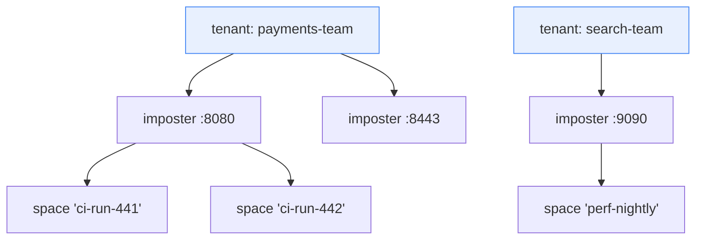

# Chapter 8 — Multi-Tenancy & Security

A shared, always-on mock cluster is only shareable if teams cannot trample
each other's configs, and only operable if "who may do what" has a real
answer. This chapter covers the tenancy and RBAC design (RFC-002, issue #17)
and the cluster's internal security model. One framing rule up front: **the
admin plane is authorized per principal; the data plane is isolated by
port/space, not by principal** — mock traffic from a system-under-test carries
no credentials, and pretending otherwise would break every client. Stating
what tenancy does *not* isolate is part of the design.

## The tenancy model

A **tenant** is an explicit control-plane object owning imposters. Not a port
range (collides with runtime-minted ports and Kubernetes single-port
reality), not a `space` (spaces isolate *matching* within one imposter — two
teams sharing a port would share one config object, making per-team edit
rights unrepresentable). The hierarchy:

Ports remain globally unique (they are TCP ports); the tenant owns the port
*binding*. Config ownership keys become `(tenant, port)` — the tuple exists to
make ownership explicit, **not** to give tenants independent write paths. Every
tenancy and config write is still leader-serialized and still pays the write
barrier, so one tenant's write burst *does* queue behind another's; ADR-001's
single Raft log is the price of authorization data that is strongly consistent
(RFC-002 §3.1). The OSS config schema never learns the field — tenancy is stored
on the control-plane record and injected/stripped at the API boundary, keeping
the open-core line clean.

> **Design of record: [RFC-002](../rfc/RFC-002-multi-tenancy-and-rbac.md).** This
> chapter is the architectural overview; the RFC carries the normative model,
> role/action matrix, threat model and phasing.

**Migration:** everything pre-tenancy lands in a reserved `default` tenant;
the legacy `--api-key` maps to a synthetic principal with admin rights on it.
Tenancy becomes real the day a second tenant is created, with zero day-one
breakage.

## Principals and roles

Principals are API keys in v1 (argon2id hashes stored, key shown once at
creation), OIDC subjects and mTLS SANs in v2. Roles bind a principal to a
tenant, additive, deny-by-default:

| Role | May |
|---|---|
| `viewer` | read everything in-tenant: imposters, stubs, saved requests, scenarios, SSE streams |
| `operator` | viewer + **pause/resume** (`enable`/`disable`), clear saved requests, reset scenarios, tear down spaces — runtime control without config edits |
| `editor` | operator + create/update/delete imposters and stubs |
| `tenant-admin` | editor + manage the tenant's principals and bindings |
| `fleet-admin` | everything, cross-tenant, plus `/_cluster/*` and delete-all (a binding on the reserved tenant `*`) |

The `operator` role is why issue #15 (replicated `enabled`) mattered for
tenancy: pause/resume that silently applies to one node out of three is not a
role anyone can be given. It has since landed (upstream `EnabledChanged`,
v0.16.0), so Phase T's only hard dependency is Phase 1's control plane
(RFC-002 §10).

All tenancy records — tenants, principals, bindings — are entries in the Raft
state machine (Chapter 3). This is deliberate beyond convenience:
**authorization data is strongly consistent by construction.** An RBAC
revocation that propagates "eventually" is a security hole with a metrics
dashboard; here a revocation is a committed log entry, effective at apply on
every node, and auditable by index.

## Enforcement and the two upstream seams

Enforcement lives at every admin entry point — route handlers, SSE subscribe,
`/_cluster/*` (fleet-admin only) — via a generic upstream hook, because the
open-source admin API must stay tenancy-ignorant:

- **U-9, `AdminAuthorizer`**: a trait consulted after route parsing with
  `(credential, action, port/space)`, returning allow-with-principal or deny.
  The default implementation reproduces today's single-api-key check
  byte-for-byte; the enterprise implementation resolves principal → bindings →
  role → action. Generic OSS justification: embedders fronting Rift with their
  own identity currently have to reverse-proxy and re-parse routes to get any
  authorization at all.
- **U-10, principal on change events**: `ImposterEvent` carries the
  authenticated principal, so audit sinks can attribute changes.

Quotas (max imposters, stubs per imposter, flow-KV entries, journal retention)
enforce at the one place that sees a tenant's entire write stream — the Raft
leader's pre-append validation — plus the flow owner for KV counts.

**Audit** falls out of machinery that already exists: the intent log (Chapter
4) records *what was asked, when, with which op-id*; U-10 adds *by whom*.
Every applied ControlOp emits
`{ts, principal, tenant, action, resource, op_id, revision, outcome}` into a
retained, queryable audit table. One stream, not a bolted-on second system.

## Cluster-internal security

The node-to-node surface (Raft RPCs, owner-forwarded ops, replication, journal
pulls) shares one model:

- **A dedicated cluster port**, explicitly configured, intended for a private
  network; binding `0.0.0.0` requires an explicit acknowledgment flag. Never
  multiplexed with data-plane or admin ports.
- **Shared-secret HMAC on every message**:
  `X-Rift-Cluster-Auth: t=<ts>,n=<nonce>,mac=HMAC-SHA256(secret, ts‖nonce‖method‖path‖body)`,
  ±30 s skew window, bounded nonce cache that **fails closed** on overflow.
  Startup refuses clustering without a secret unless `--cluster-insecure` is
  passed, which logs loudly and sets a metric (`rift_cluster_insecure 1`) so a
  fleet can be audited for it.
- **Integrity and authenticity, not confidentiality** — the threat model is
  "no unauthenticated peer joins or injects ops", with confidentiality
  delegated to network isolation (VPC/namespace/WireGuard). mTLS between nodes
  is a hardening milestone, deliberately not a Phase-1 gate.
- **Version skew**: every message carries a protocol version; majors must
  match (mismatch → clean rejection, not undefined behavior), minors are
  additive — the contract that makes rolling upgrades safe (Chapter 10).

Admin-plane auth (bearer key today, U-9 principals tomorrow) is TLS-at-the-LB
plus application auth; probe endpoints (`/readyz`, `/healthz`) are
deliberately unauthenticated and stateless-safe, because kubelets and LBs
don't hold credentials.

## Explicit non-goals

Recorded so the boundary cannot be oversold: no per-principal data-plane
authorization (see the framing rule); no per-tenant TLS identities on imposter
ports; no compute/memory isolation between tenants (quotas bound object
counts, not CPU); no cross-cluster tenancy federation. Each of these is a
conscious "no", not an omission.
