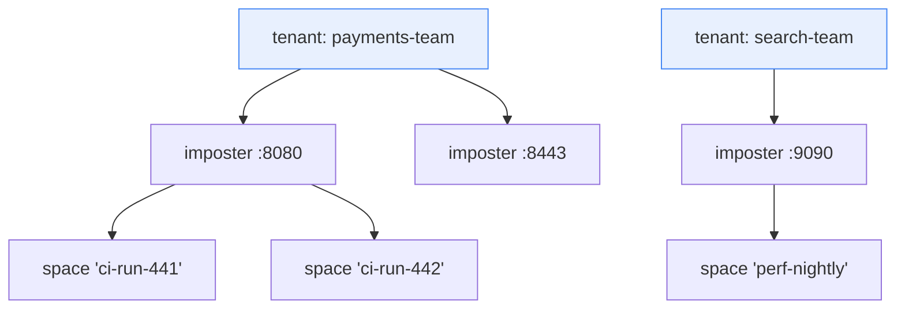

# Chapter 8 — Multi-Tenancy & Security

A shared, always-on mock cluster is only shareable if teams cannot trample
each other's configs, and only operable if "who may do what" has a real
answer. This chapter covers the tenancy and RBAC design (RFC-002, issue #17)
and the cluster's internal security model. One framing rule up front: **the
admin plane is authorized per principal; the data plane is isolated by
port/space, not by principal** — mock traffic from a system-under-test carries
no credentials, and pretending otherwise would break every client. Stating
what tenancy does *not* isolate is part of the design.

## The tenancy model

A **tenant** is an explicit control-plane object owning imposters. Not a port
range (collides with runtime-minted ports and Kubernetes single-port
reality), not a `space` (spaces isolate *matching* within one imposter — two
teams sharing a port would share one config object, making per-team edit
rights unrepresentable). The hierarchy:



Ports remain globally unique (they are TCP ports); the tenant owns the port
*binding*. Config ownership keys become `(tenant, port)` — the tuple exists to
make ownership explicit, **not** to give tenants independent write paths. Every
tenancy and config write is still leader-serialized and still pays the write
barrier, so one tenant's write burst *does* queue behind another's; ADR-001's
single Raft log is the price of authorization data that is strongly consistent
(RFC-002 §3.1). The OSS config schema never learns the field — tenancy is stored
on the control-plane record and injected/stripped at the API boundary, keeping
the open-core line clean.

> **Design of record: [RFC-002](../rfc/RFC-002-multi-tenancy-and-rbac.md).** This
> chapter is the architectural overview; the RFC carries the normative model,
> role/action matrix, threat model and phasing.

**Migration:** everything pre-tenancy lands in a reserved `default` tenant;
the legacy `--api-key` maps to a synthetic principal with admin rights on it.
Tenancy becomes real the day a second tenant is created, with zero day-one
breakage.

### What T1 ships, and the one thing it deliberately does not

Slice T1 (RFC-002 §10, issue #159) has landed: `Tenant`, `Principal`,
`RoleBinding`, `Role` and `Quotas` are real records; the six reserved
`ControlOp` variants carry typed payloads; `sm_tenants`, `sm_principals` and
`sm_bindings` are state-machine tables, in snapshots in both directions; and
the single-tenant gate is lifted, so every op accepts any well-formed tenant
slug.

**Storing is not serving.** T1 delivers the records and their storage, not
tenant-aware serving. A resource op naming a non-`default` tenant is validated,
committed and stored against `(tenant, …)`, and `TenantDelete` cascades over
it — but the read and sync paths (`desired_configs`, `desired_routes`,
`read_config`, `configured_ports`, `sources`) still filter to `default`, so
nothing binds it and no operator surface reports it. T1's exit criterion —
*no observable change* — holds because the admin HTTP front constructs
`TenantId::default()` at every call site, so nothing reachable over the API can
create such a row; only a direct `RiftNode::submit` can, which is how the tests
exercise the cascade and the fleet-wide port rule.

One consequence to carry into the slice that makes serving tenant-aware:
because ports are fleet-unique across tenants, a config stored for tenant A
*does* claim its port against tenant B. That is RFC-002 §3.2's rule, not a bug,
but it means the read paths must land in the same PR as tenant-aware serving —
otherwise an operator can be refused a port that nothing is listening on and no
read path reports as taken.

Two deletion rules are security properties rather than tidiness, and both are
enforced in the cascade: **`TenantDelete` removes the tenant's bindings**, and
**`PrincipalDelete` removes that principal's bindings across every tenant.** A
tombstone records that an id existed; it does not reserve it. Bindings left
behind would come back to life the moment the name is reused — and principal
ids in particular can be external values (an OIDC `subject`, an mTLS SAN) that
identity providers recycle. Rows already committed to the log cannot be
repaired afterwards, which is why this is settled here rather than in #161.

**Quotas are stored, not enforced.** `Quotas` rides the `Tenant` record so the
shape is in the log format now; enforcement is #163.

## Principals and roles

Principals are API keys in v1 (argon2id hashes stored, key shown once at
creation), OIDC subjects and mTLS SANs in v2. Roles bind a principal to a
tenant, additive, deny-by-default:

| Role | May |
|---|---|
| `viewer` | read everything in-tenant: imposters, stubs, saved requests, scenarios, SSE streams |
| `operator` | viewer + **pause/resume** (`enable`/`disable`), clear saved requests, reset scenarios, tear down spaces — runtime control without config edits |
| `editor` | operator + create/update/delete imposters and stubs |
| `tenant-admin` | editor + manage the tenant's principals and bindings |
| `fleet-admin` | everything, cross-tenant, plus `/_cluster/*` and delete-all (a binding on the reserved tenant `*`) |

The `operator` role is why issue #15 (replicated `enabled`) mattered for
tenancy: pause/resume that silently applies to one node out of three is not a
role anyone can be given. It has since landed (upstream `EnabledChanged`,
v0.16.0), so Phase T's only hard dependency is Phase 1's control plane
(RFC-002 §10).

All tenancy records — tenants, principals, bindings — are entries in the Raft
state machine (Chapter 3). This is deliberate beyond convenience:
**authorization data is strongly consistent by construction.** An RBAC
revocation that propagates "eventually" is a security hole with a metrics
dashboard; here a revocation is a committed log entry, effective at apply on
every node, and auditable by index.

## Enforcement and the two upstream seams

Enforcement lives at every admin entry point — route handlers, SSE subscribe,
`/_cluster/*` (fleet-admin only) — via a generic upstream hook, because the
open-source admin API must stay tenancy-ignorant:

Both seams have **landed upstream** and are in the current pin — U-9 as
`rift-mock-core::extensions::authz`, U-10 as `EventContext` on the listener
signature. Both are re-exported through `rift_ee::seams` (issue #160).

- **U-9, `AdminAuthorizer`**: a trait consulted after route parsing with
  `(credential, action, port, space, scope, params)`, returning
  allow-with-principal or deny. Installing nothing changes nothing: with no
  authorizer registered the api-key comparison decides alone, exactly as before.
  The enterprise implementation resolves principal → bindings → role → action.
  Generic OSS justification: embedders fronting Rift with their own identity
  currently have to reverse-proxy and re-parse routes to get any authorization
  at all.

  Three parts of the contract enforcement (#161) is built on, stated with their
  limits rather than as slogans:

  **Ordering.** The api-key check runs *before* the route is parsed, and only
  then is the hook consulted, so `Deny` renders `403` and a bad key renders
  `401`. But the gate is `if let Some(key) = api_key` — **keyless is upstream's
  default**, and a loopback admin plane with no `--api-key` is a supported
  configuration. So "authenticated" is a precondition, not a guarantee: an EE
  deployment that installs the authorizer and drops `--api-key` on the grounds
  that RBAC now handles identity gets every request arriving with
  `credential: None`. #161 must decide explicitly whether the EE authorizer
  refuses an absent credential or whether the binary requires a key when
  clustered.

  Note also that an EE authorizer **cannot produce a `401`**: `AuthzDecision` is
  `Allow`/`Deny` only, and `Deny` maps unconditionally to `403`. Under EE RBAC a
  missing credential is therefore a `403`, not a `401` — the `401`/`403` split
  described above belongs to the built-in api-key gate, not to us.

  **What the hook does *not* bound.** When route classification returns `None`
  — an unmatched path, or the `/__rift/` gateway — the authorizer is never
  consulted and the request falls through to the ordinary `404`. Upstream states
  the consequence plainly: *"an authenticated caller can still distinguish a
  `404` from a `403`, so the hook bounds what a principal can do, not what it
  can learn about which routes exist."* Route-existence is not concealed; do not
  claim otherwise in tenancy-isolation copy. What the ordering *does* buy is
  that an **unauthenticated** caller cannot use it as an oracle when a key is
  set.

  **`scope` is caller-asserted.** It arrives in the `x-rift-scope` request
  header, so any caller can set it to any value. It names which target a create
  is *claimed* for (`POST /imposters` has no port yet); it must be cross-checked
  against what the credential entitles, never used as the authorization subject.

  Upstream also ships an `actions` module of stable action-string constants
  (`system.read`, `system.write`, `imposter.read`, `imposter.write`,
  `imposter.delete`, `imposter.verify`, `events.read`, `intercept.read`,
  `intercept.write`). `seams_resolve` names all nine, so an upstream rename is a
  compile error here rather than a silently never-matching match arm.

- **U-10, attribution on change events**: a separate `EventContext` parameter on
  `ImposterEventListener::on_event`, **not** a field on `ImposterEvent`. That
  enum is not `#[non_exhaustive]`, so adding a field to every variant would
  break every downstream `match` — the wrong trade for a seam whose premise is
  that installing nothing changes nothing. `EventContext` is itself
  `#[non_exhaustive]` so the next attribution field (scope, request id, remote
  address) is not a second breaking change; embedders build one from `Default`
  and assign.

  The principal reaches the emit site through a **task-local** scope
  (`with_principal_scope` / `current_principal`) rather than a parameter
  threaded through `create_imposter`, `delete_imposter`, `apply_config`,
  `add_stub` and every other mutating method. A task-local follows the task
  across `.await` but **not** across `tokio::spawn`. Upstream is careful about
  this: all sixteen emit sites in `ImposterManager` are direct calls inside the
  mutating method, none is inside a spawned task, so single-node attribution is
  complete.

### The task-local does not reach a clustered write — attribution rides the log

**This is the fact #163 has to be built on, so it is stated here rather than
discovered later.** In a clustered deployment the admin request does not call
the manager. It appends a `ControlOp` and returns; the mutation happens when
openraft applies the entry:

```
admin request task            openraft state-machine task
  with_principal_scope(...)     RedbStateMachine::apply
  append ControlOp        ──▶     drive_engine
  await commit                     engine.apply_config(...)
                                     ImposterManager::emit
                                       current_principal()  ──▶  None
```

`apply` is driven by openraft's own task, not by the task that opened the scope,
so the task-local is out of scope by the time `emit` runs. **Every replicated
write attributes `None`** — and replicated writes are the whole of the clustered
write path, which is exactly what an audit trail is for. Followers are further
still from any request: they apply entries no client ever spoke to them about.

This is not a defect in U-10. A task-local is the right mechanism for the
in-process path it was designed for, and no upstream seam could have carried a
principal across a Raft log it knows nothing about. The clustered answer is the
one the log format already anticipates: `ControlRequest.principal`
(`crates/rift-cluster/src/control.rs:61`) is in the envelope today and `None` at
every construction site. #161 populates it from `AuthzDecision::Allow`, and #163
reads it at apply time. `EventContext` remains the attribution path for the
embedded/single-node case.

  One gap neither mechanism closes: `AllDeleted` carries no port, therefore no
  tenant. Its audit record gets `tenant: null, resource: "*"` — correct, and
  stated here so the null is not later read as a bug.

Quotas (max imposters, stubs per imposter, flow-KV entries, journal retention)
enforce at the one place that sees a tenant's entire write stream — the Raft
leader's pre-append validation — plus the flow owner for KV counts.

**Audit** falls out of machinery that already exists: the intent log (Chapter
4) records *what was asked, when, with which op-id*; U-10 adds *by whom*.
Every applied ControlOp emits
`{ts, principal, tenant, action, resource, op_id, revision, outcome}` into a
retained, queryable audit table. One stream, not a bolted-on second system.

## Cluster-internal security

The node-to-node surface (Raft RPCs, owner-forwarded ops, replication, journal
pulls) shares one model:

- **A dedicated cluster port**, explicitly configured, intended for a private
  network; binding `0.0.0.0` requires an explicit acknowledgment flag. Never
  multiplexed with data-plane or admin ports.
- **Shared-secret HMAC on every message**:
  `X-Rift-Cluster-Auth: t=<ts>,n=<nonce>,mac=HMAC-SHA256(secret, ts‖nonce‖method‖path‖body)`,
  ±30 s skew window, bounded nonce cache that **fails closed** on overflow.
  Startup refuses clustering without a secret unless `--cluster-insecure` is
  passed, which logs loudly and sets a metric (`rift_cluster_insecure 1`) so a
  fleet can be audited for it.
- **Integrity and authenticity, not confidentiality** — the threat model is
  "no unauthenticated peer joins or injects ops", with confidentiality
  delegated to network isolation (VPC/namespace/WireGuard). mTLS between nodes
  is a hardening milestone, deliberately not a Phase-1 gate.
- **Version skew**: every message carries a protocol version; majors must
  match (mismatch → clean rejection, not undefined behavior), minors are
  additive — the contract that makes rolling upgrades safe (Chapter 10).

Admin-plane auth (bearer key today, U-9 principals tomorrow) is TLS-at-the-LB
plus application auth; probe endpoints (`/readyz`, `/healthz`) are
deliberately unauthenticated and stateless-safe, because kubelets and LBs
don't hold credentials.

## Explicit non-goals

Recorded so the boundary cannot be oversold: no per-principal data-plane
authorization (see the framing rule); no per-tenant TLS identities on imposter
ports; no compute/memory isolation between tenants (quotas bound object
counts, not CPU); no cross-cluster tenancy federation. Each of these is a
conscious "no", not an omission.
