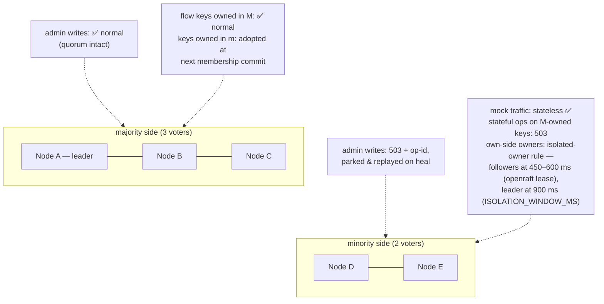

# Chapter 9 — Durability & Failure

This chapter is the system's honesty ledger: one table for *what survives
what*, one for *how each operation behaves when the cluster is degraded*, and
walkthroughs of the failure scenarios that matter. Nothing here is
open-ended — every window is bounded, counted in metrics, and visible on the
wire (`Rift-Cluster-*` headers). The design's standing rule: **when
correctness and availability conflict, reject loudly; never answer wrong
quietly.** A mock that 503s makes a test fail visibly; a mock that answers
stale makes a test pass falsely.

## The survival matrix

What state lives where, and what it survives:

| State | Store | Node crash | Full-cluster restart | Notes |
|---|---|---|---|---|
| Membership, node ids | Raft log/vote (`redb`, fsync) | ✅ | ✅ | Group re-forms from disk |
| Raft snapshot payload | file at `<cluster-state-dir>/snapshot/<id>` (temp → fsync → rename → dir fsync); `redb` holds only `{meta, file}` | ✅ | ✅ | Derived state — a missing payload is rebuilt, not mourned (#436) |
| `departed` marker | file in the state dir, fsync'd before the drain | ✅ | ✅ | Steers the next start between *resume*, *rejoin* and *bootstrap* (D-26) |
| Imposter configs + `enabled` + revisions | Raft state machine | ✅ | ✅ | Committed = fsync'd on majority |
| Front-door route table + its revision | Raft state machine | ✅ | ✅ | Committed with the configs it routes to |
| Session-signing key, fleet name | Raft state machine | ✅ | ✅ | A console session survives any restart the fleet does |
| Admin intents + op-dedup | Raft SM + accepting node's `pending_intents` | ✅ | ✅ | R4: parked before forwarded |
| Flow state @ `sync` | FlowShard `redb`, fsync-per-ack | ✅ | ✅ **zero loss** | |
| Flow state @ `async` (default) | FlowShard, group fsync per 50 ms | ✅ (replicas live) | ✅ minus ≤ 1 interval | Loss only if **all 3** holders die inside one interval |
| Flow state @ `none` | memory | via replicas | ❌ (opted) | Throwaway CI imposters |
| Sequence cursors | memory | ❌ reset (D-8) | ❌ | Deliberate: hottest stateful path, test-run-scoped |
| Request journal + counters | memory (upstream's own per-node journal) | ❌ that node's | ❌ | In-run assertion data, bounded buffers |
| proxyOnce `Pending` claims | owner memory | ❌ re-claimable | ❌ | By design — Chapter 6 |
| proxyOnce `Recorded` + recorded stubs | via config (Raft SM) | ✅ | ✅ | Recordings are config |

The volatile rows are decisions, not gaps: each would cost hot-path writes to
preserve state whose value ends with the test run.

The journal row is the plainest of them since D-74 (#552): a node's recorded requests are that
node's, held in upstream's own in-memory journal, and a restart loses them exactly as a restart of
the single-node binary does. There is no fleet identity attached to an entry any more — no
`(node_id, seq)` a peer's cache or a live cursor keeps referring to — so nothing about the
recording path needs to be durable to stay *correct*, only to stay *present*, and presence is what
the row above declines to buy.

## The degradation table

> **Amended by D-66** (2026-08-29, #529): the *proxyOnce claim* row's `503` is now what the code
> answers. It previously forwarded to the real upstream without a claim — the outcome the row
> exists to prevent — because the store's refusal was flattened into upstream's degrade-shaped
> error. A refused claim is never forwarded and is counted
> `rift_cluster_proxy_claims_total{outcome="refused"}`.

Behavior per operation class when the relevant authority is unreachable.
Defaults shown; `local` overrides exist per feature and stamp
`Rift-Cluster-Degraded: <feature>` on every response they taint:

One class the word *unreachable* does not cover: an authority that is perfectly
reachable and **refuses itself**. A flow owner that cannot see a quorum reports
`is_isolated()` and declines its own owner-side writes and strong reads (D-17,
the isolated-owner rule, Chapter 6). The outcomes in the table are unchanged —
the caller still gets a fast failure rather than a stale answer — but the cause
is the owner's own quorum state, not the network between caller and owner, and
`Rift-Cluster-Degraded` does **not** fire for it: nothing degraded, the write was
refused.

What is observable differs by operation, and it is worth stating exactly:
a refused **write** increments `rift_cluster_cas_conflicts_total{reason="isolated"}`;
a refused **forwarded** read surfaces on the serving node only as a logged
`RpcError` with its `reason()` label; a refused **local** owner-read leaves no
count at all. That asymmetry is the reason to read the *condition* rather than
its symptoms: a read-heavy workload can trip the isolated-owner rule continuously
and move none of the counters above.

The **message** is the same refusal wherever the read entered the cluster. A
`strong` read forwarded to an isolated owner fails with `backend unavailable:
flowState: unavailable: flow store: owner is isolated from the cluster` through
any node (D-61, wrapped per D-65 — `owner is isolated from the cluster` is the
stable substring to grep for): the forwarding hop relays the owner's own error
instead of restating it as its own transport failure. Before #471 the same read reported `flow store: transport
failure: <authority> unreachable (<addr>: …)`, which pointed on-call at the
network for a peer that was up and had answered — the reason survived only as a
substring of a sentence that contradicted it.

> **Amended by D-65** (2026-08-28, #522): the status paragraph below replaces one that
> recorded a 500 — the store then handed the engine a bare `anyhow::Error`, and the table
> above promised a 503 it did not deliver.

The **status** is the one this table promises. The store attaches
`BackendUnavailable { feature: "flowState" }` to every failure caused by the
cluster's state — the isolation refusal, an unreachable or shedding owner, a
fenced or misrouted write, a node that is not ready (not bound, no applied
membership, shut down), on this node or on the owner it forwarded to — and the data
plane's `backend_error_response` answers **503** (`type: "backend unavailable"`) with the
reason in `detail` (D-65). That is what the scenario match gate, the scenario
transition and the debug preview answer. Two doors erase the type before it
gets there and are unchanged: a `{{ state.k }}` token renders **empty** in a
**200** (or a 500 `x-rift-template-error` under `RIFT_DEBUG`), and a script's
`ctx.state.get` raises a 500 `script error` — the same as a Redis outage on those
paths. So the status distinguishes isolation from a fault on the FSM paths, and
on the template and script paths the message and the `isolated` field remain the
signals.

The condition is the `isolated` field of `/_cluster/status`, `/_cluster/health`
and `/_fleet/health` — `true` while this node cannot see the quorum, `false`
otherwise (#470). Every reader gets the same sample of the same rule:
`StatusReport::isolated` and `RaftNode::is_isolated` both evaluate
`isolated_from`, so two readings of one safety condition cannot drift apart. The
`rift_cluster_isolated` gauge that once carried the same bit was retired with the
operator metrics product (**D-71**, #548); the field is the reading, and it is
live rather than resampled on a timer.

Widening `rift_cluster_cas_conflicts_total{reason="isolated"}` to cover reads
was rejected: it is documented as owner-side **write** refusals, and changing
what an existing family counts would silently redefine what the scenarios that
read it are asserting.

| Operation | Authority | Unreachable ⇒ default | Rationale |
|---|---|---|---|
| Admin write (config, tenancy, enable) | Raft quorum | `503` + `Retry-After` + **op-id, durably parked, auto-replayed** | R4: refused ≠ lost |
| Scenario match-gate read | flow owner | fast-fail `503` | A stale read here = silently wrong stub |
| Scenario CAS / flow-KV write | flow owner | fast-fail `503` | Single-writer or nothing |
| Script flow-KV read (`strong`, default) | flow owner | `503` | Scripts drive responses off this |
| Script flow-KV read (`local`, opt-in) | — | local replica, flagged when owner down | Imposter chose speed |
| Sequence advance | cursor owner (opt-in, D-47) | **falls back to the node-local cursor, annotated and counted** (`rift_cluster_sequence_fallbacks_total`) | Blocking all cyclic responses during a blip is worse than a possible duplicate index — the one place availability wins (D-10). Never a `503`; the counter, not the returned index, is what distinguishes a degraded answer from a healthy one |
| proxyOnce claim | signature owner | `503`, **never forwarded**; counted `rift_cluster_proxy_claims_total{outcome="refused"}` (D-66) | Duplicate upstream side-effects are worse than a failed mock call — and with the owner unreachable the duplicate is bounded by the *outage*, not by "1 + ownership changes" |
| Journal append / count | — (always local) | unaffected | Recording never leaves the node |
| Journal / count read | — (this node's own journal) | unaffected, and scoped to this node by contract | A per-node answer cannot be partial: there is nothing it failed to reach (D-74) |
| Admin config read | — (local applied state) | served, possibly behind; revision comparable | Staleness is measurable, not hidden |

## The replication ceiling

**The log carries metadata, and nothing else** (D-71, #549). Every op is small
JSON: the only payloads that were ever measured in MiB — an uploaded OpenAPI
document, a CSV table — no longer enter the cluster at all, and neither does the
out-of-band transport that once carried them. What follows describes the log's
own large-entry path (#411): it still exists and still bounds any entry the
transport cap admits, but nothing routine takes it any more.

What bounds a log entry's size is the transport's own body cap (32 MiB). What
bounds its *latency* is the link:

- A large entry commits in **`O(size / link speed)`**, not in one heartbeat.
  openraft grants each AppendEntries RPC only `heartbeat_interval` (50 ms), so
  the transfer deliberately **outlives** that deadline — it runs on its own task
  in the network adapter, and openraft's re-send attaches to the transfer in
  flight instead of restarting it from byte 0.
- **Heartbeats and failover are unaffected.** A heartbeat carries no entries and
  is sent inline, never queued behind a transfer, so the leader keeps its term
  for the whole upload. The election timers are untouched (50 / 150–300 ms), and
  ADR-001's "~1–3 s elections" still holds.
- An entry that cannot cross the link at **≥ 1 MiB/s** exceeds its transfer
  deadline. The op then takes the ordinary parked-intent path — `503`, op-id,
  durably parked, auto-replayed — and op-id dedup makes the eventual commit
  happen exactly once.
- A follower that refuses an over-cap batch answers `413`. The leader halves the
  batch and retries immediately rather than treating the peer as unreachable, so
  a lagging follower catching up across several large entries makes progress
  instead of backing off forever.

Before #411 none of this was true: every attempt was cut at 50 ms and restarted,
so a 512 KiB entry took 23–548 s and anything ≥ 1 MiB never committed at all —
the effective ceiling was "whatever replicates in one heartbeat", far below the
entry sizes the write path admits.

**The silent window, and why it is closed.** A follower's election timer is
refreshed only by an AppendEntries that reaches its engine, and openraft 0.9
sends a follower nothing else while a large entry is in flight nor anything at
all during a snapshot install. A window longer than `election_timeout_min`
(150 ms) makes a **voter** campaign, and once its term has moved the leader —
which rejects a candidate without adopting its term — never reconciles with it.
Two independent fixes closed it, and removing the multi-MiB payloads removed what
opened it in the first place. #431 supplies a per-peer liveness heartbeat that
bypasses the health tracker, a 50 ms reconnect backoff, and a restart grace for a
node that already belongs to a cluster, so a voter no longer campaigns through a
legitimate transfer; a stale replication core reading a range the new leader's
conflict had truncated — the openraft 0.9.24 panic behind #430 — is tolerated
from 0.9.25 (#435). And with every op back in KiB (D-71, #549), the multi-MiB
entries and multi-MiB `InstallSnapshotRequest`s that used to make the window
*routine* no longer exist.

## Scenario walkthroughs

**One voter crashes (the common case).** Raft elects within ~1–3 s if it was
the leader (admin writes pause invisibly — intents park and replay); mock
traffic unaffected on surviving nodes. Flow keys owned by the dead node are
adopted by their successors after the membership entry commits — staleness ≤
one replication round, or a flagged FSM reset if all replicas were lost too.
LB health checks drain the dead node. Nothing requires an operator.

**Network partition, 5 nodes → 3|2:**

The minority never diverges — it *refuses*. On heal: parked intents replay
(op-dedup makes replay exactly-once), minority nodes catch up on the log, and
the fencing tuple `(m_idx, v, origin)` disposes of anything an isolated owner
wrote inside the heartbeat window. What v2 needed conflict counters and merge
rules for, this design makes structurally unrepresentable — the one lost-update
class remaining is the flagged, opt-in `local` modes.

**Full-cluster restart (deploy, power event).** Chapter 3's cold start: redb →
group re-forms → replay. Configs, tenancy, intents: intact (R3). Flow state:
per its durability level. Recorded requests: gone on every node (matrix above). A CI run interrupted
mid-flight resumes against identical mocks with identical scenario states (at
`sync`/`async`), which is precisely the "always-on shared environment" promise.

**Disk loss on one node.** The node restarts empty → it is a *new* node
(identity lived on that disk — unless `--cluster-node-name` is set, which
re-derives the same id): joins as learner, snapshots the state machine,
re-syncs flow replicas. The old id is removed by runbook. No data loss —
everything it held exists on ≥ 2 other disks. **Correlated disk loss on a
majority of voters** is the honest limit of a self-contained cluster: configs
survive only as `--datadir` exports/backups (Chapter 10's backup runbook);
this is stated rather than hedged.

That catch-up moves the *whole* state machine — imposter configs, tenancy,
bindings, dedup — and it costs roughly 4× its size on the wire, because snapshot
chunks ride the JSON cluster port as byte
arrays. The transfer is bounded **per chunk**, not per snapshot: a chunk that
misses its deadline abandons the entire transfer back to offset 0, so the bounds
are deliberately generous rather than tight (#428). Two apply, and the smaller
governs — the RPC's own size-aware deadline (~6 s for a 1 MiB chunk: a flat
budget plus a 1 MiB/s floor on the link) inside openraft's per-chunk
`install_snapshot_timeout` of 10 s. The join itself never rides that install:
admission is two-phase (#433) — the join RPC returns once the membership
entry commits, the node starts up as a learner, and the leader promotes it to
voter when its replication is current. However long the catch-up above takes,
it delays *promotion*, never startup; a refused, unreachable, or mis-secreted
join still fails the deployment exactly as before.

**What a snapshot costs to store, measured (#436).** The payload is written as a plain file beside
redb rather than inlined into a `redb` row as a JSON integer array, which is what made the stored
artifact ~3.7× the bytes it carried. Measured after the change, on loopback: a fleet holding 4 MiB
of state stores **1.00×** its raw bytes, and one holding 16 MiB likewise **1.00×**.

**Fresh-joiner catch-up, before and after (#436),** same probe on both sides, 1 voter → 2:

| fleet state | before (#436) | after file-backed (#436) |
|---|---|---|
| 4 MiB | 3.1 s | **2.2 s** |
| 16 MiB | 12.3 s | **8.8 s** |

Those figures were measured against a state machine that could reach tens of MiB. It no longer can:
the state machine holds imposter configs, tenancy and dedup — small JSON, all of it — so a snapshot
is bounded by how many imposters a fleet runs, not by an upload quota (D-71, #549). The
`InstallSnapshotRequest` path is still openraft's own, still chunked as a JSON integer array, and
still the reason a snapshot is measured rather than assumed; what changed is that nothing puts MiB
of payload into it any more.

**Producing a snapshot costs the leader CPU, but never its runtime (#444).** The chapter above
describes what a catch-up costs the *joiner*; the other half is what building one costs the node
that serves it. A build walks every state-machine table and encodes the result — O(state) CPU with
no await in it — and an install does the same in reverse under one `Durability::Immediate`
transaction. All three of `build_snapshot`, `get_current_snapshot` and `install_snapshot` run that
work on tokio's **blocking pool**, never on a runtime worker, so heartbeats, elections and the
per-peer liveness ticker are unaffected by a build or an install of any size.

That placement is load-bearing rather than tidy. tokio cannot preempt a synchronous body, so before
#444 a build held a runtime worker for its whole duration; on a two-vCPU runner — where all three
in-process nodes' runtimes share two vCPUs — that was long enough for a follower's election timeout
(150–300 ms) to fire and for the leader to lose office while doing nothing but snapshotting. The
`worker_threads = 1` gate in `raft::store`'s tests pins it: the leader's tick gap across a build,
read and install of a ≥ 16 MiB snapshot stays under `election_timeout_min`, measured with **no
joiner present** so the leader-side cost is isolated from anything on the install path.

**The write path still has this shape, in one place.** `RaftLogStorage::append` is synchronous on a
runtime worker — it commits and fsyncs every entry before acknowledging it — and is not hoisted: a
blocking-pool hop per committed entry buys latency for nothing on the hot path, and every entry is
KiB of JSON (D-71, #549), so the serde and fsync it carries are small. `apply` writes `sm_*` tables
and calls the local engine; it carries no bulk payload of any kind.

A related case, and the one more likely to be met in practice: the scenario
above is a node that comes back **empty**. A node that returns still holding its
old state, having been down long enough for the fleet to snapshot and purge past
it, is caught up by snapshot too — but only since #431. Before it the leader's
own peer-health tracker refused to heartbeat the restarted voter for its
cooldown, the voter campaigned, its term ran away, and it stayed at the index it
left off forever. The liveness probes of D-22 close that window;
`a_restarted_voter_behind_a_purged_log_catches_up_by_snapshot` pins it, term
assertion included.

**Slow node (GC-pause-class stall, not dead).** The three protections:
fast-fail RPC health stops per-request timeout burn; the bounded bridge sheds
stateful ops so stateless traffic never queues behind a black hole (chaos C13
pins stateless p99 < 5 ms through owner loss); the write barrier caps at 2 s
and names the straggler in `Rift-Cluster-Warnings` rather than hanging the
admin plane.

## The client-visible contract

Everything above surfaces through five headers — `Rift-Cluster-Revision`,
`Rift-Cluster-Op-Id`, `Rift-Cluster-Warnings`, `Rift-Cluster-Degraded`,
`Rift-Cluster-Partial` — plus `rift_cluster_degraded_ops_total{feature}` and
friends in metrics. A strict test harness asserts the absence of the last
three; a lenient one ignores them. Both get the truth.

`Rift-Cluster-Partial` is the narrowest of the five, and deliberately so since D-74 (#552): it is
stamped only on reads that genuinely fan out across the fleet — `/_fleet/members`,
`/_fleet/health`, the fleet spaces listing — where "I could not reach every node" is a fact about
the answer. A read that was never a fan-out cannot be partial, so requests reads no longer carry
it at all rather than carrying it as a permanent disclaimer.
