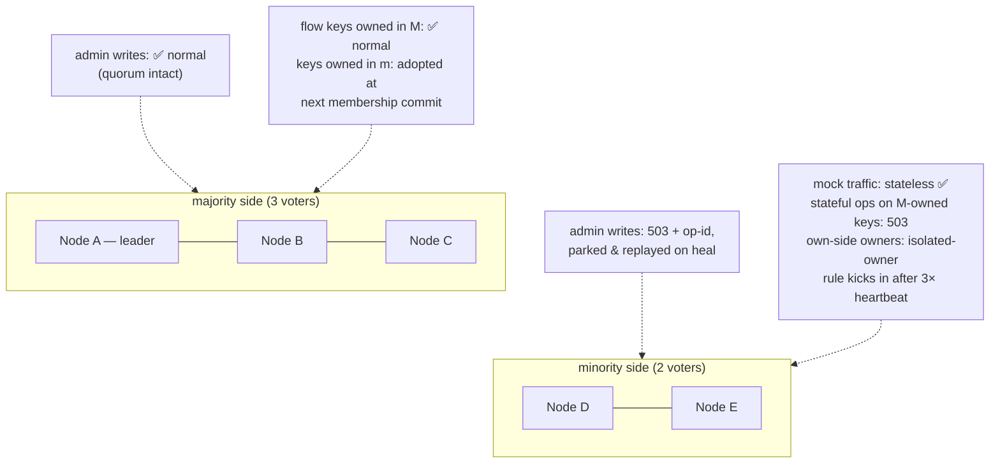

# Chapter 9 — Durability & Failure

This chapter is the system's honesty ledger: one table for *what survives
what*, one for *how each operation behaves when the cluster is degraded*, and
walkthroughs of the failure scenarios that matter. Nothing here is
open-ended — every window is bounded, counted in metrics, and visible on the
wire (`Rift-Cluster-*` headers). The design's standing rule: **when
correctness and availability conflict, reject loudly; never answer wrong
quietly.** A mock that 503s makes a test fail visibly; a mock that answers
stale makes a test pass falsely.

## The survival matrix

What state lives where, and what it survives:

| State | Store | Node crash | Full-cluster restart | Notes |
|---|---|---|---|---|
| Membership, node ids | Raft log/vote/snapshot (`redb`, fsync) | ✅ | ✅ | Group re-forms from disk |
| Imposter configs + `enabled` + revisions | Raft state machine | ✅ | ✅ | Committed = fsync'd on majority |
| Tenants, principals, bindings | Raft state machine | ✅ | ✅ | Authz survives anything the configs survive |
| Admin intents + op-dedup | Raft SM + accepting node's `pending_intents` | ✅ | ✅ | R4: parked before forwarded |
| Flow state @ `sync` | FlowShard `redb`, fsync-per-ack | ✅ | ✅ **zero loss** | |
| Flow state @ `async` (default) | FlowShard, group fsync per 50 ms | ✅ (replicas live) | ✅ minus ≤ 1 interval | Loss only if **all 3** holders die inside one interval |
| Flow state @ `none` | memory | via replicas | ❌ (opted) | Throwaway CI imposters |
| Sequence cursors | memory | ❌ reset (D-8) | ❌ | Deliberate: hottest stateful path, test-run-scoped |
| Request journal + counters | memory (CRDT shards) | ❌ that shard | ❌ | In-run assertion data, bounded buffers |
| proxyOnce `Pending` claims | owner memory | ❌ re-claimable | ❌ | By design — Chapter 7 |
| proxyOnce `Recorded` + recorded stubs | via config (Raft SM) | ✅ | ✅ | Recordings are config |

The volatile rows are decisions, not gaps: each would cost hot-path writes to
preserve state whose value ends with the test run.

## The degradation table

Behavior per operation class when the relevant authority is unreachable.
Defaults shown; `local` overrides exist per feature and stamp
`Rift-Cluster-Degraded: <feature>` on every response they taint:

| Operation | Authority | Unreachable ⇒ default | Rationale |
|---|---|---|---|
| Admin write (config, tenancy, enable) | Raft quorum | `503` + `Retry-After` + **op-id, durably parked, auto-replayed** | R4: refused ≠ lost |
| Scenario match-gate read | flow owner | fast-fail `503` | A stale read here = silently wrong stub |
| Scenario CAS / flow-KV write | flow owner | fast-fail `503` | Single-writer or nothing |
| Script flow-KV read (`strong`, default) | flow owner | `503` | Scripts drive responses off this |
| Script flow-KV read (`local`, opt-in) | — | local replica, flagged when owner down | Imposter chose speed |
| Sequence advance | owner (Phase 4) | **`local`** by default: node-local cursor, flagged | Blocking all cyclic responses during a blip is worse than a possible duplicate index — the one place availability wins |
| proxyOnce claim | signature owner | `503` | Duplicate upstream side-effects are worse than a failed mock call |
| Journal append / count | — (always local) | unaffected | Mergeable by design |
| Journal / count read | all peers | merge of reachable shards + `Rift-Cluster-Partial: true` | Partial-and-says-so beats blocked |
| Admin config read | — (local applied state) | served, possibly behind; revision comparable | Staleness is measurable, not hidden |

## Scenario walkthroughs

**One voter crashes (the common case).** Raft elects within ~1–3 s if it was
the leader (admin writes pause invisibly — intents park and replay); mock
traffic unaffected on surviving nodes. Flow keys owned by the dead node are
adopted by their successors after the membership entry commits — staleness ≤
one replication round, or a flagged FSM reset if all replicas were lost too.
LB health checks drain the dead node. Nothing requires an operator.

**Network partition, 5 nodes → 3|2:**

The minority never diverges — it *refuses*. On heal: parked intents replay
(op-dedup makes replay exactly-once), minority nodes catch up on the log, and
the fencing tuple `(m_idx, v, origin)` disposes of anything an isolated owner
wrote inside the heartbeat window. What v2 needed conflict counters and merge
rules for, this design makes structurally unrepresentable — the one lost-update
class remaining is the flagged, opt-in `local` modes.

**Full-cluster restart (deploy, power event).** Chapter 3's cold start: redb →
group re-forms → replay. Configs, tenancy, intents: intact (R3). Flow state:
per its durability level. Journal: empty (matrix above). A CI run interrupted
mid-flight resumes against identical mocks with identical scenario states (at
`sync`/`async`), which is precisely the "always-on shared environment" promise.

**Disk loss on one node.** The node restarts empty → it is a *new* node
(identity lived on that disk): joins as learner, snapshots the state machine,
re-syncs flow replicas. The old id is removed by runbook. No data loss —
everything it held exists on ≥ 2 other disks. **Correlated disk loss on a
majority of voters** is the honest limit of a self-contained cluster: configs
survive only as `--datadir` exports/backups (Chapter 10's backup runbook);
this is stated rather than hedged.

**Slow node (GC-pause-class stall, not dead).** The three protections:
fast-fail RPC health stops per-request timeout burn; the bounded bridge sheds
stateful ops so stateless traffic never queues behind a black hole (chaos C13
pins stateless p99 < 5 ms through owner loss); the write barrier caps at 2 s
and names the straggler in `Rift-Cluster-Warnings` rather than hanging the
admin plane.

## The client-visible contract

Everything above surfaces through five headers — `Rift-Cluster-Revision`,
`Rift-Cluster-Op-Id`, `Rift-Cluster-Warnings`, `Rift-Cluster-Degraded`,
`Rift-Cluster-Partial` — plus `rift_cluster_degraded_ops_total{feature}` and
friends in metrics. A strict test harness asserts the absence of the last
three; a lenient one ignores them. Both get the truth.
