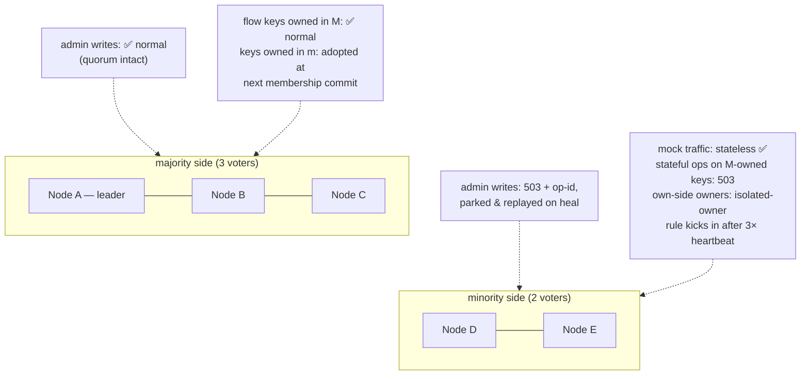

# Chapter 9 — Durability & Failure

This chapter is the system's honesty ledger: one table for *what survives
what*, one for *how each operation behaves when the cluster is degraded*, and
walkthroughs of the failure scenarios that matter. Nothing here is
open-ended — every window is bounded, counted in metrics, and visible on the
wire (`Rift-Cluster-*` headers). The design's standing rule: **when
correctness and availability conflict, reject loudly; never answer wrong
quietly.** A mock that 503s makes a test fail visibly; a mock that answers
stale makes a test pass falsely.

## The survival matrix

What state lives where, and what it survives:

| State | Store | Node crash | Full-cluster restart | Notes |
|---|---|---|---|---|
| Membership, node ids | Raft log/vote (`redb`, fsync) | ✅ | ✅ | Group re-forms from disk |
| Raft snapshot payload | file at `<cluster-state-dir>/snapshot/<id>` (temp → fsync → rename → dir fsync); `redb` holds only `{meta, file}` | ✅ | ✅ | Derived state — a missing payload is rebuilt, not mourned (#436) |
| `departed` marker | file in the state dir, fsync'd before the drain | ✅ | ✅ | Steers the next start between *resume*, *rejoin* and *bootstrap* (D-26) |
| Imposter configs + `enabled` + revisions | Raft state machine | ✅ | ✅ | Committed = fsync'd on majority |
| Tenants, principals, bindings | Raft state machine | ✅ | ✅ | Authz survives anything the configs survive |
| Admin intents + op-dedup | Raft SM + accepting node's `pending_intents` | ✅ | ✅ | R4: parked before forwarded |
| Flow state @ `sync` | FlowShard `redb`, fsync-per-ack | ✅ | ✅ **zero loss** | |
| Flow state @ `async` (default) | FlowShard, group fsync per 50 ms | ✅ (replicas live) | ✅ minus ≤ 1 interval | Loss only if **all 3** holders die inside one interval |
| Flow state @ `none` | memory | via replicas | ❌ (opted) | Throwaway CI imposters |
| Sequence cursors | memory | ❌ reset (D-8) | ❌ | Deliberate: hottest stateful path, test-run-scoped |
| Request journal + counters | memory (CRDT shards) | ❌ that shard | ❌ | In-run assertion data, bounded buffers |
| Journal per-port **seq floor** | `journal-seq-floors` in the state dir | ✅ | ✅ | Not the entries — just the counter, so a restarted writer cannot reuse `(node_id, seq)` (#351) |
| proxyOnce `Pending` claims | owner memory | ❌ re-claimable | ❌ | By design — Chapter 7 |
| proxyOnce `Recorded` + recorded stubs | via config (Raft SM) | ✅ | ✅ | Recordings are config |

The volatile rows are decisions, not gaps: each would cost hot-path writes to
preserve state whose value ends with the test run.

The seq-floor row is the one place that reasoning was applied too widely, and
#351 corrects it. The journal's *entries* are indeed test-run-scoped and stay
volatile. Its *counter* is not the same kind of thing: `node_id` is durable, so
`(node_id, seq)` is an identity the rest of the fleet keeps referring to — in
replica caches and in live cursors — after the writer that issued it is gone.
A counter that restarted at 0 would hand those identities out a second time,
which is not lost data but wrong data. Persisting it also does not cost a
hot-path write, because the floor is reserved a block at a time: one fsync per
2^20 appends per port, and nothing at all in between.

## The degradation table

Behavior per operation class when the relevant authority is unreachable.
Defaults shown; `local` overrides exist per feature and stamp
`Rift-Cluster-Degraded: <feature>` on every response they taint:

One class the word *unreachable* does not cover: an authority that is perfectly
reachable and **refuses itself**. A flow owner that cannot see a quorum reports
`is_isolated()` and declines its own owner-side writes and strong reads (D-17,
the isolated-owner rule, Chapter 6). The outcomes in the table are unchanged —
the caller still gets a fast failure rather than a stale answer — but the cause
is the owner's own quorum state, not the network between caller and owner, and
`Rift-Cluster-Degraded` does **not** fire for it: nothing degraded, the write was
refused.

What is observable differs by operation, and it is worth stating exactly:
a refused **write** increments `rift_cluster_cas_conflicts_total{reason="isolated"}`;
a refused **forwarded** read surfaces on the serving node as
`rift_cluster_rpc_failures_total{reason="unavailable"}`; a refused **local**
owner-read emits no metric at all today. The condition itself is on the
`isolated` field of `/_cluster/health` (and `/_fleet/health`), which is the
signal to watch — exposing it as a gauge is #470.

| Operation | Authority | Unreachable ⇒ default | Rationale |
|---|---|---|---|
| Admin write (config, tenancy, enable) | Raft quorum | `503` + `Retry-After` + **op-id, durably parked, auto-replayed** | R4: refused ≠ lost |
| Scenario match-gate read | flow owner | fast-fail `503` | A stale read here = silently wrong stub |
| Scenario CAS / flow-KV write | flow owner | fast-fail `503` | Single-writer or nothing |
| Script flow-KV read (`strong`, default) | flow owner | `503` | Scripts drive responses off this |
| Script flow-KV read (`local`, opt-in) | — | local replica, flagged when owner down | Imposter chose speed |
| Sequence advance | cursor owner (opt-in, D-47) | **falls back to the node-local cursor, annotated and counted** (`rift_cluster_sequence_fallbacks_total`) | Blocking all cyclic responses during a blip is worse than a possible duplicate index — the one place availability wins (D-10). Never a `503`; the counter, not the returned index, is what distinguishes a degraded answer from a healthy one |
| proxyOnce claim | signature owner | `503` | Duplicate upstream side-effects are worse than a failed mock call |
| Journal append / count | — (always local) | unaffected | Mergeable by design |
| Journal / count read | all peers | merge of reachable shards + `Rift-Cluster-Partial: true` | Partial-and-says-so beats blocked |
| Journal read **from a crash-restarted writer** | all peers | merge, still `Rift-Cluster-Partial: true` while peers cache entries of its own lost shard (#349) | The entries are gone for good, not late — a knowingly short answer must say so |
| Admin config read | — (local applied state) | served, possibly behind; revision comparable | Staleness is measurable, not hidden |
| Admin write **carrying a large payload** (spec ≤ 4 MiB, dataset ≤ 8 MiB) | Raft quorum | commits in `O(size / link speed)`; below ~1 MiB/s the intent parks and replays | The bytes ride the log — a big entry is slow, not impossible (#411) |

## The replication ceiling

Two shipped quotas put real bytes in a single log entry: a spec document up to
4 MiB (RFC-004 S2) and a dataset up to a tenant-configurable 8 MiB (RFC-005 §4).
The fleet carries them as **one entry each** — atomically, or not at all.

What bounds an entry's size is the transport's own body cap (32 MiB), which sits
above every quota. What bounds its *latency* is the link:

- A large entry commits in **`O(size / link speed)`**, not in one heartbeat.
  openraft grants each AppendEntries RPC only `heartbeat_interval` (50 ms), so
  the transfer deliberately **outlives** that deadline — it runs on its own task
  in the network adapter, and openraft's re-send attaches to the transfer in
  flight instead of restarting it from byte 0.
- **Heartbeats and failover are unaffected.** A heartbeat carries no entries and
  is sent inline, never queued behind a transfer, so the leader keeps its term
  for the whole upload. The election timers are untouched (50 / 150–300 ms), and
  ADR-001's "~1–3 s elections" still holds.
- An entry that cannot cross the link at **≥ 1 MiB/s** exceeds its transfer
  deadline. The op then takes the ordinary parked-intent path — `503`, op-id,
  durably parked, auto-replayed — and op-id dedup makes the eventual commit
  happen exactly once.
- A follower that refuses an over-cap batch answers `413`. The leader halves the
  batch and retries immediately rather than treating the peer as unreachable, so
  a lagging follower catching up across several large entries makes progress
  instead of backing off forever.

Before #411 none of this was true: every attempt was cut at 50 ms and restarted,
so a 512 KiB entry took 23–548 s and anything ≥ 1 MiB never committed at all —
the effective ceiling was "whatever replicates in one heartbeat", far below both
documented quotas.

**The silent window.** A follower's election timer is refreshed only by an
AppendEntries that reaches its engine. openraft 0.9 sends a follower nothing
else while a large entry is in flight (a heartbeat tick to a lagging follower
re-sends the entry) and nothing at all during a snapshot install. Any such
window longer than `election_timeout_min` (150 ms) makes a **voter** campaign,
and once its term has moved the leader — which rejects a candidate without
adopting its term — never reconciles with it. Large payloads make that window
routine; CPU pressure widens it. That churn is the real mechanism behind the
issues this chapter used to list separately: a leader that loses its term keeps
its replication cores alive for a moment, and a stale core reading a range the
new leader's conflict has truncated was what openraft 0.9.24 panicked on
(#430 — an empty read is tolerated from 0.9.25, #435). Closing the window
itself is #431: a per-peer liveness heartbeat that bypasses the health tracker,
a 50 ms reconnect backoff, and a restart grace for a node that already belongs
to a cluster. The measured story is in the RCA report linked from those issues.

## Scenario walkthroughs

**One voter crashes (the common case).** Raft elects within ~1–3 s if it was
the leader (admin writes pause invisibly — intents park and replay); mock
traffic unaffected on surviving nodes. Flow keys owned by the dead node are
adopted by their successors after the membership entry commits — staleness ≤
one replication round, or a flagged FSM reset if all replicas were lost too.
LB health checks drain the dead node. Nothing requires an operator.

**Network partition, 5 nodes → 3|2:**

The minority never diverges — it *refuses*. On heal: parked intents replay
(op-dedup makes replay exactly-once), minority nodes catch up on the log, and
the fencing tuple `(m_idx, v, origin)` disposes of anything an isolated owner
wrote inside the heartbeat window. What v2 needed conflict counters and merge
rules for, this design makes structurally unrepresentable — the one lost-update
class remaining is the flagged, opt-in `local` modes.

**Full-cluster restart (deploy, power event).** Chapter 3's cold start: redb →
group re-forms → replay. Configs, tenancy, intents: intact (R3). Flow state:
per its durability level. Journal: empty (matrix above). A CI run interrupted
mid-flight resumes against identical mocks with identical scenario states (at
`sync`/`async`), which is precisely the "always-on shared environment" promise.

**Disk loss on one node.** The node restarts empty → it is a *new* node
(identity lived on that disk — unless `--cluster-node-name` is set, which
re-derives the same id): joins as learner, snapshots the state machine,
re-syncs flow replicas. The old id is removed by runbook. No data loss —
everything it held exists on ≥ 2 other disks. **Correlated disk loss on a
majority of voters** is the honest limit of a self-contained cluster: configs
survive only as `--datadir` exports/backups (Chapter 10's backup runbook);
this is stated rather than hedged.

That catch-up moves the *whole* state machine, datasets and spec documents
included, so it is measured in MiB rather than KiB — and it costs roughly 4× its
size on the wire, because snapshot chunks ride the JSON cluster port as byte
arrays. The transfer is bounded **per chunk**, not per snapshot: a chunk that
misses its deadline abandons the entire transfer back to offset 0, so the bounds
are deliberately generous rather than tight (#428). Two apply, and the smaller
governs — the RPC's own size-aware deadline (~6 s for a 1 MiB chunk: a flat
budget plus a 1 MiB/s floor on the link) inside openraft's per-chunk
`install_snapshot_timeout` of 10 s. The join itself never rides that install:
admission is two-phase (#433) — the join RPC returns once the membership
entry commits, the node starts up as a learner, and the leader promotes it to
voter when its replication is current. However long the catch-up above takes,
it delays *promotion*, never startup; a refused, unreachable, or mis-secreted
join still fails the deployment exactly as before.

**What a snapshot costs to store, measured (#436).** The payload is written as a plain file beside
redb rather than inlined into a `redb` row as a JSON integer array, which is what made the stored
artifact ~3.7× the bytes it carried. Measured after the change, on loopback: a fleet holding 4 MiB
of datasets stores **1.00×** its raw bytes, and one holding 16 MiB likewise **1.00×**.

**Fresh-joiner catch-up, before and after (#436),** same probe on both sides, 1 voter → 2:

| fleet state | before | after |
|---|---|---|
| 4 MiB | 3.1 s | **2.2 s** |
| 16 MiB | 12.3 s | **8.8 s** |
| 64 MiB | never converges | **still never converges** |

The 64 MiB row is the honest headline: binary, file-backed snapshots cut what a snapshot costs to
*store* and to *install*, but they do not move the ceiling, because the payload is still chunked
onto the wire as a JSON integer array by openraft's own `InstallSnapshotRequest`. That is what
`#432`'s later children address — the ceiling sits between 16 MiB and 64 MiB until then.

**Producing a snapshot costs the leader CPU, but never its runtime (#444).** The chapter above
describes what a catch-up costs the *joiner*; the other half is what building one costs the node
that serves it. A build walks every state-machine table and encodes the result — O(state) CPU with
no await in it — and an install does the same in reverse under one `Durability::Immediate`
transaction. All three of `build_snapshot`, `get_current_snapshot` and `install_snapshot` run that
work on tokio's **blocking pool**, never on a runtime worker, so heartbeats, elections and the
per-peer liveness ticker are unaffected by a build or an install of any size.

That placement is load-bearing rather than tidy. tokio cannot preempt a synchronous body, so before
#444 a build held a runtime worker for its whole duration; on a two-vCPU runner — where all three
in-process nodes' runtimes share two vCPUs — that was long enough for a follower's election timeout
(150–300 ms) to fire and for the leader to lose office while doing nothing but snapshotting. The
`worker_threads = 1` gate in `raft::store`'s tests pins it: the leader's tick gap across a build,
read and install of a ≥ 16 MiB snapshot stays under `election_timeout_min`, measured with **no
joiner present** so the leader-side cost is isolated from anything on the install path.

**The write path still has this shape, in two places.** `apply` is synchronous in the same way — a
`DatasetPut` carries its whole CSV through serde and an fsync on a runtime worker — and so is
`RaftLogStorage::append`, which commits and fsyncs every entry before acknowledging it. Neither is
hoisted: a blocking-pool hop per committed entry buys latency for nothing on the hot path, and
#432's move to digest-only entries shrinks the serde half of it anyway. A heartbeat gap observed
during a large `DatasetPut` is that residual, not a regression of the fix above.

**Catch-up has a size ceiling below the documented quotas, and it is not the one
above.** A fleet holding a few MiB of state catches a node up in seconds
(measured: ~4 MiB in 8 s on loopback). A fleet at RFC-005's 64 MiB per-tenant
dataset ceiling does **not** catch a node up at all — the joiner applies nothing
even given minutes, though the same 64 MiB writes normally. So the quotas in
RFC-005 §4 currently describe more state than a node can be brought up to hold,
and an operator near them should expect a replacement node to fail to converge
rather than to converge slowly. The per-chunk deadline above is not the cause;
the remaining bottleneck is #432.

A related case, and the one more likely to be met in practice: the scenario
above is a node that comes back **empty**. A node that returns still holding its
old state, having been down long enough for the fleet to snapshot and purge past
it, is caught up by snapshot too — but only since #431. Before it the leader's
own peer-health tracker refused to heartbeat the restarted voter for its
cooldown, the voter campaigned, its term ran away, and it stayed at the index it
left off forever. The liveness probes of D-22 close that window;
`a_restarted_voter_behind_a_purged_log_catches_up_by_snapshot` pins it, term
assertion included.

**Slow node (GC-pause-class stall, not dead).** The three protections:
fast-fail RPC health stops per-request timeout burn; the bounded bridge sheds
stateful ops so stateless traffic never queues behind a black hole (chaos C13
pins stateless p99 < 5 ms through owner loss); the write barrier caps at 2 s
and names the straggler in `Rift-Cluster-Warnings` rather than hanging the
admin plane.

## The client-visible contract

Everything above surfaces through five headers — `Rift-Cluster-Revision`,
`Rift-Cluster-Op-Id`, `Rift-Cluster-Warnings`, `Rift-Cluster-Degraded`,
`Rift-Cluster-Partial` — plus `rift_cluster_degraded_ops_total{feature}` and
friends in metrics. A strict test harness asserts the absence of the last
three; a lenient one ignores them. Both get the truth.
