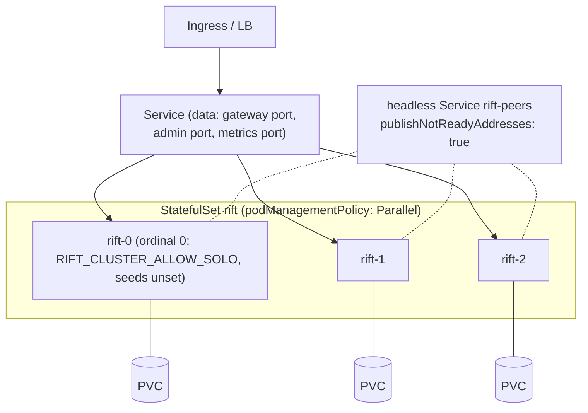

# Chapter 10 — Operations

Running the cluster: bootstrap, Kubernetes, probes, diagnostics, upgrades,
backups, and sizing. The operator experience is a design goal, not an
afterthought — the target user runs ephemeral CI fleets and perimeter-bound
on-prem environments, usually without a dedicated platform team.

## CLI surface (cluster-relevant)

```
rift-cluster-server \
  --cluster                          # master switch; everything below inert without it
  --cluster-allow-solo               # FIRST node of a NEW cluster: found it when no seeds are
                                      # given (a seedless node without it refuses to start)
  --cluster-bind 10.0.0.5:4790       # required: Raft + owner RPC (TCP, one port)
  --cluster-advertise <host:port>    # NAT/container address peers should dial; a hostname
                                      # is re-resolved on every send, IPv6 literals bracketed
  --cluster-seeds rift-0.rift-peers:4790,rift-1.rift-peers:4790   # DNS re-resolved per attempt
  --cluster-secret-file /secrets/cluster.key                # required (or --cluster-insecure)
  --cluster-state-dir /var/lib/rift  # redb: identity, raft log/vote/snapshot + flow shard;
                                      # default <datadir>/_cluster
  --cluster-write-barrier ready-nodes|none    # Ch.4; default ready-nodes
  --cluster-leave-timeout 10         # seconds (default 10); orchestrator grace ≥ 2× this
  --cluster-probe-bind 0.0.0.0:2526  # unauthenticated /readyz + /healthz (default shown)
```

Every flag has an `RIFT_CLUSTER_*` environment form (`crates/rift-cluster-server/src/cli.rs`
is the source of truth; `docs/rift-cluster-server.md` the full reference).

There is no `--cluster-degraded-mode` flag: what a node does when a flow's owner is unreachable
is a per-imposter `readConsistency` setting (D-10, Chapter 9's degradation table), not a
fleet-wide switch — the flag sketched in earlier drafts was superseded rather than built (#378).
Nor is there a `--cluster-features` flag: config sync and flow state are always on under
`--cluster` (#120 — a per-feature opt-out would reintroduce the per-imposter split-brain the
clustered flow store exists to remove).

Guard rails enforced at startup: `--cluster` with `--runtime per-core` is
rejected (the sync bridge assumes a work-stealing data plane — D-14);
`--cluster` with intercept mode is rejected (out of scope); no secret and no
explicit `--cluster-insecure` is a refusal to start; a node with no seeds and
no `--cluster-allow-solo` refuses to start rather than founding a second
cluster beside the real one, and a node that already holds state decides
between *join*, *rejoin* and *bootstrap* by D-26's table — never by wiping it.

## Kubernetes deployment

StatefulSet + headless Service; every peculiarity below exists because a
default manifest deadlocks or loses data:



- **`publishNotReadyAddresses: true`** on the headless Service — readiness
  means "caught up and serving", so on a full restart *no* pod is Ready; a
  default headless Service would publish no seed DNS and nothing could ever
  join. Cluster formation is deliberately independent of readiness.
- **`podManagementPolicy: Parallel`** — `OrderedReady` waits for pod 0 to be
  Ready before starting pod 1, but a one-voter group of a three-voter cluster
  isn't Ready. Classic deadlock, designed out.
- **PVC per pod, non-negotiable** for voters: the Raft vote and log live
  there. `emptyDir` is *unsupported* for durability — a simultaneous restart
  on emptyDir is the correlated-disk-loss scenario of Chapter 9.
- **Gateway-fronted mode** for data traffic (Service ports are static;
  runtime-minted imposter ports can't be exposed) — Chapter 2.
- Probes: readiness `/readyz`, liveness `/healthz` (both unauthenticated).
  `preStop` = SIGTERM with `terminationGracePeriodSeconds ≥ 2 ×
  cluster-leave-timeout` so graceful leave (flow handoff → voter removal)
  completes. `PodDisruptionBudget maxUnavailable: 1`.
- Cluster port stays ClusterIP-internal; secret via K8s Secret →
  `--cluster-secret-file`.

## Diagnostics and metrics

**Endpoints** (cluster port, authenticated; probes excepted):

| Endpoint | Answers |
|---|---|
| `GET /_cluster/members` | roster: id, address, voter/learner, Ready, applied index; plus this node's own `bound_ports` / `bind_failures` (Chapter 2 divergence) |
| `GET /_cluster/config` | per port: revision @ every node, `converged: bool` — the CI wait target |
| `GET /_cluster/imposters` | per-(port, node) bind status (Chapter 2 divergence) |
| `GET /_cluster/ring?key=…` | computed owner + m_idx — "who owns this flow right now". *Designed (RFC-001 §10, phase 2); not served by this build* |
| `GET /_cluster/kv/:flow_id` | owner value vs local replica — the *why is my scenario stuck* endpoint. *Designed (RFC-001 §10, phase 2); not served by this build* |
| `GET /_cluster/ops/:op_id` | intent state: pending / applied / failed (Chapter 4) |
| `GET /_cluster/health` | rolled-up diagnostics for this node; `GET /_fleet/health` is the fleet projection of the same |

**Metrics** (Prometheus, served by the standard metrics port).

> **Retired by D-71** (RFC-007 §3.2, #548): the operator observability pack —
> `deploy/observability/`'s Grafana dashboards, the Prometheus recording and alert
> rules and their `promtool` tests, the compose overlay, and the CI lanes that
> checked them — is removed, along with every `rift_cluster_*` family nothing read
> but a dashboard. Nothing below pages: no alert rule ships with this repository.

What is left is **correctness instrumentation**, not an operator product. Each
surviving family is read by a chaos scenario or an in-process test to pin a claim
no state endpoint can answer — a *count of things that happened* has no state
equivalent — and the authoritative list, with its reader beside each entry, is the
module doc of `crates/rift-cluster/src/metrics.rs`. It is served on the standard
metrics port because that is where the tests already read it.

**Membership, leadership and bind state come from `GET /_fleet/members`**, not from
metrics. A voter list and an agreed `current_leader` are stronger facts than the
`rift_cluster_members{state}` gauges that used to sum to them, and they are read off
the node's Raft state at request time rather than resampled on a 5 s timer, so there
is no sampler to race. `bind_failures` on the same body is the per-port successor to
the bind-failure gauge (#369). `deploy/compose/verify.sh`, `deploy/compose/smoke.sh`
and the chaos harness all assert on that view.

For a partition, `rift_cluster_proxy_claims_total{outcome="refused"}` is the
proxyOnce reading: a claim the cluster could not serialize, answered `503` and
**not** forwarded to the upstream (D-66) — a counter of *refused requests*, so it
measures the blast radius of a partition on proxy traffic rather than its duration.
The condition itself is `isolated` on `GET /_cluster/status` and `GET
/_cluster/health` (#470): `1` while this node cannot see the quorum and is refusing
owner-side operations — proxyOnce claims under D-40, flow-KV owner writes and strong
reads under D-17.

A cursor reset that did not reach every member (**D-57**) is **named in a log
line**, not counted: the `sequencer reset did not reach every member` warning
names the member that is still cycling responses for a stub that was deleted or
replaced, and it will keep doing so until it is asked again or the membership
changes. That warning is the signal — a counter of the same event told you it
happened without telling you where, which is why the count went with the rest of
the retired families (D-71) and the warning stayed.

`rift_cluster_sequence_decisions_total{op,path}` (#476)
(counter, every cursor decision by operation and answering path — **D-63**).
`op` is `next` or `peek`; `path` is `owner` (this node owns the cursor, no hop),
`forward` (one RPC to the owner), `local` (the imposter never opted in — D-10's
default, not a degradation) or `fallback` (the fleet could not answer, the same
event `rift_cluster_sequence_fallbacks_total` counts). Two things to read from it.
`forward / (owner + forward)` is the share of decisions paying an owner hop, the
sequencing counterpart of the same ratio on `rift_cluster_flow_reads_total`. And
**`op="peek"` should never move**: the serving path issues one `next` per decision
and peeks only from the debug response preview, so a rising `peek` means a code
path now pays an owner round trip per cursor reference — the amplification
RFC-001 §11.3 once assumed, arriving for real. Both are what to look at when
sequencing is suspected of costing more than one RPC.

`rift_cluster_flow_wal_lag_ops` is the async durability backlog — the `async`
loss window, measured. The flow-shard tests read it for exactly that; nobody has
chosen a threshold for it that would be meaningful across deployments.

## The admin credential, console sessions and the fleet projection

*Moved here from Chapter 8 by D-73 (#550), which retired that chapter's tenancy body, and
rewritten for one credential. Operating the admin plane is an operations question.*

### One key, or none

The admin plane has exactly one credential: open-source Rift's `--api-key` (`MB_APIKEY`), sent as
the **raw** `Authorization` header value — no `Bearer ` prefix, none stripped — and compared in
constant time. **Set ⇒ the whole admin plane is closed to that key. Unset ⇒ the plane is open**,
exactly as an unclustered `rift` behaves; there is no second switch and no grace window (D-73,
superseding D-44's principal-counting rule). A blank or whitespace-only key is a misconfiguration
and **fails closed** rather than degrading to "no auth", because a request with no `Authorization`
header reaches the comparison as `""` and would otherwise match.

Two surfaces stay open regardless:

- **`/healthz` and `/readyz`** on the probe listener — a liveness probe that needs a credential is
  a probe that fails for the wrong reason.
- **`/__rift/{port}/*`**, the data-plane gateway. Upstream exempts this prefix from its own key
  gate, and the front does not merely skip the check: it must not *inject* the key on that leg
  either, because the request reaches the imposter, where an `Authorization` header would land in
  its predicates and its recorded request log.

There is no per-resource authorization. Whoever holds the key administers the whole fleet;
isolation between teams is two fleets, not a feature (RFC-007 §3.3).

### The loopback leg carries the key, not the caller's credential

The public admin listener is this crate's front; the core admin retreats to an ephemeral loopback
port the front proxies to, and **that listener runs upstream's own key gate**. The front therefore
authenticates first and then presents the *configured* key on both internal legs — the proxied
reads, and the re-read that renders a committed write. It does not forward what the caller sent: a
cookie-authenticated request has no `Authorization` at all, and forwarding a session token would be
refused by a raw compare. Getting this wrong is a confusing failure rather than a quiet one — the
write commits and only the render is refused, so the client is told `401` about a change that
landed.

### `POST /session` — how a browser holds the credential

A browser should not keep the key after login, so `POST /session` exchanges it once for an
HMAC-signed cookie (`HttpOnly`, `Secure`, `SameSite=Strict`, 8-hour `Max-Age`); `DELETE /session`
clears it. The key that signs the token is a fleet-wide control-plane record, so **every node
verifies from its own applied state and a login is not a Raft write** — only the first mint and any
rotation are. A cookie minted on one node is accepted by every other. Because the cookie is
`Secure`, **console login works only over HTTPS** (or a `localhost` origin): over plain HTTP `POST
/session` answers `200`, the browser never stores the cookie, and everything after it is `401` —
terminate TLS in front of the admin port before pointing a browser at it.

**Give the console its own hostname, not one that also serves imposters.** Cookies are scoped by
host, never by port: a browser attaches `rift_session` to *any* request to the origin's hostname,
whatever port it is on. The front strips the cookie from `/__rift/{port}/…` gateway traffic, but
that strip only reaches requests that pass *through* the front. An imposter bound directly on its
own port is a separate listener the front never sees — and once the admin origin is HTTPS, an
imposter declared `"protocol": "https"` on another port of the same hostname satisfies both
`Secure` and `SameSite=Strict`, so the browser hands it a live session token that it will record,
predicate on, and forward through any proxying stub. There is no cookie attribute that would fix
this (`Domain` widens scope, and no `Port` attribute exists), so it is an operational rule: the
hostname the console is served on must not also serve imposters over HTTPS. A distinct hostname
for the admin origin — or imposters on hostnames of their own — is the containment.

That record carries an actual secret into the replicated log — the one op that does, and
deliberately. The distinction is what the secret means *outside* the fleet: an op naming a
credential for a third-party system would spread power that exists somewhere else, and none does;
this key is **fleet-internal and meaningless anywhere else**, and cannot be stored hashed, because
verifying an HMAC requires the key itself — a digest would make the cookie unverifiable by anyone,
including us. It therefore sits inside the same trust boundary as the state directory, which
already holds all committed config. Deriving it from the cluster secret instead was considered and
rejected: that secret is optional (`--cluster-insecure`), so an unauthenticated fleet would have
nothing to derive from.

**Rotation is the containment, and it is structural.** Every token carries the key record's
`revision`; verification refuses a token whose revision is not the current one, so writing a new
key invalidates every outstanding session at once without sweeping a table. It is also the **only**
revocation: with one credential there is no principal to disable, so the documented bounds are the
8-hour `Max-Age` and signing-key rotation, and nothing else. A fleet running with no `--api-key`
has nothing to exchange and answers `400` rather than handing out a cookie that proves nothing.

**What the cookie proves.** Authentication, and nothing more — its subject is the constant
`"admin"` and `session::verify` answers `Result<(), _>`, because there is no identity for it to
resolve to. CSRF is `SameSite=Strict` plus a required `X-Rift-CSRF` header on cookie-authenticated
mutations; a bearer-authenticated request is exempt, because a bearer cannot be attached by a
victim's browser, which is the entire attack. That `403` is the only one this front produces.

### `/_fleet/*` — the read-only projection

The console cannot hold the cluster-port HMAC secret, so the admin port terminates a **read-only
projection** of the operator surface: `GET /_fleet/members`, `/_fleet/health`, `/_fleet/ops/:id`.
`/_cluster/*` on the cluster port is unchanged, and node-vs-node comparison still means asking each
node directly. The projection may *add* to the cluster port's body (the per-voter members fan-out,
the fleet-wide parked-intent sum) but never drop or restate a field — the two ports answering the
same question differently is the failure it exists to avoid.

RFC-006 §12 Q3 asked whether this should be visible below the operator tier. That question was
settled as `ClusterAdmin`-only and is now **moot**: there is one tier. `/_fleet/*` is authenticated
like every other admin route.

### `PUT /admin/fleet/name`

The only fleet-scoped *write* on the admin port, and the reason this route is worth naming: it is
not a projection. It is replicated rather than a per-node flag so two nodes cannot disagree about
what the fleet is called (`ControlOp::FleetNamePut` records the control-plane reasoning). The
operationally relevant half is that the name is **a label, never an identity**: nothing
authorizes, addresses or routes by it, so a fleet renamed mid-flight changes what an operator sees
and nothing about what anyone may do. Node ids remain what every decision is made against.

## Runbooks (sketches; full versions ship with the harness)

The `cluster …` subcommands sketched below are **not built**: the binary has
no membership or recovery subcommand today (membership changes only through a
node joining or leaving — D-25, D-26; the cluster maintains its own log and
snapshots — D-24). They are kept as the design of what a crash-retire and a
majority-loss recovery would have to look like.

- **Scale up**: start pod with seeds → auto learner → voter if < 9
  (`MAX_AUTO_VOTERS`, D-27). Nothing else.
- **Scale down / retire**: SIGTERM, wait for exit (graceful leave does the
  rest; the leader refuses a leave that would drop the voter set below two —
  D-25). Crash-retire: `rift-cluster-server cluster remove-node <id>` against
  any live node *(sketch — not built)*.
- **Restore quorum after majority loss**: last-resort
  `cluster force-recover --from-state-dir` on the best surviving node (log
  end inspected via `cluster inspect`), then rejoin others empty. Documented
  as data-loss-possible, operator-confirmed, twice *(sketch — not built)*.
- **Backup**: configs are exportable at any moment via `GET /imposters`
  (Mountebank-compatible JSON) or the core `--datadir` write-through; the
  state dir itself is snapshot-friendly (redb single file, crash-consistent).
- **Stuck scenario triage** (once `/_cluster/ring` and `/_cluster/kv` ship —
  see the endpoint table): `/_cluster/ring?key=flow` → `/_cluster/kv/:flow`
  → compare owner vs replica `(m_idx, v)` → the answer is one of: owner
  isolated (heartbeat metric), adoption reset (degraded counter), or the test
  actually didn't send the transition. Three checks, no log spelunking.

## Rolling upgrades

One node at a time, SIGTERM-driven; the invariants that make it boring:
protocol majors must match to join (clean refusal otherwise), gossip/RPC
fields are additive within a major, config bodies tolerate unknown fields
(so an old node can apply a new node's config — it reports rather than
crashes on genuinely new required semantics), and graceful leave means no
election and no ownership guess per step. Sequence cursors still reset on
ownership moves (D-8) — schedule upgrades between test runs, stated in the
docs rather than discovered in one.

## Sizing rules of thumb

3 voters for HA (survives 1), 5 for comfort (survives 2); learners beyond 9
add data-plane capacity without consensus weight. Per node: flow shard ≤ 100k
entries (LRU-shed above), journal ≤ ports × shard cap × avg entry, config SM =
fleet config size (small), Raft log bounded by snapshot cadence. Disk: state
dir on real block storage (fsync latency is the `sync`-durability floor);
tens of GB is generous. Network: everything assumes single-DC LAN — the
timeouts are wrong for WAN by design.
