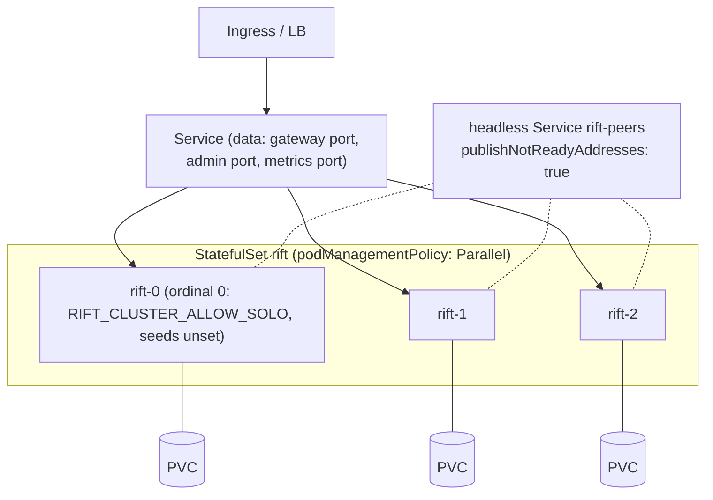

# Chapter 10 — Operations

Running the cluster: bootstrap, Kubernetes, probes, observability, upgrades,
backups, and sizing. The operator experience is a design goal, not an
afterthought — the target user runs ephemeral CI fleets and perimeter-bound
on-prem environments, usually without a dedicated platform team.

## CLI surface (cluster-relevant)

```
rift-cluster-server \
  --cluster                          # master switch; everything below inert without it
  --cluster-allow-solo               # FIRST node of a NEW cluster: found it when no seeds are
                                      # given (a seedless node without it refuses to start)
  --cluster-bind 10.0.0.5:4790       # required: Raft + owner RPC (TCP, one port)
  --cluster-advertise <host:port>    # NAT/container address peers should dial; a hostname
                                      # is re-resolved on every send, IPv6 literals bracketed
  --cluster-seeds rift-0.rift-peers:4790,rift-1.rift-peers:4790   # DNS re-resolved per attempt
  --cluster-secret-file /secrets/cluster.key                # required (or --cluster-insecure)
  --cluster-state-dir /var/lib/rift  # redb: identity, raft log/vote/snapshot + flow shard;
                                      # default <datadir>/_cluster
  --cluster-write-barrier ready-nodes|none    # Ch.4; default ready-nodes
  --cluster-leave-timeout 10         # seconds (default 10); orchestrator grace ≥ 2× this
  --cluster-probe-bind 0.0.0.0:2526  # unauthenticated /readyz + /healthz (default shown)
```

Every flag has an `RIFT_CLUSTER_*` environment form (`crates/rift-cluster-server/src/cli.rs`
is the source of truth; `docs/rift-cluster-server.md` the full reference).

There is no `--cluster-degraded-mode` flag: what a node does when a flow's owner is unreachable
is a per-imposter `readConsistency` setting (D-10, Chapter 9's degradation table), not a
fleet-wide switch — the flag sketched in earlier drafts was superseded rather than built (#378).
Nor is there a `--cluster-features` flag: config sync and flow state are always on under
`--cluster` (#120 — a per-feature opt-out would reintroduce the per-imposter split-brain the
clustered flow store exists to remove).

One subcommand is not a server at all:

```
rift-cluster-server mcp --url https://fleet.example:2525 --api-key-file ~/.rift/agent.key
```

`mcp` runs a Model Context Protocol server over stdio for coding agents. It is a
**client** of the admin API named by `--url` — it binds no port, joins no ring,
and holds no state, so it is not a node and does not appear in any topology.
Full reference in `docs/rift-cluster-server.md`.

Guard rails enforced at startup: `--cluster` with `--runtime per-core` is
rejected (the sync bridge assumes a work-stealing data plane — D-14);
`--cluster` with intercept mode is rejected (out of scope); no secret and no
explicit `--cluster-insecure` is a refusal to start; a node with no seeds and
no `--cluster-allow-solo` refuses to start rather than founding a second
cluster beside the real one, and a node that already holds state decides
between *join*, *rejoin* and *bootstrap* by D-26's table — never by wiping it.

## Kubernetes deployment

StatefulSet + headless Service; every peculiarity below exists because a
default manifest deadlocks or loses data:



- **`publishNotReadyAddresses: true`** on the headless Service — readiness
  means "caught up and serving", so on a full restart *no* pod is Ready; a
  default headless Service would publish no seed DNS and nothing could ever
  join. Cluster formation is deliberately independent of readiness.
- **`podManagementPolicy: Parallel`** — `OrderedReady` waits for pod 0 to be
  Ready before starting pod 1, but a one-voter group of a three-voter cluster
  isn't Ready. Classic deadlock, designed out.
- **PVC per pod, non-negotiable** for voters: the Raft vote and log live
  there. `emptyDir` is *unsupported* for durability — a simultaneous restart
  on emptyDir is the correlated-disk-loss scenario of Chapter 9.
- **Gateway-fronted mode** for data traffic (Service ports are static;
  runtime-minted imposter ports can't be exposed) — Chapter 2.
- Probes: readiness `/readyz`, liveness `/healthz` (both unauthenticated).
  `preStop` = SIGTERM with `terminationGracePeriodSeconds ≥ 2 ×
  cluster-leave-timeout` so graceful leave (demote → flow handoff → remove)
  completes. `PodDisruptionBudget maxUnavailable: 1`.
- Cluster port stays ClusterIP-internal; secret via K8s Secret →
  `--cluster-secret-file`.

## Observability

**Endpoints** (cluster port, authenticated; probes excepted):

| Endpoint | Answers |
|---|---|
| `GET /_cluster/members` | roster: id, address, voter/learner, Ready, applied index; plus this node's own `bound_ports` / `bind_failures` (Chapter 2 divergence) |
| `GET /_cluster/config` | per port: revision @ every node, `converged: bool` — the CI wait target |
| `GET /_cluster/imposters` | per-(port, node) bind status (Chapter 2 divergence) |
| `GET /_cluster/ring?key=…` | computed owner + m_idx — "who owns this flow right now". *Designed (RFC-001 §10, phase 2); not served by this build* |
| `GET /_cluster/kv/:flow_id` | owner value vs local replica — the *why is my scenario stuck* endpoint. *Designed (RFC-001 §10, phase 2); not served by this build* |
| `GET /_cluster/ops/:op_id` | intent state: pending / applied / failed (Chapter 4) |
| `GET /_cluster/health` | rolled-up diagnostics — including `blob_fetch_stall`, non-`null` while this node's apply is parked on a sideloaded blob it cannot fetch from any member (#439). The fleet projection `GET /_fleet/health` adds `blob_fetch_stalls_fleet`, one row per stalled voter. A stall is *degraded*, not *not-ready*: the node stays in the load balancer and self-heals when a holder returns, but every committed write behind the parked entry is unapplied on that node until it does |
| `GET /_cluster/route-hits` | this node's per-route dispatch counts, in memory since process start — the node-local input the admin port's `GET /front-door/route-hits` sums across the fleet |

**Metrics that page** (Prometheus, served by the standard metrics port).

This list mixes families that exist today with families that were designed here
and never registered. The distinction is not pedantry: an alert rule naming an
unregistered family is not a loud failure but a silent one — the expression
evaluates to no data forever, so the alert never fires and reads as health. The
shipped alert pack in `deploy/observability/` therefore references only the
first group, and `scripts/check-observability-families.sh` enforces that.

*Registered, and alerted on by the shipped pack:*
`rift_cluster_intents_pending` (stuck > minutes = quorum loss),
`rift_cluster_insecure` (should be 0 everywhere, forever),
`rift_cluster_members{state}`, `rift_cluster_barrier_timeouts_total`,
`rift_cluster_bind_failures`, `rift_cluster_no_principals`, the
`rift_cluster_audit_export_*` family, and
`rift_cluster_source_scheduler_read_failures_total` /
`rift_cluster_source_scheduler_corrupt_rows`.

*Registered by #439, alert threshold still to be chosen:*
`rift_cluster_blob_fetch_stalled` (gauge, `1` while this node's apply is parked
on a blob no member can supply — the metric form of `blob_fetch_stall` above;
`stalled for > 5m` is the obvious rule, and a stall that outlives every
plausible transient is a lost blob, which is an operator's problem, not a
retry's) and `rift_cluster_blob_fetch_stalls_total` (counter, one per stall
onset — a rising count on a fleet with no partitions says a blob is being
reaped before its op commits, which is the #438 pin failing).

*Registered, but not alerted on:* `rift_cluster_flow_wal_lag_ops` (async
durability backlog). It is a legitimate paging signal, but it appears in
neither the alert pack nor the shipped dashboards yet: nobody has chosen a
threshold that is meaningful across deployments, and an alert with an
arbitrary one trains people to ignore it.

*Aspirational — designed, not registered, deliberately absent from the pack:*
`rift_cluster_raft_leader_changes_total` (flapping = network trouble),
`rift_cluster_applied_index_lag` per node (barrier stragglers),
`rift_cluster_degraded_ops_total{feature}` (any nonzero during a strict test
run is a finding), `rift_cluster_bridge_rejected_total` (owner black-hole
shedding). Leader flapping is the sharpest of these and has no substitute today;
`RiftClusterNoLeader` catches the outage but not the flap that preceded it.

## Runbooks (sketches; full versions ship with the harness)

The `cluster …` subcommands sketched below are **not built**: the binary has
no membership or recovery subcommand today (membership changes only through a
node joining or leaving — D-25, D-26; the cluster maintains its own log and
snapshots — D-24). They are kept as the design of what a crash-retire and a
majority-loss recovery would have to look like.

- **Scale up**: start pod with seeds → auto learner → voter if < 9
  (`MAX_AUTO_VOTERS`, D-27). Nothing else.
- **Scale down / retire**: SIGTERM, wait for exit (graceful leave does the
  rest; the leader refuses a leave that would drop the voter set below two —
  D-25). Crash-retire: `rift-cluster-server cluster remove-node <id>` against
  any live node *(sketch — not built)*.
- **Restore quorum after majority loss**: last-resort
  `cluster force-recover --from-state-dir` on the best surviving node (log
  end inspected via `cluster inspect`), then rejoin others empty. Documented
  as data-loss-possible, operator-confirmed, twice *(sketch — not built)*.
- **Backup**: configs are exportable at any moment via `GET /imposters`
  (Mountebank-compatible JSON) or the core `--datadir` write-through; the
  state dir itself is snapshot-friendly (redb single file, crash-consistent).
- **Stuck scenario triage** (once `/_cluster/ring` and `/_cluster/kv` ship —
  see the endpoint table): `/_cluster/ring?key=flow` → `/_cluster/kv/:flow`
  → compare owner vs replica `(m_idx, v)` → the answer is one of: owner
  isolated (heartbeat metric), adoption reset (degraded counter), or the test
  actually didn't send the transition. Three checks, no log spelunking.

## Rolling upgrades

One node at a time, SIGTERM-driven; the invariants that make it boring:
protocol majors must match to join (clean refusal otherwise), gossip/RPC
fields are additive within a major, config bodies tolerate unknown fields
(so an old node can apply a new node's config — it reports rather than
crashes on genuinely new required semantics), and graceful leave means no
election and no ownership guess per step. Sequence cursors still reset on
ownership moves (D-8) — schedule upgrades between test runs, stated in the
docs rather than discovered in one.

**Sideloaded blobs (#439, D-49): upgrade the whole fleet before the first
dataset or spec write on the new build.** A new node replays every entry an
old build wrote — the payload fields stayed on the wire, optional — but the
reverse does not hold: an old build cannot deserialize a digest-only
`DatasetPut`/`SpecPut` and fails closed at apply. Reads and every other
write are unaffected during the roll; it is only a sideloaded write landing
on a mixed fleet that an old member cannot follow. A member whose build
cannot serve blobs is reported as *skewed* in the fan-out refusal and in
`blob_fetch_stall`, distinct from a partition, so a half-finished roll reads
as what it is.

## Sizing rules of thumb

3 voters for HA (survives 1), 5 for comfort (survives 2); learners beyond 9
add data-plane capacity without consensus weight. Per node: flow shard ≤ 100k
entries (LRU-shed above), journal ≤ ports × shard cap × avg entry, config SM =
fleet config size (small), Raft log bounded by snapshot cadence. Disk: state
dir on real block storage (fsync latency is the `sync`-durability floor);
tens of GB is generous. Network: everything assumes single-DC LAN — the
timeouts are wrong for WAN by design.
