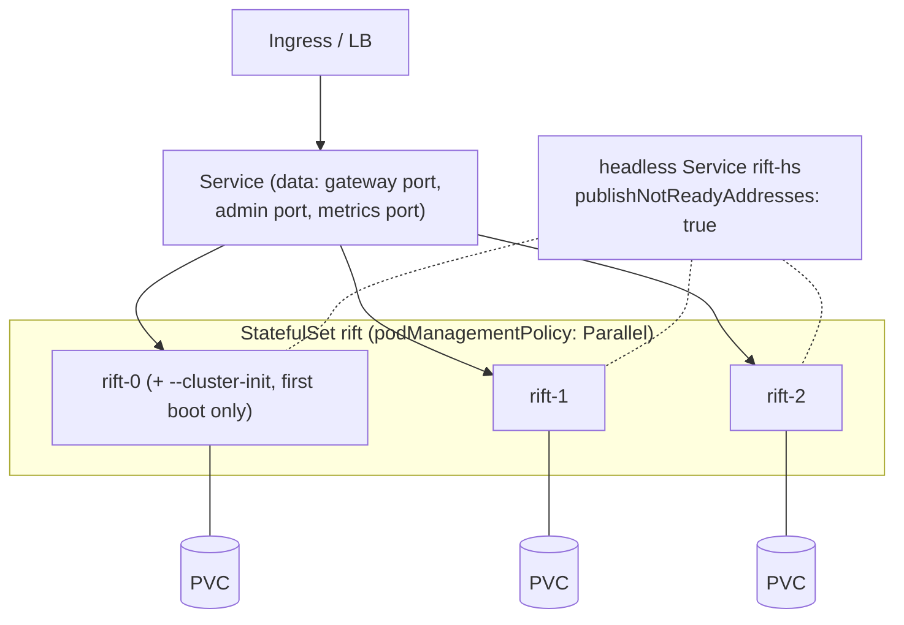

# Chapter 10 — Operations

Running the cluster: bootstrap, Kubernetes, probes, observability, upgrades,
backups, and sizing. The operator experience is a design goal, not an
afterthought — the target user runs ephemeral CI fleets and perimeter-bound
on-prem environments, usually without a dedicated platform team.

## CLI surface (cluster-relevant)

```
rift-ee-server \
  --cluster                          # master switch; everything below inert without it
  --cluster-init                     # FIRST node of a NEW cluster, exactly once
  --cluster-bind 10.0.0.5:4790       # required: Raft + owner RPC (TCP, one port)
  --cluster-advertise <host:port>    # NAT/container address peers should dial; a hostname
                                      # is re-resolved on every send, IPv6 literals bracketed
  --cluster-seeds rift-0.rift-hs:4790,rift-1.rift-hs:4790   # DNS re-resolved per attempt
  --cluster-secret-file /secrets/cluster.key                # required (or --cluster-insecure)
  --cluster-state-dir /var/lib/rift  # redb: raft log/vote/snapshot + flow shard
  --cluster-features config-sync,flow-state   # per-phase enablement / rollback lever
  --cluster-write-barrier ready-nodes|none    # Ch.4; default ready-nodes
  --cluster-degraded-mode reject|local        # Ch.9 table override
  --cluster-leave-timeout 10s
```

Guard rails enforced at startup: `--cluster` with `--runtime per-core` is
rejected (the sync bridge assumes a work-stealing data plane — D-14);
`--cluster` with intercept mode is rejected (out of scope); no secret and no
explicit `--cluster-insecure` is a refusal to start; `--cluster-init` refuses
to run if a group already exists in the state dir or is reachable via seeds.

## Kubernetes deployment

StatefulSet + headless Service; every peculiarity below exists because a
default manifest deadlocks or loses data:



- **`publishNotReadyAddresses: true`** on the headless Service — readiness
  means "caught up and serving", so on a full restart *no* pod is Ready; a
  default headless Service would publish no seed DNS and nothing could ever
  join. Cluster formation is deliberately independent of readiness.
- **`podManagementPolicy: Parallel`** — `OrderedReady` waits for pod 0 to be
  Ready before starting pod 1, but a one-voter group of a three-voter cluster
  isn't Ready. Classic deadlock, designed out.
- **PVC per pod, non-negotiable** for voters: the Raft vote and log live
  there. `emptyDir` is *unsupported* for durability — a simultaneous restart
  on emptyDir is the correlated-disk-loss scenario of Chapter 9.
- **Gateway-fronted mode** for data traffic (Service ports are static;
  runtime-minted imposter ports can't be exposed) — Chapter 2.
- Probes: readiness `/readyz`, liveness `/healthz` (both unauthenticated).
  `preStop` = SIGTERM with `terminationGracePeriodSeconds ≥ 2 ×
  cluster-leave-timeout` so graceful leave (demote → flow handoff → remove)
  completes. `PodDisruptionBudget maxUnavailable: 1`.
- Cluster port stays ClusterIP-internal; secret via K8s Secret →
  `--cluster-secret-file`.

## Observability

**Endpoints** (cluster port, authenticated; probes excepted):

| Endpoint | Answers |
|---|---|
| `GET /_cluster/members` | roster: id, address, voter/learner, Ready, applied index |
| `GET /_cluster/config` | per port: revision @ every node, `converged: bool` — the CI wait target |
| `GET /_cluster/imposters` | per-(port, node) bind status (Chapter 2 divergence) |
| `GET /_cluster/ring?key=…` | computed owner + m_idx — "who owns this flow right now" |
| `GET /_cluster/kv/:flow_id` | owner value vs local replica — the *why is my scenario stuck* endpoint |
| `GET /_cluster/ops/:op_id` | intent state: pending / applied / failed (Chapter 4) |
| `GET /_cluster/health` | rolled-up diagnostics |

**Metrics that page** (Prometheus, served by the standard metrics port):
`rift_cluster_raft_leader_changes_total` (flapping = network trouble),
`rift_cluster_applied_index_lag` per node (barrier stragglers),
`rift_cluster_degraded_ops_total{feature}` (any nonzero during a strict test
run is a finding), `rift_cluster_intents_pending` (stuck > minutes = quorum
loss), `rift_cluster_flow_wal_lag_ops` (async durability backlog),
`rift_cluster_bridge_rejected_total` (owner black-hole shedding),
`rift_cluster_insecure` (should be 0 everywhere, forever).

## Runbooks (sketches; full versions ship with the harness)

- **Scale up**: start pod with seeds → auto learner → voter if < 9. Nothing
  else.
- **Scale down / retire**: SIGTERM, wait for exit (graceful leave does the
  rest). Crash-retire: `rift-ee-server cluster remove-node <id>` against any
  live node.
- **Restore quorum after majority loss**: last-resort
  `cluster force-recover --from-state-dir` on the best surviving node (log
  end inspected via `cluster inspect`), then rejoin others empty. Documented
  as data-loss-possible, operator-confirmed, twice.
- **Backup**: configs are exportable at any moment via `GET /imposters`
  (Mountebank-compatible JSON) or the OSS `--datadir` write-through; the
  state dir itself is snapshot-friendly (redb single file, crash-consistent).
- **Stuck scenario triage**: `/_cluster/ring?key=flow` → `/_cluster/kv/:flow`
  → compare owner vs replica `(m_idx, v)` → the answer is one of: owner
  isolated (heartbeat metric), adoption reset (degraded counter), or the test
  actually didn't send the transition. Three checks, no log spelunking.

## Rolling upgrades

One node at a time, SIGTERM-driven; the invariants that make it boring:
protocol majors must match to join (clean refusal otherwise), gossip/RPC
fields are additive within a major, config bodies tolerate unknown fields
(so an old node can apply a new node's config — it reports rather than
crashes on genuinely new required semantics), and graceful leave means no
election and no ownership guess per step. Sequence cursors still reset on
ownership moves (D-8) — schedule upgrades between test runs, stated in the
docs rather than discovered in one.

## Sizing rules of thumb

3 voters for HA (survives 1), 5 for comfort (survives 2); learners beyond 9
add data-plane capacity without consensus weight. Per node: flow shard ≤ 100k
entries (LRU-shed above), journal ≤ ports × shard cap × avg entry, config SM =
fleet config size (small), Raft log bounded by snapshot cadence. Disk: state
dir on real block storage (fsync latency is the `sync`-durability floor);
tens of GB is generous. Network: everything assumes single-DC LAN — the
timeouts are wrong for WAN by design.
