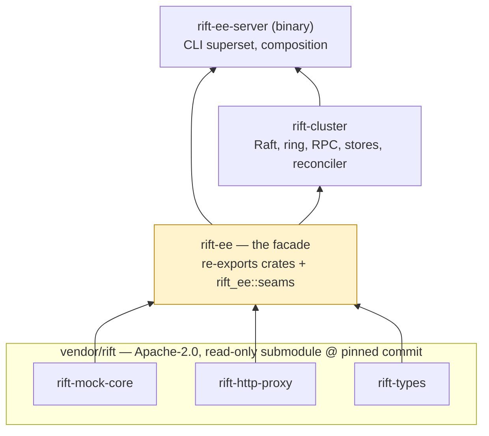

# Chapter 11 — The Open-Core Boundary

Rift-EE is layered on an unmodified, Apache-2.0 Rift. That sentence is a
product commitment, an engineering discipline, and a build-system invariant —
this chapter covers all three.

## The shape: seams upstream, brains enterprise

The open-source engine knows nothing about clusters. It exposes **generic
extension seams** — traits with `Local` default implementations that preserve
single-node behavior byte-for-byte — and the enterprise crates supply
cluster-aware implementations. All eight seams are merged upstream
(`achird-labs/rift#311–#318`); Phase 0 of the program is *complete*:

| Seam (upstream issue) | Upstream trait | Enterprise implementation |
|---|---|---|
| #311 | `FlowStore::compare_and_set` (+`CasOutcome`) | atomic scenario transitions — also fixed an OSS race |
| #312 | `FlowStoreProvider` | per-imposter `ClusteredFlowStore` injection |
| #313 | `ResponseSequencer` / `SequenceKey` | owner/Redis sequencing (Phase 4) |
| #314 | `RequestJournal` (+ cursor reads #603) | sharded CRDT journal, vector cursors |
| #315 | `ProxyRecordingStore` (claim/release) | owner claim state machine — also fixed a stuck-pending OSS bug |
| #316 | `apply_config` + `ImposterEvent` + `stub_key` + `move_stub` | incremental reconcile as the Raft apply step |
| #317 | `ServerBuilder` / `run_metrics_server` / `dispatch_to_port` | `rift-ee-server` composes instead of forking `main.rs` |
| #318 | `BackendUnavailable` + `annotate()` + `ResponseDecorator` | every `Rift-Cluster-*` header, without OSS handlers knowing what a cluster is |

The pattern in #318 deserves a sentence: enterprise backends *annotate* the
request task-locally ("degraded: kv-adopt", "revision: 421"), and an
enterprise decorator translates annotations into response headers. The OSS
handlers never learn cluster vocabulary — which is what keeps the seams
honestly generic and upstreamable.

Two seams are queued for RFC-002 (Chapter 8): U-9 `AdminAuthorizer` and U-10
principal-on-events. Same rules: generic names, `Local` defaults, independently
justifiable to an OSS maintainer.

## The dependency architecture

**`rift-ee` is the single doorway.** It alone carries path dependencies into
the submodule; `rift-cluster` and `rift-ee-server` depend on `rift-ee` and
nothing vendored. The consequence: reaching around the facade *fails to
resolve* — the boundary is enforced by Cargo, not by review vigilance. A
compile-time test in `rift-ee` (`seams_resolve`) names every re-exported seam,
so an upstream rename breaks loudly at the facade with a one-line fix, instead
of surfacing as a confusing error deep in cluster code.

Feature discipline rides the same manifest: `rift-http-proxy` is consumed
without its binary-only allocator default, with `redis-backend` / `javascript`
/ `quamina-matching` forwarded *explicitly* — because upstream's own history
(#777) proved that a default-on feature reaches nobody through a
`default-features = false` consumer, silently, with CI green.

## The read-only submodule and the two-repo flow

`vendor/rift` is pinned to an exact commit; CI builds against the pin, and a
daily job proposes bumps as reviewable PRs. Core changes are **never made
here** — the flow for "enterprise feature needs a core capability" is: patch
inside `vendor/rift` → `scripts/upstream-pr.sh` opens the PR against
`achird-labs/rift` → merge upstream → `scripts/sync-upstream.sh` bumps the
pin → build the enterprise feature. The friction is the point: every
generic capability lands where the community gets it, and the enterprise repo
holds only what is genuinely proprietary.

## What is enterprise, and why it holds

Everything in `rift-cluster` and `rift-ee-server`: the Raft control plane and
its storage, the ownership ring and fencing, HMAC RPC, the flow-state durable
tier, the sharded journal and vector cursors, the proxyOnce owner machine, the
Redis-strict backends, tenancy/RBAC/audit, `/_cluster/*`, the chaos harness
and k8s manifests.

The commercial moat, assessed honestly (decision D-6): it is **not** the trait
implementations — any competent team can implement `FlowStore` over a shared
Redis in days, and the existing OSS Redis flow store already covers
multi-instance scenario state for teams that accept a Redis dependency. What
is genuinely hard to reproduce is the *system*: zero-dependency
self-clustering with a durable, linearizable control plane; correctness under
partition with an honest, tested degradation contract; cluster-merged
verification; fleet operations. That is a product, not a patch — and pricing
follows the product, with the OSS single node remaining genuinely excellent so
the funnel stays honest.
