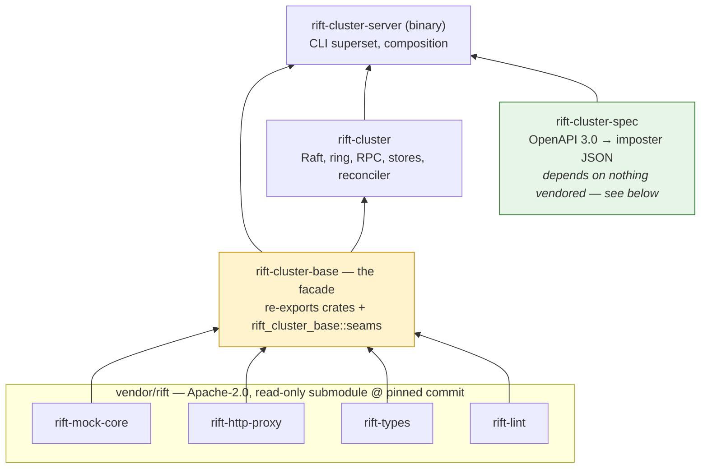

# Chapter 11 — The Upstream Boundary

RiftCluster is layered on an unmodified, Apache-2.0 Rift. That sentence is an
engineering discipline and a build-system invariant — this chapter covers both.

> **Note (2026-08-04):** this chapter was written under an open-core model, where
> the boundary also separated a free edition from a paid one. That split is
> retired: everything is Apache-2.0, nothing is withheld, and there is no paid
> edition. What survives is the *technical* boundary described here — which code
> lives upstream, which stays in the cluster crates, and how Cargo enforces it.
> That part was always the valuable half.

## The shape: seams upstream, brains cluster

The open-source engine knows nothing about clusters. It exposes **generic
extension seams** — traits with `Local` default implementations that preserve
single-node behavior byte-for-byte — and the cluster crates supply
cluster-aware implementations. All eight seams are merged upstream
(`achird-labs/rift#311–#318`); Phase 0 of the program is *complete*:

Every seam has a stable identifier, `U-n`, which is what code, RFCs and this guide cite; this
table is where a `U-n` is defined (`scripts/design-check.py` resolves citations against it).

| Seam | Upstream | Surface | Cluster use | Status |
|---|---|---|---|---|
| U-1 | rift#311 | `FlowStore::compare_and_set` (+`CasOutcome`) | atomic scenario transitions — also fixed an OSS race | merged (v0.14.0) |
| U-2 | rift#312 | `FlowStoreProvider` | per-imposter `ClusteredFlowStore` injection | merged |
| U-3 | rift#313 | `ResponseSequencer` / `SequenceKey` | owner/Redis sequencing (Phase 4, D-12) | merged |
| U-4 | rift#314 | `RequestJournal` (+ cursor reads rift#603) | sharded CRDT journal, vector cursors (Ch.7) | merged |
| U-5 | rift#315 | `ProxyRecordingStore` (claim/release) | owner claim state machine — also fixed a stuck-pending OSS bug | merged |
| U-6 | rift#316 | `apply_config` + `ImposterEvent` + `stub_key` + `move_stub` | incremental reconcile as the Raft apply step (D-5) | merged |
| U-7 | rift#317 | `ServerBuilder` / `run_metrics_server` / `dispatch_to_port` (+ `handle_imposter_request`, re-exported for #344) | `rift-cluster-server` composes instead of forking `main` (D-11) | merged |
| U-8 | rift#318 | `BackendUnavailable` + `annotate()` + `ResponseDecorator` | every `Rift-Cluster-*` header, without core handlers knowing what a cluster is | merged |
| U-9 | rift#854 (+ `authz::classify`, rift#889) | `AdminAuthorizer` / `AuthzRequest` / `AuthzDecision` | RFC-002 enforcement point (Chapter 8) | merged |
| U-10 | rift#855 | `EventContext` on `ImposterEventListener` (principal-on-events) | audit attribution (RFC-002, Chapter 8) | merged |
| U-11 | — | `front_door::{RouteTable, bind_front_door, RouteObserver}` (route table + listener) | single-port content routing (#19, Chapter 13); the admin CRUD is a replicated control-plane object here (#131) | merged |
| U-12 | — | `ImposterSource` provider trait, `SourceRegistry`, `parse_remote_document`; `FileSource`/`HttpSource` built-ins | imposter sources (#20, Chapter 13) | merged |
| U-13 | rift#966/#967 | `ExchangeInspector` / `ExchangeInspectorProvider` (`extensions::exchange_inspector`) | request-side hook after journaling and before matching; response-side hook in the shared funnel — spec traffic validation (RFC-004 §6); re-exported by #281 | merged |
| U-14 | — | `extensions::template_fn` — template-function registration | template read parity for datasets (RFC-005 §3.8, §6.2) | **queued** (#291) |
| U-15 | — | `extensions::state_ops` — declarative state operations | `_rift.stateOps` (RFC-005 §3.7, §6.1); landed by #418 | merged |
| U-16 | rift#910/#911 | `ProxyRecordingStore` claim semantics revised for fleet-wide exactly-once (`StubPublication`, `publishes_stubs()`) | clustered `proxyOnce` (#226, Chapter 7) | merged |

The pattern in U-8 deserves a sentence: cluster backends *annotate* the
request task-locally ("degraded: kv-adopt", "revision: 421"), and a
cluster decorator translates annotations into response headers. The OSS
handlers never learn cluster vocabulary — which is what keeps the seams
honestly generic and upstreamable. U-13 is the first seam that can act on an
in-flight exchange rather than only observe or decorate it. Every seam follows
the same rules — generic names, `Local`/default-off behavior, independently
justifiable to an OSS maintainer.

## The dependency architecture

**`rift-cluster-base` is the single doorway.** It alone carries path dependencies into
the submodule; `rift-cluster` and `rift-cluster-server` depend on `rift-cluster-base` and
nothing vendored. The consequence: reaching around the facade *fails to
resolve* — the boundary is enforced by Cargo, not by review vigilance. A
compile-time test in `rift-cluster-base` (`seams_resolve`) names every re-exported seam,
so an upstream rename breaks loudly at the facade with a one-line fix, instead
of surfacing as a confusing error deep in cluster code.

**A crate that needs no doorway is the cheapest kind.** `rift-cluster-spec` (RFC-004 §3.1,
issue #277) compiles an OpenAPI 3.0 document into imposter JSON and depends on neither the
facade nor anything vendored — not even `rift-types`. The alternative, emitting a typed
`ImposterConfig`, was checked and rejected: under the facade rule "typed output" means a
`rift-cluster-base` dependency, which drags the whole engine into what is a text-to-text
function. Instead it emits the same JSON a client would `PUT`, and `rift-cluster-server`
admits it through the gate every other write already passes. Type safety stays where it is
load-bearing — at admission — and the compiler stays a pure function of `(spec bytes,
options)` that golden files can pin. The arrow is a real dependency as of issue #278:
`rift-cluster-server` calls the compiler on the accepting node — at `PUT /specs/{id}`,
`deploy`, and for edit-time warnings — and parses its output through the same
`ImposterConfig` gate. **`rift-cluster` does not depend on it, and must not**: the state
machine stores spec bytes and stamps provenance, but never parses OpenAPI, so apply stays
free of fallible spec code (RFC-004 §8). The one number both crates need — the 4 MiB
pre-commit cap — is declared in each and held equal by a tripwire test in the server crate.

**One seam cannot be guarded that way, and gets its own tripwire.**
`ServerBuilder::manager()` is all-or-nothing: injecting a manager replaces
upstream's internal construction *wholesale*, so `compose::cluster_manager`
hand-mirrors it. A rename breaks the build, but an upstream **addition** — a
new `with_*` inside the `None` arm — does not: the clustered path just silently
stops getting it, at a pin bump, in a file nobody here edited. `rift-cluster-server`'s
`manager_parity` test compares the set of builder calls at the two construction
sites and fails naming the one that diverged (issue #30). When it fires during a
bump, mirror the call into `cluster_manager` or record it in that test's
`INTENTIONALLY_NOT_MIRRORED` with a reason — the point is that the divergence
becomes a decision instead of an accident.

Feature discipline rides the same manifest: `rift-http-proxy` is consumed
without its binary-only allocator default, with `redis-backend` / `javascript`
/ `quamina-matching` forwarded *explicitly* — because upstream's own history
(#777) proved that a default-on feature reaches nobody through a
`default-features = false` consumer, silently, with CI green.

## The read-only submodule and the two-repo flow

`vendor/rift` is pinned to an exact commit; CI builds against the pin, and a
daily job proposes bumps as reviewable PRs. Core changes are **never made
here** — the flow for "cluster feature needs a core capability" is: patch
inside `vendor/rift` → `scripts/upstream-pr.sh` opens the PR against
`achird-labs/rift` → merge upstream → `scripts/sync-upstream.sh` bumps the
pin → build the cluster feature. The friction is the point: every generic
capability lands where every Rift user gets it, and this repo holds only what is
genuinely cluster-specific. Both repos are Apache-2.0, so the boundary is about
where code *belongs*, not about what is withheld.

## What is cluster, and why it holds

Everything in `rift-cluster` and `rift-cluster-server`: the Raft control plane and
its storage, the ownership ring and fencing, HMAC RPC, the flow-state durable
tier, the sharded journal and vector cursors, the proxyOnce owner machine,
tenancy/RBAC/audit, `/_cluster/*`, the chaos harness and k8s manifests. The
Redis-strict backends of D-12 are demand-gated and none is built: the cluster
crates contain no Redis implementation of any seam — the durable tier is redb
(D-16), and the only Redis `FlowStore` anywhere is upstream's own (D-6).

The commercial moat, assessed honestly (decision D-6): it is **not** the trait
implementations — any competent team can implement `FlowStore` over a shared
Redis in days, and the existing OSS Redis flow store already covers
multi-instance scenario state for teams that accept a Redis dependency. What
is genuinely hard to reproduce is the *system*: zero-dependency
self-clustering with a durable, linearizable control plane; correctness under
partition with an honest, tested degradation contract; cluster-merged
verification; fleet operations. That is a product, not a patch — and pricing
follows the product, with the core single node remaining genuinely excellent so
the funnel stays honest.
