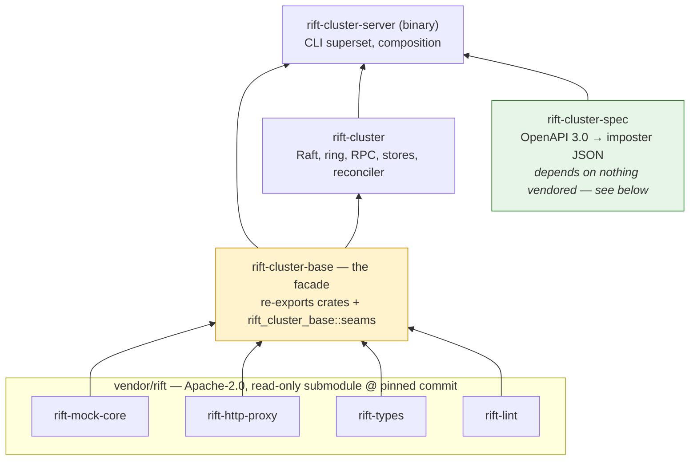

# Chapter 11 — The Upstream Boundary

RiftCluster is layered on an unmodified, Apache-2.0 Rift. That sentence is an
engineering discipline and a build-system invariant — this chapter covers both.

> **Note (2026-08-04):** this chapter was written under an open-core model, where
> the boundary also separated a free edition from a paid one. That split is
> retired: everything is Apache-2.0, nothing is withheld, and there is no paid
> edition. What survives is the *technical* boundary described here — which code
> lives upstream, which stays in the cluster crates, and how Cargo enforces it.
> That part was always the valuable half.

## The shape: seams upstream, brains cluster

> **Amended by D-69** (2026-09-01, #537): the seam table below gains **U-18**. It is the first
> seam added not to give the cluster a new capability but to stop it *losing* one: terminating a
> route moves the request off an upstream handler, and any validation living in that handler has
> to come across the boundary with it or be silently dropped.

The open-source engine knows nothing about clusters. It exposes **generic
extension seams** — traits with `Local` default implementations that preserve
single-node behavior byte-for-byte — and the cluster crates supply
cluster-aware implementations. The first eight (`achird-labs/rift#311–#318`) landed together and
completed Phase 0 of the program; the table below has grown to eighteen since, and five of those
rows now read **withdrawn** — merged upstream, still upstream's, no longer consumed here (U-9 in
part: its authorizer half is withdrawn, its `classify` half is not). A withdrawn
row is kept, never deleted: `U-n` is a stable citation, and "the cluster stopped using this" is a
fact a reader needs as much as "it uses this":

Every seam has a stable identifier, `U-n`, which is what code, RFCs and this guide cite; this
table is where a `U-n` is defined (`scripts/design-check.py` resolves citations against it).

| Seam | Upstream | Surface | Cluster use | Status |
|---|---|---|---|---|
| U-1 | rift#311 | `FlowStore::compare_and_set` (+`CasOutcome`) | atomic scenario transitions — also fixed an OSS race | merged (v0.14.0) |
| U-2 | rift#312 | `FlowStoreProvider` | per-imposter `ClusteredFlowStore` injection | merged |
| U-3 | rift#313 | `ResponseSequencer` / `SequenceKey` | owner-routed sequencing — `ClusteredSequencer` on the HRW ring (D-47), holding each cursor in memory on its owner. Cursors are neither replicated nor persisted (D-8): a handoff resets them, which is the contract, not a fault. D-12 proposed shipping this Redis-backed first and is superseded; there is no Redis sequencer | merged |
| U-4 | rift#314 | `RequestJournal` (+ cursor reads rift#603) | no longer consumed: D-74 (#552) retired the sharded journal that implemented it, and recording is upstream's own per-node journal, read unwrapped. The trait stays upstream; the cluster registers nothing behind it | **withdrawn** |
| U-5 | rift#315 | `ProxyRecordingStore` (claim/release) | owner claim state machine — also fixed a stuck-pending OSS bug | merged |
| U-6 | rift#316 | `apply_config` + `move_stub` (also `ImposterEvent`, `stub_key`) | incremental reconcile as the Raft apply step (D-5). `apply_config` and `move_stub` are called from the state machine; `ImposterEvent` is consumed only by this crate's tests and `stub_key` by nothing — upstream still uses both internally, and the re-exports stay as the seam's declared surface | merged |
| U-7 | rift#317 | `ServerBuilder` (+ `handle_imposter_request`, re-exported for #344; also `run_metrics_server`, `dispatch_to_port`) | `rift-cluster-server` composes instead of forking `main` (D-11). `ServerBuilder` and `handle_imposter_request` are called; `run_metrics_server` is not — the cluster's surviving families register into the global registry upstream's own server serves (D-71, #548), so nothing here starts it — and `dispatch_to_port` names the in-process path the router takes without this crate calling it | merged |
| U-8 | rift#318 | `BackendUnavailable` + `annotate()` + `ResponseDecorator` | every `Rift-Cluster-*` header, without core handlers knowing what a cluster is | merged |
| U-9 | rift#854 (+ `authz::classify`, rift#889) | `AdminAuthorizer` / `AuthzRequest` / `AuthzDecision` | the authorizer half is no longer consumed: it existed to give the clustered admin front a second, tenant-aware gate behind upstream's own, and D-73 (#550) left one credential and one gate — `compose.rs` never calls `.admin_authorizer(...)`. The `classify` half (rift#889) **is** consumed, as `classify_upstream` in `admin_front.rs`, but for path-parameter extraction, not authorization: one authoritative route parser for the terminating front. The trait stays upstream | **withdrawn** (authorizer); `classify` merged |
| U-10 | rift#855 | `EventContext` on `ImposterEventListener` (principal-on-events) | event attribution. Not consumed: `with_principal_scope` is still called on the apply path but always with `None`, because D-73 (#550) left one identity and there is no principal to attribute to. The trait stays upstream | **withdrawn** |
| U-11 | — | `front_door::{RouteTable, bind_front_door}` (route table + listener); also `RouteObserver` / `bind_front_door_with_observer` | single-port content routing — the router (#19, [Chapter 13](13-router.md)); the admin CRUD is a replicated control-plane object here (#131). The observer half was the per-route hit counter and is consumed by nothing since #559 removed route hits; `compose.rs` binds with plain `bind_front_door` | merged |
| U-12 | — | `SourceRegistry`, `SourceRef`, `parse_uri_list`; `FileSource`/`HttpSource` built-ins (the `ImposterSource` provider trait too, now unused here) | the one-shot `--imposters <uri>` bootstrap resolves each URI through this registry at startup and submits the parsed documents as ordinary `PutImposter` ops (D-72, #549). The cluster registers no provider of its own: the `git+`/`s3:`/`registry:` providers went with the tracking sources and are refused by name at startup (`RETIRED_SOURCE_SCHEMES`) rather than silently unresolved | merged |
| U-13 | rift#966/#967 | `ExchangeInspector` / `ExchangeInspectorProvider` (`extensions::exchange_inspector`) | request-side hook after journaling and before matching; response-side hook in the shared funnel — built for spec traffic validation (RFC-004 §6), which was never implemented; the stored-spec subsystem it would have enforced against was removed by D-72 (#549) and the re-export (#281) with it. Upstream keeps the seam | **withdrawn** |
| U-14 | — | `extensions::template_fn` — template-function registration | never consumed; RFC-005 was retired in full (D-71, #549) and #291 closed as out of scope | **withdrawn** |
| U-15 | — | `extensions::state_ops` — declarative state operations | `_rift.stateOps`, landed by #418. The only *merged* row with no facade re-export, and deliberately: the ops run inside the engine against the imposter's `FlowStore`, so the cluster adds no symbol and consumes the seam through JSON. What proves it is a test (`crates/rift-cluster-server/tests/state_ops_cluster.rs`), which is the right shape for a behavioural seam. (U-13 and U-14 carry no re-export either, but both are withdrawn — for them the absence records a seam the cluster never consumed, not a seam consumed through JSON.) RFC-005 specified it and is retired (D-71, #549); the feature is upstream's and stays | merged |
| U-16 | rift#910/#911 | `ProxyRecordingStore` claim semantics revised for fleet-wide exactly-once (`StubPublication`, `publishes_stubs()`) | clustered `proxyOnce` (#226, Chapter 6) | merged |
| U-17 | rift#990 | `ProxyStoreError::Refused(BackendUnavailable)` (+ `#[non_exhaustive]`) and the proxy-leg 503 door — a store that *arbitrates* exactly-once can refuse a claim instead of being degraded around | clustered `proxyOnce` fails closed at the client (#529, D-66; Chapter 6) | merged |
| U-18 | rift#1012 | `admin_api::not_a_stub_reason` — the space-stub shape guard's *decision* (#336), separated from its rendering | the clustered front terminates `POST .../spaces/{flowId}/stubs` as a replicated write and applies the same rule, rather than keeping a second copy of `STUB_FIELD_NAMES` that would go stale (#537, D-69) | merged |

The pattern in U-8 deserves a sentence: cluster backends *annotate* the
request task-locally ("degraded: kv-adopt", "revision: 421"), and a
cluster decorator translates annotations into response headers. The OSS
handlers never learn cluster vocabulary — which is what keeps the seams
honestly generic and upstreamable. U-13 was the first seam that could act on an
in-flight exchange rather than only observe or decorate it; the cluster no
longer consumes it, but the seam stays upstream for whoever does. Every seam follows
the same rules — generic names, `Local`/default-off behavior, independently
justifiable to an OSS maintainer.

Five rows read **withdrawn**: U-4 (the request journal, D-74/#552), U-9's authorizer half and
U-10 (both D-73/#550), U-13 and U-14. Withdrawn means the cluster registers nothing behind the
seam — not that the seam was a mistake. They divide in two. U-4, U-9's authorizer and U-10 were
consumed and stopped being consumed, because RFC-007 removed the subsystem behind each: the
journal merge, the tenant-aware admin gate, principal attribution. U-13 and U-14 were never
consumed at all — each was upstreamed for something specified and never built (RFC-004 §6's spec
traffic validation, RFC-005's template functions), and both specifications are now retired: §6 by
D-71/#549, RFC-005 in full. Either way the
seams are generic enough that upstream keeps them for whoever wants them; that they cost upstream
nothing to keep is the test each was designed to pass. `crates/rift-cluster-base/src/lib.rs` still
re-exports several of these symbols with no first-party consumer, because the facade's job is to
name the boundary, and a compile-time marker there is what makes a seam's disappearance a build
failure rather than a surprise.

## The dependency architecture

**`rift-cluster-base` is the single doorway.** It alone carries path dependencies into
the submodule; `rift-cluster` and `rift-cluster-server` depend on `rift-cluster-base` and
nothing vendored. The consequence: reaching around the facade *fails to
resolve* — the boundary is enforced by Cargo, not by review vigilance. A
compile-time test in `rift-cluster-base` (`seams_resolve`) names every re-exported seam,
so an upstream rename breaks loudly at the facade with a one-line fix, instead
of surfacing as a confusing error deep in cluster code.

**A crate that needs no doorway is the cheapest kind.** `rift-cluster-spec` (RFC-004 §3.1,
issue #277) compiles an OpenAPI 3.0 document into imposter JSON and depends on neither the
facade nor anything vendored — not even `rift-types`. The alternative, emitting a typed
`ImposterConfig`, was checked and rejected: under the facade rule "typed output" means a
`rift-cluster-base` dependency, which drags the whole engine into what is a text-to-text
function. Instead it emits the same JSON a client would `PUT`, and `rift-cluster-server`
admits it through the gate every other write already passes. Type safety stays where it is
load-bearing — at admission — and the compiler stays a pure function of `(spec bytes,
options)` that golden files can pin. The arrow is a real dependency as of issue #278:
`rift-cluster-server` calls the compiler on the node that accepted `POST /specs/compile`,
and answers the compiled imposter JSON to the caller — who then writes it with an ordinary
`PUT /imposters`, through the same `ImposterConfig` gate. Since D-72 (#549) that endpoint is
**stateless**: it retains no document. **`rift-cluster` does not depend on the compiler, and
must not**: the state machine never parses OpenAPI, so apply stays free of fallible spec
code (RFC-004 §8). The one number both crates need — the 4 MiB request cap — is declared in
each and held equal by a tripwire test in the server crate.

**One seam cannot be guarded that way, and gets its own tripwire.**
`ServerBuilder::manager()` is all-or-nothing: injecting a manager replaces
upstream's internal construction *wholesale*, so `compose::cluster_manager`
hand-mirrors it. A rename breaks the build, but an upstream **addition** — a
new `with_*` inside the `None` arm — does not: the clustered path just silently
stops getting it, at a pin bump, in a file nobody here edited. `rift-cluster-server`'s
`manager_parity` test compares the set of builder calls at the two construction
sites and fails naming the one that diverged (issue #30). When it fires during a
bump, mirror the call into `cluster_manager` or record it in that test's
`INTENTIONALLY_NOT_MIRRORED` with a reason — the point is that the divergence
becomes a decision instead of an accident. It has already paid for itself once:
the `a2712c5` bump carried upstream's per-client outbound TLS trust (`#976`), and
without the mirror a clustered node would have gone on ignoring `--upstream-ca-file`
while the single-node binary honoured it. Two practical notes for the next bump.
The extraction is *textual*, so any `.with_*` inside `cluster_manager` counts as a
builder call — use `.context`, not `.with_context`, in that function, or an
`anyhow` call registers as a surplus cluster-only builder and has to be declared
as one. And a sibling assertion guards the other direction: calls the clustered
path makes and upstream does not are held in `CLUSTER_ADDITIONS`, so an upstream
*removal* is a decision too.

Feature discipline rides the same manifest: `rift-http-proxy` is consumed
without its binary-only allocator default, with `redis-backend` / `javascript`
/ `quamina-matching` forwarded *explicitly* — because upstream's own history
(#777) proved that a default-on feature reaches nobody through a
`default-features = false` consumer, silently, with CI green.

## The read-only submodule and the two-repo flow

`vendor/rift` is pinned to an exact commit; CI builds against the pin, and a
daily job proposes bumps as reviewable PRs. Core changes are **never made
here** — the flow for "cluster feature needs a core capability" is: patch
inside `vendor/rift` → `scripts/upstream-pr.sh` opens the PR against
`achird-labs/rift` → merge upstream → `scripts/sync-upstream.sh` bumps the
pin → build the cluster feature. The friction is the point: every generic
capability lands where every Rift user gets it, and this repo holds only what is
genuinely cluster-specific. Both repos are Apache-2.0, so the boundary is about
where code *belongs*, not about what is withheld.

## What is cluster, and why it holds

Everything in `rift-cluster` and `rift-cluster-server`: the Raft control plane and
its storage, the ownership ring and fencing, HMAC RPC, the flow-state durable
tier, the proxyOnce owner machine,
the admin front and its one-key gate, `/_cluster/*`, the chaos harness and k8s
manifests. Recorded requests are **not** in that list: since D-74 (#552) the journal is upstream's
own, per node, consumed as it ships. The
Redis-backed backends D-12 proposed were never built and are not pending: D-47 superseded that
decision, and sequencing ships owner-routed on the ring. The cluster crates contain no Redis
implementation of any seam — the durable tier is redb (D-16), and the only Redis `FlowStore`
anywhere is upstream's own (D-6).

Where the value actually is (decision D-6): **not** in the trait implementations. Any competent
team can implement `FlowStore` over a shared Redis in days, and the existing OSS Redis flow store
already covers multi-instance scenario state for teams that accept a Redis dependency. What is
genuinely hard to reproduce is the *system*: zero-dependency self-clustering with a durable,
linearizable control plane; correctness under partition with an honest, tested degradation
contract; fleet operations. That is why the boundary is drawn where it is — a seam is worth
upstreaming when it is generic, and the cluster keeps only what cannot be expressed as one.

> This paragraph closed, until #554, with "pricing follows the product … so the funnel stays
> honest" — a claim from the open-core model the note at the top of this chapter retired in
> 2026-08-04. There is no paid edition and no funnel. The technical judgement survives; the
> commercial frame around it did not.
