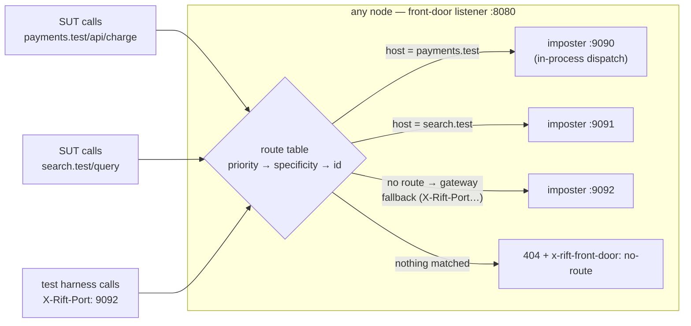

# Chapter 13 — The Front Door & Imposter Sources

Two capabilities lifted from studying how teams actually wrap mock servers in
production (the Mimemo/Solo pattern: nginx hiding Mountebank behind one port,
and an `IMPOSTERS` variable pulling mock definitions from a registry, GitHub,
or disk). Rift-EE absorbs both into the product so the wrapper layer — its
proxy, its glue scripts, its config drift — stops existing. Tracked as issues
#19 (front door, upstream seam U-11) and #20 (sources, upstream seam U-12).

## The front door: many imposters, one port, zero client cooperation

Chapter 2's gateway mode asks the *client* to name the target imposter
(`X-Rift-Port` header, `p-8080.` subdomain, `/__rift/8080` prefix). Test
harnesses can do that; an unmodified system-under-test cannot — it believes it
is calling `payments.example.com/api/charge`. The front door closes the gap
with a **content-based route table**: host, path-prefix, header, and method
rules mapping requests to imposters, evaluated on one listener, dispatched
**in-process** (the same zero-hop `dispatch_to_port` path — no nginx, no extra
socket, no sidecar to keep in sync with imposter churn).

Design points that carry weight (full spec in #19):

- **Deterministic order, no config-order footguns**: priority, then
  specificity (exact host > wildcard > none; longer prefix; more header
  clauses), then id. An ambiguous table — two enabled routes with identical
  match clauses — is rejected at write time, not resolved silently.
- **Routes compose with spaces**: the route picks the imposter; `flowIdSource`
  /`space` still picks the isolated state slice within it. One virtual
  hostname, N parallel test flows.
- **Predicates see the truth by default**: `strip_prefix` is opt-in, so path
  predicates, `savedRequests`, and recordings show the real downstream request
  unless the operator explicitly chose prefix routing.
- **The replicated table inherits R1**: in cluster mode the table is a
  control-plane document (`ControlOp::PutRoutes`) — committed, applied
  everywhere, write-barriered. When the `PUT` returns, every node routes the
  new way; after a full restart the table is still there (R3, via the same
  snapshot as everything else).
- **It absorbs bind divergence**: dispatch targets the imposter object, not
  its socket — a node whose :9090 bind failed still serves :9090's imposter
  through the front door. On Kubernetes and behind managed LBs this makes the
  front-door port the *only* data port a Service ever needs to expose.
- **Tenancy-aware** (#17): routes belong to tenants and may only target their
  tenant's imposters; shared catch-alls are fleet-admin territory.

## Imposter sources: mocks come from somewhere

The second wrapper habit: mock definitions live in GitHub, a registry, S3, or
a laptop — and the serving fleet should *pull* them, at bootstrap and on
demand, rather than having CI push file contents through ad-hoc scripts. The
SPI (#20) makes source resolution pluggable:

The one rule that makes this cluster-correct: **fetching never happens in the
apply path.** Two nodes fetching the same URL can receive different bytes; so
exactly one fetch happens, its result enters the log as data, and every node
applies identical bytes. Everything else follows from machinery already built:
pulls are ops (op-id dedup makes retries safe, Chapter 4), the barrier makes a
pull fleet-visible at its 2xx, provenance (`source id + version`) lands on
each config record, and a manual edit to a source-owned imposter flips a
visible `drifted` flag whose fate on the next pull is a per-source policy
(`overwrite | skip | fail`) — Solo's silent re-pull clobber, made declared and
observable.

Sources are tenant-owned, quota-counted, and audited like every other write:
"who moved the payment mocks to which commit, when" is a log query, not a
Slack archaeology session.

## What this buys, concretely

The Mimemo/Solo deployment — nginx + a Node management service + Mountebank +
glue for GitHub/registry pulls, per environment — collapses to `rift-ee-server`
with a route table and two source records. Same single exposed port, same
pull-from-anywhere ergonomics, plus everything the wrapper never had: fleet
HA, replicated routes and configs with read-after-write semantics, drift
visibility, RBAC, and an audit trail.
