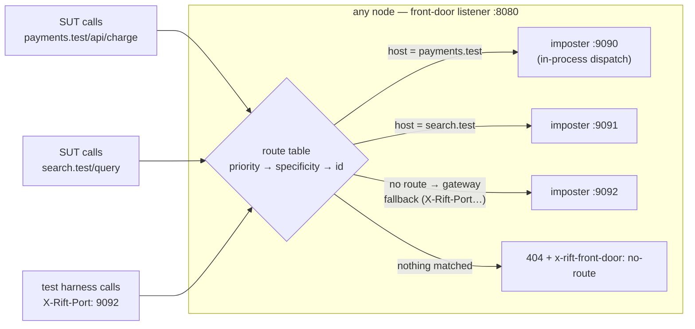
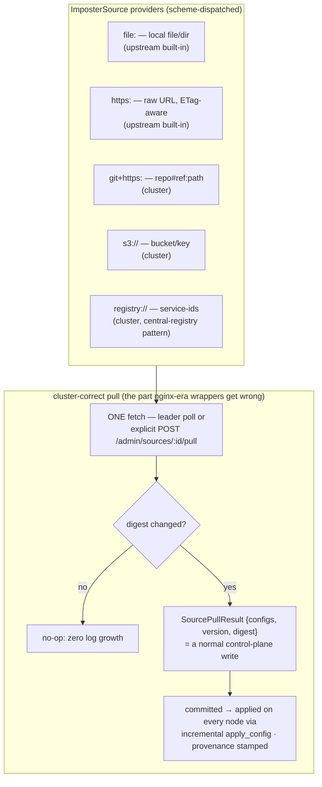

# Chapter 13 — The Front Door & Imposter Sources

Two capabilities lifted from studying how teams actually wrap mock servers in
production (the Mimemo/Solo pattern: nginx hiding Mountebank behind one port,
and an `IMPOSTERS` variable pulling mock definitions from a registry, GitHub,
or disk). RiftCluster absorbs both into the product so the wrapper layer — its
proxy, its glue scripts, its config drift — stops existing. Tracked as issues
#19 (front door, upstream seam U-11) and #20 (sources, upstream seam U-12).

## The front door: many imposters, one port, zero client cooperation

Chapter 2's gateway mode asks the *client* to name the target imposter
(`X-Rift-Port` header, `p-8080.` subdomain, `/__rift/8080` prefix). Test
harnesses can do that; an unmodified system-under-test cannot — it believes it
is calling `payments.example.com/api/charge`. The front door closes the gap
with a **content-based route table**: host, path-prefix, header, and method
rules mapping requests to imposters, evaluated on one listener, dispatched
**in-process** (the same zero-hop `dispatch_to_port` path — no nginx, no extra
socket, no sidecar to keep in sync with imposter churn).

Design points that carry weight (full spec in #19):

- **Deterministic order, no config-order footguns**: priority, then
  specificity (exact host > wildcard > none; longer prefix; more header
  clauses), then id. An ambiguous table — two enabled routes with identical
  match clauses — is rejected at write time, not resolved silently.
- **Routes compose with spaces**: the route picks the imposter; `flowIdSource`
  /`space` still picks the isolated state slice within it. One virtual
  hostname, N parallel test flows.
- **Predicates see the truth by default**: `strip_prefix` is opt-in, so path
  predicates, `savedRequests`, and recordings show the real downstream request
  unless the operator explicitly chose prefix routing.
- **The replicated table inherits R1**: in cluster mode the table is a
  control-plane document (`ControlOp::PutRoutes`) — committed, applied
  everywhere, write-barriered. When the `PUT` returns, every node routes the
  new way; after a full restart the table is still there (R3, via the same
  snapshot as everything else).
- **It absorbs bind divergence**: dispatch targets the imposter object, not
  its socket — a node whose :9090 bind failed still serves :9090's imposter
  through the front door. On Kubernetes and behind managed LBs this makes the
  front-door port the *only* data port a Service ever needs to expose.
- **Tenancy-aware** (#17): routes belong to tenants and may only target their
  tenant's imposters; shared catch-alls are fleet-admin territory. Only the
  default tenant's routes are actually compiled into the listener — see
  Chapter 8, and `routes_installed_for`, which is the one definition of that
  rule.
- **Dispatches are counted** (#368): upstream calls a `RouteObserver` once per
  request a route *claims*, before its target answers, so a route that only
  ever 404s still counts — a route claiming traffic and failing is exactly
  what an operator needs to see. The counts are per node and in memory, summed
  across the fleet by `GET /front-door/route-hits` and stamped
  `Rift-Cluster-Partial` when a peer could not be reached. The figure that
  matters most is a zero — but a zero only means "wrong or dead" for a route
  that *could* have taken a request, and three states where it could not are
  reported rather than collapsed into it: a tenant whose routes are never
  compiled in (`installed: false`, above), a route switched off, and a fleet
  where no node binds a listener at all.
- **Listener presence is published too** (#403): `--front-door` is optional,
  so a whole fleet can run without one — and then every route reports an
  honest zero that reads exactly like a misconfigured route. Each node states
  its own listener on `GET /_cluster/route-hits`, and the admin read folds
  those into `front_door: bound | none | unknown` on the same body as the
  counts. `none` is *proven* absence and is the only value that explains the
  zeros: it is claimable only when every voter answered and every one of them
  denied binding a listener, which is what makes it mutually exclusive with
  `Rift-Cluster-Partial` by construction. A peer that could not be asked, or
  one running a build from before the field existed, yields `unknown` — the
  counts still stand, but absence is not inferred from silence. The fold is a
  pure function beside the count merge, because every wire test here runs a
  solo node and would never execute the peer arms.

## Imposter sources: mocks come from somewhere

The second wrapper habit: mock definitions live in GitHub, a registry, S3, or
a laptop — and the serving fleet should *pull* them, at bootstrap and on
demand, rather than having CI push file contents through ad-hoc scripts. The
SPI (#20) makes source resolution pluggable:

The one rule that makes this cluster-correct: **fetching never happens in the
apply path.** Two nodes fetching the same URL can receive different bytes; so
exactly one fetch happens, its result enters the log as data, and every node
applies identical bytes. Everything else follows from machinery already built:
pulls are ops (op-id dedup makes retries safe, Chapter 4), provenance
(`source id + version`) lands on each config record, and a manual edit to a
source-owned imposter flips a visible `drifted` flag whose fate on the next
pull is a per-source policy (`overwrite | skip | fail`) — Solo's silent
re-pull clobber, made declared and observable.

**Correction (#137).** An earlier draft of this section also claimed "the
barrier makes a pull fleet-visible at its 2xx". It does not, and the
distinction matters to anyone scripting against this path.
`--cluster-write-barrier` is a property of the **admin front**
(`crates/rift-cluster-server/src/admin_front.rs`), and it does not extend to a
source pull on either port. `SourcePuller::pull` submits the op and then awaits
only *this* node's local apply (#99), so its 2xx means "committed, and the node
you asked has it".

**Updated (#253).** The source *write* verbs — `POST /admin/sources`,
`DELETE /admin/sources/{id}` and `POST /admin/sources/{id}/pull` — are now served
on **both** ports. They began on the cluster port under the node-to-node cluster
credential, where they still are and still write the default tenant; #253
promoted them to the RBAC'd admin front, where they are authorized as
`imposter.write` / `imposter.delete` (the names the audit stream already emits
for these ops, rather than a new `SourceWrite` the audit and the gate would
disagree about) and write the **caller's resolved tenant**. Both ports run the
same `SourcePuller` methods, which is what keeps the two from drifting; the
tenant is the only difference between them. The fleet follows within a replication round, which is what
`c20_source_pull_converges_and_fetches_once` polls for rather than asserting at
2xx-return. Read-your-write across the fleet on this path would be a barrier the
source handler has to take, not one it already has.

**Updated (#288).** A pull is not a way to admit `flowState.contextScope:
"fleet"`. RFC-005 S1 gates that scope on `FleetAdmin` at admission, and nothing
about a pull proves the role — the scheduler re-pulls with no principal, and
the manual verb is a plain `imposter.write` — so `SourcePuller::pull` refuses a
document whose imposter sets it, before the write, once the admin plane is
enforced (an admin credential configured or any principal existing — the same
predicate the front's bypass reads; composition tells the puller the credential
half). The refusal names the port and the way in (`PUT /imposters` as a
`FleetAdmin`, or `tenant` scope in the document); configs an earlier pull
admitted keep serving.

**Verified, not asserted.** Container scenarios C20–C23
(`tests/cluster-chaos/tests/scenarios.rs`) hold this section to its claims: a
pull converges fleet-wide and the config server counts **exactly one** request
for it (`== 1`, never `>= 1`); a tracking source is polled by the leader alone,
and still is after that leader is killed; sources, provenance and drift flags
survive a full-fleet restart; and a hand edit shows as drift on every node
before the next pull overwrites it. Each was also shown red under a named
mutant — see the chaos README's "C20–C23" section.

Sources are tenant-owned, quota-counted, and audited like every other write:
"who moved the payment mocks to which commit, when" is a log query, not a
Slack archaeology session.

## What this buys, concretely

The Mimemo/Solo deployment — nginx + a Node management service + Mountebank +
glue for GitHub/registry pulls, per environment — collapses to `rift-cluster-server`
with a route table and two source records. Same single exposed port, same
pull-from-anywhere ergonomics, plus everything the wrapper never had: fleet
HA, replicated routes and configs with read-after-write semantics, drift
visibility, RBAC, and an audit trail.
