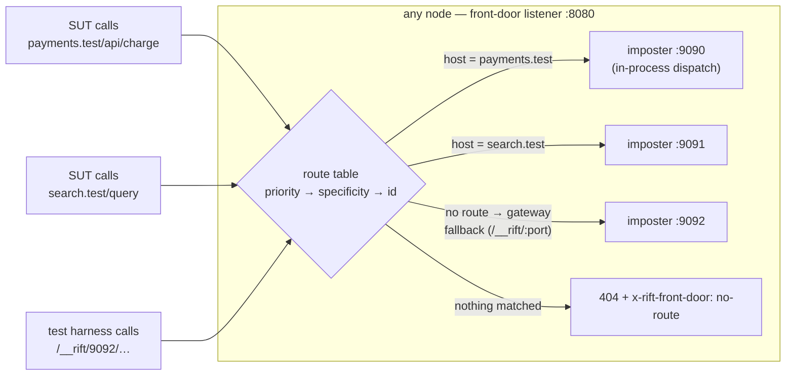

# Chapter 13 — The Front Door

A capability lifted from studying how teams actually wrap mock servers in
production (the nginx-hiding-Mountebank-behind-one-port pattern). RiftCluster
absorbs it into the product so the wrapper layer — its proxy, its glue scripts,
its config drift — stops existing. Tracked as issue #19 (front door, upstream
seam U-11).

> **Retired by D-71** (RFC-007 §3.2, #549): this chapter used to carry a second
> half on *imposter sources* — tracking source records, the `git+`/`s3:`/
> `registry:` providers, the leader poll scheduler, drift policy and `authRef`.
> All of it is gone. Imposters now arrive one of two ways: an ordinary
> `PUT /imposters`, or the one-shot `--imposters <uri>` bootstrap at startup
> (`file:` and `http(s):` only, through upstream's own `SourceRegistry` — U-12),
> which submits each document as a plain `ControlOp::PutImposter` and keeps no
> record of where it came from. See `docs/rift-cluster-server.md`.

## The front door: many imposters, one port, zero client cooperation

> **Amended by D-68** (2026-09-01, #536): the "Tenancy-aware" bullet below said only that the
> default tenant's routes are compiled into the listener. It is now also *published*: both
> `PUT` and `GET /front-door/routes` answer `installed: <bool>` beside the table, so a tenant
> writing a table that can never dispatch learns it on the write. Since #545 (D-71, RFC-007
> §3.2) those two endpoints are the only place the flag appears: the per-route dispatch counters
> this chapter once described are gone, the request log being what answers "is this route taking
> traffic".

Chapter 2's gateway mode asks the *client* to name the target imposter
(the `/__rift/8080` path prefix — the header and subdomain forms were withdrawn
by D-54 in favour of the route table below). Test
harnesses can do that; an unmodified system-under-test cannot — it believes it
is calling `payments.example.com/api/charge`. The front door closes the gap
with a **content-based route table**: host, path-prefix, header, and method
rules mapping requests to imposters, evaluated on one listener, dispatched
**in-process** (the same zero-hop `dispatch_to_port` path — no nginx, no extra
socket, no sidecar to keep in sync with imposter churn).

Design points that carry weight (full spec in #19):

- **Deterministic order, no config-order footguns**: priority, then
  specificity (exact host > wildcard > none; longer prefix; more header
  clauses), then id. An ambiguous table — two enabled routes with identical
  match clauses — is rejected at write time, not resolved silently.
- **Routes compose with spaces**: the route picks the imposter; `flowIdSource`
  /`space` still picks the isolated state slice within it. One virtual
  hostname, N parallel test flows.
- **Predicates see the truth by default**: `strip_prefix` is opt-in, so path
  predicates, `savedRequests`, and recordings show the real downstream request
  unless the operator explicitly chose prefix routing.
- **The replicated table inherits R1**: in cluster mode the table is a
  control-plane document (`ControlOp::PutRoutes`) — committed, applied
  everywhere, write-barriered. When the `PUT` returns, every node routes the
  new way; after a full restart the table is still there (R3, via the same
  snapshot as everything else).
- **It absorbs bind divergence**: dispatch targets the imposter object, not
  its socket — a node whose :9090 bind failed still serves :9090's imposter
  through the front door. On Kubernetes and behind managed LBs this makes the
  front-door port the *only* data port a Service ever needs to expose.
- **Tenancy-aware** (#17): routes belong to tenants and may only target their
  tenant's imposters; shared catch-alls are fleet-admin territory. Only the
  default tenant's routes are actually compiled into the listener — see
  Chapter 8, and `routes_installed_for`, which is the one definition of that
  rule. **Both route endpoints publish that fact** (#536, D-68): `PUT` and
  `GET /front-door/routes` answer `installed: <bool>` beside the table, from
  that same function, so a tenant that writes a table which can never dispatch
  learns it at the moment it writes rather than discovering it later. The flag
  is a read-only decoration on the response — it is not part of the stored
  table, and a `PUT` body claiming `installed: true` is ignored.

## What this buys, concretely

The nginx + Node-management-service + Mountebank deployment, per environment,
collapses to `rift-cluster-server` with a route table. Same single exposed port,
plus everything the wrapper never had: fleet HA, and replicated routes and
configs with read-after-write semantics.
