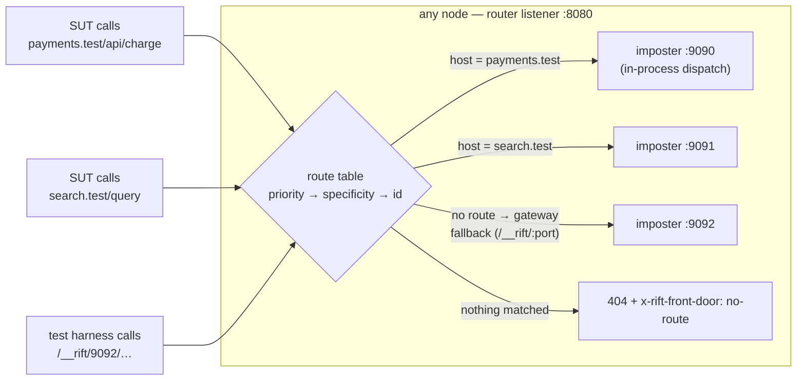

# Chapter 13 — The Router

A capability lifted from studying how teams actually wrap mock servers in
production (the nginx-hiding-Mountebank-behind-one-port pattern). RiftCluster
absorbs it into the product so the wrapper layer — its proxy, its glue scripts,
its config drift — stops existing. Tracked as issue #19, which filed it as the *front door*;
RFC-007 §6 renamed the feature to the **router** in prose, console labels and CLI help, and left
the wire contract alone — the path `/front-door/routes`, the `--front-door` flag, the
`RIFT_FRONT_DOOR` environment variable, the `x-rift-front-door` header and upstream's
`rift-http-proxy::front_door` module (U-11) all keep their names. Read #19 as amended by D-68 and
D-73: the design it describes was tenant-scoped, and is not.

> **Retired by D-71** (RFC-007 §3.2, #549): this chapter used to carry a second
> half on *imposter sources* — tracking source records, the `git+`/`s3:`/
> `registry:` providers, the leader poll scheduler, drift policy and `authRef`.
> All of it is gone. Imposters now arrive one of two ways: an ordinary
> `PUT /imposters`, or the one-shot `--imposters <uri>` bootstrap at startup
> (`file:` and `http(s):` only, through upstream's own `SourceRegistry` — U-12),
> which submits each document as a plain `ControlOp::PutImposter` and keeps no
> record of where it came from. See `docs/rift-cluster-server.md`.

## The router: many imposters, one port, zero client cooperation

> **Amended by D-68** (2026-09-01, #536), then **superseded by D-73** (RFC-007 §3.2, #550): the
> "Tenancy-aware" bullet below is gone with tenancy. There is **one fleet-wide route table** and
> every stored route is compiled into the listener, so the `installed` flag D-68 added to
> `PUT`/`GET /front-door/routes` would be a constant `true` and is removed from both. D-68 is
> worth reading anyway: it is the clearest evidence that tenancy had leaked into the router, which
> is the argument RFC-007 §3.2 makes for removing it rather than freezing it.

Chapter 2's gateway mode asks the *client* to name the target imposter
(the `/__rift/8080` path prefix — the header and subdomain forms were withdrawn
by D-54 in favour of the route table below). Test
harnesses can do that; an unmodified system-under-test cannot — it believes it
is calling `payments.example.com/api/charge`. The router closes the gap
with a **content-based route table**: host, path-prefix, header, and method
rules mapping requests to imposters, evaluated on one listener, dispatched
**in-process** (the same zero-hop `dispatch_to_port` path — no nginx, no extra
socket, no sidecar to keep in sync with imposter churn).

Design points that carry weight (full spec in #19):

- **Deterministic order, no config-order footguns**: priority, then
  specificity (exact host > wildcard > none; longer prefix; more header
  clauses), then id. An ambiguous table — two enabled routes with identical
  match clauses — is rejected at write time, not resolved silently.
- **Routes compose with spaces**: the route picks the imposter; `flowIdSource`
  /`space` still picks the isolated state slice within it. One virtual
  hostname, N parallel test flows.
- **Predicates see the truth by default**: `strip_prefix` is opt-in, so path
  predicates, `savedRequests`, and recordings show the real downstream request
  unless the operator explicitly chose prefix routing.
- **The replicated table inherits R1**: in cluster mode the table is a
  control-plane document (`ControlOp::PutRoutes`) — committed, applied
  everywhere, write-barriered. When the `PUT` returns, every node routes the
  new way; after a full restart the table is still there (R3, via the same
  snapshot as everything else).
- **It absorbs bind divergence**: dispatch targets the imposter object, not
  its socket — a node whose :9090 bind failed still serves :9090's imposter
  through the router. On Kubernetes and behind managed LBs this makes the
  router's port the *only* data port a Service ever needs to expose.
- **One table, fleet-wide** (#550, D-73): there is a single replicated route
  table, every route in it is compiled into the listener, and a route may target
  any imposter the fleet holds. `PUT /front-door/routes` replaces it as a unit,
  `DELETE /front-door/routes/{id}` removes one entry, and `GET` answers the table;
  every body is a plain `RouteTable`. The `installed`
  decoration D-68 added is gone — with nothing filtered out of the compiled set
  it could only ever say `true`.

### What is stored is what dispatches

There is one fleet-wide route table and the listener compiles all of it. On every applied route
op — and again on snapshot restore — the state machine reads every record in `sm_routes`,
deserializes each into a `Route`, and hands the whole set to the listener as one `RouteTable`
(`RedbStateMachine::desired_routes` → `EngineAction::SyncRoutes` → `bind_front_door` in
`compose.rs`). There is no filter, no scoping predicate and no subset: a route that is stored is a
route that can take a request, on every node, as soon as its `PutRoutes` commits. `GET
/front-door/routes` therefore answers exactly the table the listener is running, carrying the same
`routes@<revision>` token the write path issues, so a `200` on a write means both *stored* and
*dispatching*.

The compile is all-or-nothing on purpose. If a stored record fails to parse, the state machine
does not skip it and carry on with a smaller table — it emits `RefuseRoutesSync { id, error }`
naming the offending route and leaves the previously compiled table in place. This crate is the
only writer of `sm_routes`, so it should never happen; the read path stays defensive rather than
trusting that, because a silently shortened route table is a routing change nobody asked for and
nothing would report.

Before #550 this same function filtered to one tenant's routes, which is why the route endpoints
used to answer an `installed` flag beside the table (D-68, superseded by D-73). The single
definition of that rule was a function called `routes_installed_for`; both the filter and the flag
are gone, and the chapter that described them (`docs/architecture/08-tenancy-security.md`) is
retired. This section is where that definition now lives.

## What this buys, concretely

The nginx + Node-management-service + Mountebank deployment, per environment,
collapses to `rift-cluster-server` with a route table. Same single exposed port,
plus everything the wrapper never had: fleet HA, and replicated routes and
configs with read-after-write semantics.
