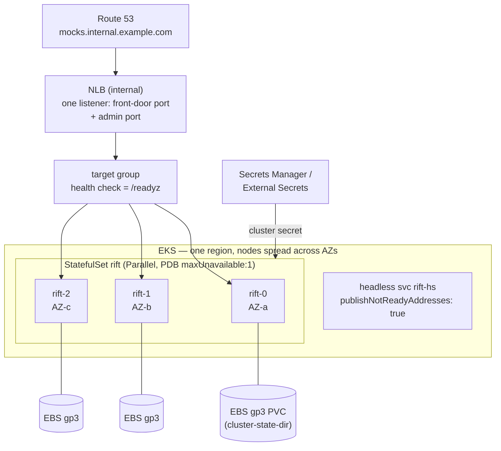

# Chapter 14 — Deploying on AWS (and Clouds Generally)

Chapter 10 covered the Kubernetes mechanics; this chapter maps the cluster
onto AWS specifically — the platform the Mimemo/Solo lineage runs on — and
states which cloud properties the design cares about. The portable summary:
**the cluster needs stable-ish peer addressing, a real disk per voter, one
routable data port, and a private network for the cluster port.** Any platform
providing those four runs RiftCluster well; the sections below are those four
requirements dressed in AWS clothes.

## Reference deployment: EKS

EKS is the recommended home — it is exactly the Chapter 10 StatefulSet with
AWS-flavored details:

AWS-specific decisions and why:

- **NLB, not ALB, at the front.** The front door (Chapter 13) does the L7
  routing *inside* Rift — host/path/header dispatch is the product's job now,
  so the cloud LB only needs to be a fast, cheap L4 spreader with health
  checks. If header-hash affinity is wanted (a latency optimization only —
  Chapter 2), put an Envoy/nginx tier behind the NLB; ALB alone cannot
  header-hash.
- **EBS `gp3` per voter, one AZ each.** EBS is zonal — which is fine, because
  each voter's volume only ever reattaches in its own AZ, and quorum survives
  a full AZ loss with 3 voters across 3 AZs. Do **not** reach for EFS to make
  volumes "portable": NFS fsync latency sits directly under the Raft log and
  the `sync` flow-durability path.
- **Multi-AZ is in-scope, multi-region is not.** Inter-AZ RTT (~0.5–1.5 ms)
  is within the design's LAN envelope — it widens write-barrier and owner-RPC
  latencies slightly and that is all. Cross-region violates every timeout
  assumption (Chapter 1's non-goal); run one cluster per region instead, each
  pulling the same sources (#20) — same mocks everywhere without stretching
  consensus.
- **Secrets**: Secrets Manager → External Secrets Operator → mounted file, but
  by two different routes. The **cluster HMAC secret** is a single file named by
  `--cluster-secret-file`. **Source `auth_ref`s** (Git tokens, registry creds,
  S3 static keys) are a *directory* of `<auth_ref>`-named files pointed at by
  `RIFT_SOURCE_SECRETS_DIR`, or individual `RIFT_SOURCE_AUTH_<REF>` environment
  variables, which take precedence (#136).
  IRSA grants the pod role read access to those secrets. It does **not** yet
  reach `s3://` sources: the S3 provider signs with static keys resolved from an
  `auth_ref`, and ambient role credentials are not implemented — a bucket
  policy that only admits the pod role will not be readable by this build. An
  `s3://` source with no `auth_ref` fetches anonymously.
- **Cluster port stays ClusterIP-internal** — never on the NLB. Security
  group: cluster port open node-to-node only; front-door/admin from the NLB;
  metrics from the scrape infrastructure.

## ECS / Fargate — supported, with one honest caveat

The Solo lineage runs on Fargate, so this path matters. It works — Service
Discovery (Cloud Map) provides the seed DNS, one task definition maps to
`rift-cluster-server`, and an internal NLB fronts the service — but **Fargate
ephemeral storage is not a durable state dir.** Options, in order of
preference:

1. **Fargate + EBS volumes** (supported since platform 1.4 via ECS volume
   configuration): a real disk per task — full R3 durability, the recommended
   ECS shape.
2. **Fargate ephemeral + external re-seeding**: accept that a *simultaneous*
   full-fleet replacement loses control-plane disk, and lean on sources (#20)
   as the recovery story — on cold start, one task runs `--cluster-init` and
   re-pulls every `pinned` source. Configs survive (they live in Git/S3/the
   registry — provenance makes this legitimate, not a hack); **flow state does
   not**. Acceptable for perf-test fleets; state so in the runbook.
3. **EC2 launch type** with instance EBS when neither fits.

Rolling deploys on ECS: `minimumHealthyPercent: 66` + one-at-a-time
(the ECS equivalent of `maxUnavailable: 1`), health check = `/readyz`,
`stopTimeout ≥ 2 × cluster-leave-timeout` so SIGTERM graceful leave completes.

## Plain EC2 / auto-scaling groups

For perimeter-bound environments without an orchestrator: 3× EC2 across AZs,
EBS on each, systemd unit (`ExecStop` = SIGTERM, generous
`TimeoutStopSec`), seeds via Route 53 private records or an internal NLB DNS
name (re-resolved per attempt, as always). ASG-managed replacement works with
one rule: **scale-in must SIGTERM, not terminate** — use lifecycle hooks to
give graceful leave its window; a hard terminate is just the crash path
(safe, but takes the election + adoption windows instead of the zero-cost
leave).

## Cost & sizing sketch (per-region, HA baseline)

| Component | Baseline | Notes |
|---|---|---|
| 3× compute | c7g.large-class (2 vCPU/4 GiB) | Rift is CPU-light per request; scale for target RPS, learners for read fan-out |
| 3× EBS gp3 | 20 GiB each | State dir: Raft log (snapshot-bounded) + flow shard; IOPS matter more than size — gp3 baseline is fine, provision IOPS only if `sync` durability at high transition rates |
| 1× internal NLB | 2 listeners | front door + admin |
| Secrets Manager | 2–5 secrets | cluster key + source creds |

No ElastiCache, no RDS, no MSK, no external coordinator — the zero-dependency
premise is precisely what makes the bill this short. (The optional Redis-strict
backends of Phases 4–5 are the one feature that adds a managed service, by
explicit choice.)

## The checklist

Any cloud, condensed:

1. One **routable data port** (front door) + admin port behind an internal L4
   LB with `/readyz` health checks; cluster port private.
2. A **real block device per voter**, surviving instance replacement in its
   AZ; never NFS under the state dir.
3. **Stable seed DNS** (headless service / Cloud Map / Route 53) — re-resolved
   per attempt by design, so IP churn is fine.
4. **SIGTERM with ≥ 2× leave-timeout** on every replacement path (deploys,
   scale-in, spot interruption handlers).
5. Secrets from the platform's secret store as files, never env-inlined URIs.
6. One cluster per region; share mocks across regions via sources, not
   consensus.
