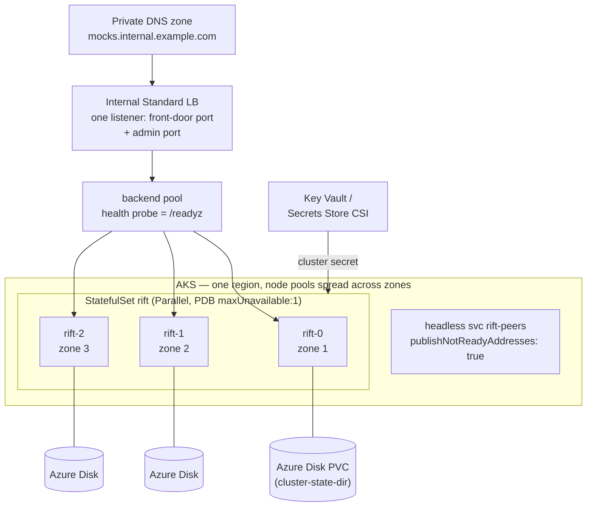

# Chapter 15 — Deploying on Azure

Chapter 14 mapped the cluster onto AWS. It opens with the portable summary —
**stable-ish peer addressing, a real disk per voter, one routable data port, and
a private network for the cluster port** — and closes with those four expanded
into a six-item, deliberately cloud-neutral checklist. Chapter 14 owns both.
This chapter dresses them in Azure clothes rather than restating them, and the
table at the end maps every one of the six to where it is answered.

Read it as a translation exercise, because that is mostly what it is. Two places
where the translation does *not* hold are the reason the chapter is worth
reading:

- Azure's default disk redundancy on a zone-spread cluster is the opposite of
  AWS's, so the AKS section argues for opting *down* rather than accepting the
  default;
- one Azure compute shape fails checklist item 2 outright, and the honest answer
  is "not supported" rather than a contorted recommendation.

## Reference deployment: AKS

AKS is the recommended home, and it is exactly the Chapter 10 StatefulSet with
Azure-flavored details.



`deploy/helm/rift-cluster/values-aks.yaml` is the Azure-specific half of this
diagram as values — storage class, `service.type: LoadBalancer` **plus** the
internal-LB annotation (the annotation alone does nothing on the chart's default
`ClusterIP`, so both are required), and the Secret name the Key Vault CSI driver
projects into. Everything else in the diagram (the two Services, the zone
spread, the PDB, the derived grace period) is chart default, because none of it
is Azure-specific.

Azure-specific decisions and why:

- **Internal Standard Load Balancer, not Application Gateway** (checklist 1).
  Same argument as NLB-not-ALB: the front door (Chapter 13) does host/path/header
  dispatch *inside* Rift, so the cloud LB needs only to be a fast L4 spreader with
  health probes. A `Service` of type `LoadBalancer` carrying
  `service.beta.kubernetes.io/azure-load-balancer-internal: "true"` provisions one
  in the node resource group, on the cluster's own VNet, with a private frontend
  IP. (Basic SKU is gone — AKS dropped support on 2025-09-30 — so "Standard" is
  simply what you get.) If header-hash affinity is wanted, that is an Envoy/nginx
  tier behind the LB, exactly as on AWS.
- **Azure Disk per voter** (checklist 2) — and here Azure differs from AWS in a
  way worth stating plainly, because the default is not the AWS default.

  On AKS 1.29 and later, a cluster deployed across availability zones gets
  **ZRS** from the built-in storage classes, not LRS. That is the opposite of
  EBS, which is always zonal. So the reflex "it's the EBS section with different
  nouns" is wrong on the one axis that matters: out of the box, each voter's
  disk is synchronously replicated across three zones.

  It works, and it is not what this design wants. ZRS buys the ability to
  reattach a stateful pod's disk in a surviving zone — genuinely valuable for a
  *single-replica* stateful workload, and close to pointless for this one, where
  quorum already survives a zone loss and the fleet keeps serving without any
  disk moving anywhere. What you pay for it is synchronous cross-zone
  replication on every Raft append, on the write path the whole control plane
  is bounded by, plus a higher per-GiB price.

  So on a zone-spread AKS cluster, **opt down to LRS deliberately** with a
  custom storage class. It has to be a custom one: AKS reconciles the built-in
  classes and overwrites edits to them, so neither the SKU nor the binding mode
  below can be "just changed" in place.

  ```yaml
  apiVersion: storage.k8s.io/v1
  kind: StorageClass
  metadata:
    name: rift-state
  provisioner: disk.csi.azure.com
  parameters:
    skuName: Premium_LRS
  allowVolumeExpansion: true
  reclaimPolicy: Delete
  # The pod is scheduled first, then its disk is created in the zone it landed
  # in. With `Immediate` the disk is placed before anything knows where the pod
  # is going, and an LRS disk cannot attach across zones — so the pod that
  # needed it is stuck Pending.
  volumeBindingMode: WaitForFirstConsumer
  ```

  That returns you to the EBS shape and its reasoning: each voter's volume only
  ever reattaches in its own zone, and 3 voters across 3 zones tolerate losing
  one entirely. Taking the built-in class instead is a defensible choice — it is
  simply a different trade, and it should be a chosen one rather than a
  default one nobody noticed.
- **Do not reach for Azure Files under the state dir** (checklist 2). It is the
  EFS trap with a different logo: SMB (and NFS) fsync latency sits directly
  under the Raft log and the `sync` flow-durability path. Azure Files is a fine
  place for a shared corpus of mock definitions; it is not a place for a
  consensus log.
- **Premium SSD v2 is the exception to the ZRS default, in this design's
  favour.** The `managed-csi-premium-v2` class provisions LRS regardless of zone
  spread — **ZRS is not supported for Premium SSD v2 at all** — so it lands on
  the redundancy this workload wants without a custom class. It also decouples
  IOPS from capacity, which suits a state dir that needs fsync throughput far
  more than it needs space. Two things gate it: the class exists only on
  Kubernetes **1.35 and later**, and Premium SSD v2 has region and zone
  availability requirements, so check that your node pool's zones offer it
  before selecting the class.
- **Multi-zone is in-scope, multi-region is not** (checklist 6). Same envelope as Chapter 14:
  intra-region inter-zone RTT is within the design's LAN assumptions; cross-region
  violates every timeout assumption (Chapter 1's non-goal). One cluster per
  region, each pulling the same sources (#20).
- **Cluster port stays ClusterIP-internal** (checklist 1) — never on the load
  balancer. NSG: cluster port node-to-node only; front-door/admin from the LB
  subnet; metrics from the scrape infrastructure.
- **Seed DNS** (checklist 3) is the headless Service, as everywhere. A Private
  DNS zone is the Route 53 analogue for anything *outside* the cluster that needs
  to reach the fleet — clients, not peers.

### Secrets (checklist 5)

Key Vault → **Secrets Store CSI driver** (the AKS-managed add-on) or External
Secrets Operator → a mounted **file**. Two distinct shapes, as on AWS:

- the **cluster HMAC secret** is a single file named by `--cluster-secret-file`;
- **source `auth_ref`s** (Git tokens, registry creds, object-store static keys)
  are a *directory* of `<auth_ref>`-named files pointed at by
  `RIFT_SOURCE_SECRETS_DIR`, or individual `RIFT_SOURCE_AUTH_<REF>` environment
  variables, which take precedence (#136).

**Workload identity federation is the IRSA analogue**, and it is one of several
ways to give the Key Vault CSI add-on an identity (a user-assigned managed
identity on the node pool is the out-of-box default). Any of them is fine — the
chart consumes a Kubernetes Secret and does not care how it got there.

**Sources are where Azure is genuinely thinner than AWS, and it is worth being
blunt about it.** This build registers exactly these schemes:

| Scheme | Credentialed |
|---|---|
| `git+https`, `git+file` | yes, via `auth_ref` |
| `registry` (OCI) | yes, via `auth_ref` |
| `s3` | yes, via `auth_ref` (static keys only) |
| `file`, `http` | no — anonymous |

There is **no Azure Blob provider**. Blob Storage has no native S3 API either,
so `s3://` does not reach a storage account unless you put an S3-compatible
gateway in front of it and point the source's `endpoint` at that gateway. The
practical consequences on Azure:

- **Use Git or an OCI registry.** Azure DevOps Repos and GitHub over
  `git+https`, or ACR over `registry` — both authenticate through `auth_ref` and
  are the shapes this design was built around anyway (Chapter 13).
- **A storage account is only usable if it is anonymously readable** over
  `http:`. Do not mint a storage-account access key and put it in an `auth_ref`
  expecting it to work — nothing consumes it, because nothing speaks to Blob
  Storage.
- **The `s3://` ambient-credential caveat from Ch.14 still applies** wherever you
  do use S3: the provider signs with static keys from an `auth_ref`, and ambient
  role credentials are not implemented in this build. Workload identity does not
  change that on Azure any more than IRSA does on AWS.

## Container Apps / ACI — not supported, and here is exactly why

Chapter 14's Fargate section is candid about ephemeral storage and then lists
three ways around it. The equivalent section here is shorter, because there is
no way around it.

Azure Container Apps offers three storage shapes and none of them is a durable
per-replica block device:

| Shape | What it is | Verdict against checklist 2 |
|---|---|---|
| Container-scoped ephemeral | Scratch, gone on container restart | Fails |
| Replica-scoped ephemeral | `EmptyDir` equivalent; survives a container restart *within* the replica, dies with the replica | Fails |
| Azure Files volume mount | SMB/NFS share, shared across replicas and revisions | Fails — and fails twice |

The Azure Files row is the interesting one. It is durable, so it looks like the
answer, and it is the worst of the three: it puts a network filesystem under the
Raft log (the EFS trap), *and* it is shared across replicas by design, so three
voters would be writing their supposedly-private state directories into the same
share. That is not a durability compromise; it is a correctness one.

There is no Fargate-with-EBS equivalent — Container Apps has no per-replica
managed-disk option to reach for, in GA or preview. ACI has the same story, which
is why AKS Virtual Nodes (ACI-backed) reject PersistentVolumeClaims outright.

So: **Container Apps and ACI are not supported deployment targets.** Not "works
with caveats" — the platform cannot satisfy requirement 2.

Chapter 14's escape hatch for Fargate does not rescue it either. That option
(accept ephemeral state, re-seed every `pinned` source on cold start) rests on
provenance: configs live in Git or a registry, so losing them locally is
recoverable. Replica-scoped ephemeral storage does survive a *container* restart,
so a single crash-looping container is fine. What it does not survive is replica
replacement — which is the routine event here, not the exotic one, since it is
what every deploy, scale, and node recycle does. Each replacement is a voter
returning with an empty state directory, so the fleet is permanently in the
re-seed path rather than occasionally in it; and flow state, which has no source
to re-pull from, is lost every time.

If what you actually wanted was "no node pool to manage", the answer is AKS with
the cluster autoscaler or Node Autoprovisioning — **not** Virtual Nodes, which
are ACI-backed and therefore inherit this same section's problem wholesale.

## Plain VMs / VMSS

For perimeter-bound environments without an orchestrator: 3× zonal VMs across
zones, a managed disk on each, a systemd unit (`ExecStop` = SIGTERM, generous
`TimeoutStopSec`), seeds via Private DNS records or the internal LB name —
re-resolved per attempt, as always (checklist 3).

VMSS-managed replacement works with one rule, and it is checklist item 4 wearing
an Azure hat: **scale-in must SIGTERM, not deallocate.** The mechanism is
*terminate notifications*, delivered through the Scheduled Events metadata
endpoint inside the VM:

1. Enable terminate notification on the scale set and set the window during
   which Azure holds off deleting the instance —
   `virtualMachineProfile.scheduledEventsProfile.terminateNotificationProfile.notBeforeTimeout`
   in the VMSS model, ISO 8601 (`PT15M`); `--terminate-notification-time` on the
   CLI, `-TerminateScheduledEventNotBeforeTimeoutInMinutes` in PowerShell.
2. An agent in the VM polls the Scheduled Events endpoint, sees the `Terminate`
   event, and sends SIGTERM to `rift-cluster-server`.
3. When the graceful leave completes, POST an approval back to the metadata
   service to release the instance immediately rather than waiting out the
   window.

Three things to know about that window. It accepts **5 to 15 minutes** and
defaults to 5 — comfortably more than `2 × cluster-leave-timeout` needs at any
sane leave timeout, so the ceiling is not a constraint here, but the *default*
is worth raising deliberately rather than inheriting. It cannot be extended once
an event has been generated, so the value has to be right before the scale-in
happens, not during it. And it is the only pause that applies to scale-in: VMSS
does have lifecycle hooks, but they are scoped to automatic OS upgrade phases,
not to instance deletion, so there is no ASG-style scale-in hook to reach for
instead.

Skipping the agent entirely is safe but not free: a hard delete is just the
crash path, so the fleet pays the election and adoption windows instead of a
zero-cost leave.

## Cost & sizing sketch (per-region, HA baseline)

| Component | Baseline | Notes |
|---|---|---|
| 3× compute | D2s-class (2 vCPU/8 GiB) or D2ps (Arm) | Rift is CPU-light per request; scale for target RPS, learners for read fan-out |
| 3× Azure Disk | P10-class (128 GiB) or Premium SSD v2 at 20 GiB | State dir: Raft log (snapshot-bounded) + flow shard; IOPS matter more than size. P-series bundles IOPS with capacity, so the smallest tier that meets your IOPS floor sets the size; Premium SSD v2 decouples them and is usually cheaper for this shape |
| 1× internal Standard LB | 2 listeners | front door + admin |
| Key Vault | 2–5 secrets | cluster key + source creds |

No Cosmos DB, no Azure Cache for Redis, no Event Hubs, no external coordinator —
the zero-dependency premise is what makes the bill this short, on Azure exactly
as on AWS. (The optional Redis-strict backends of Phases 4–5 are the one feature
that adds a managed service, by explicit choice.)

## The checklist, discharged

Chapter 14's six items, and where each is answered above:

| # | Item | Azure |
|---|---|---|
| 1 | Routable data port + admin behind an internal L4 LB; cluster port private | Internal Standard LB via the `azure-load-balancer-internal` annotation; cluster port ClusterIP-only, NSG node-to-node |
| 2 | A real block device per voter, surviving replacement in its zone; never NFS under the state dir | Azure Disk — but note the built-in classes give ZRS on a zone-spread cluster, so opt down to `Premium_LRS` with `WaitForFirstConsumer`, or use `managed-csi-premium-v2` (LRS by definition). Azure Files explicitly rejected — and the reason Container Apps is unsupported |
| 3 | Stable seed DNS, re-resolved per attempt | Headless Service inside AKS; Private DNS zone for external clients and for VMSS seeds |
| 4 | SIGTERM with ≥ 2× leave-timeout on every replacement path | Helm derives `terminationGracePeriodSeconds`; on VMSS, terminate notifications + Scheduled Events |
| 5 | Secrets as files, never env-inlined | Key Vault via Secrets Store CSI; `--cluster-secret-file` and `RIFT_SOURCE_SECRETS_DIR` |
| 6 | One cluster per region; share mocks via sources | Unchanged — sources (#20), not stretched consensus |
